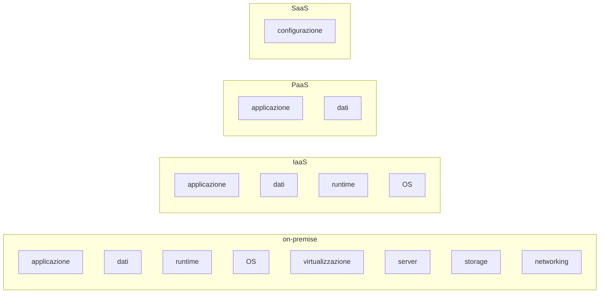

# Cos'è il cloud e cos'è AWS

Prima di toccare un solo servizio, serve avere un modello mentale corretto. Il cloud computing non è "internet" e non è "il computer di qualcun altro". È un cambio di **modello economico e operativo**: passi da comprare hardware e pagarlo in anticipo (CAPEX) a noleggiare capacità computazionale al minuto, fatturata a consumo (OPEX). Questa pagina ti dà i fondamenti concettuali e il perché di tutto quello che leggerai nelle prossime 51 sezioni.

## 1. Cosa è cambiato nel 2006

Il 14 marzo 2006 Amazon lanciò **S3**: storage di oggetti accessibile via HTTP, fatturato a GB-mese. Pochi mesi dopo arrivò **EC2**: macchine virtuali on-demand, fatturate all'ora. Per la prima volta uno sviluppatore con una carta di credito poteva avere 100 server in 5 minuti senza firmare un contratto, senza data center, senza CAPEX. Questa è la rottura. Tutto il resto — le altre 200 e più servizi — è venuto dopo.

Prima del cloud, se volevi lanciare una startup web dovevi: (a) stimare il traffico massimo nei prossimi 3 anni, (b) comprare server per quella capacità di picco, (c) sperare di non fallire prima di averli ammortizzati, (d) sperare anche di non aver sottostimato — perché aggiungere capacità voleva dire ordinare hardware con 8 settimane di lead time. Risultato: o sotto-provisioning (sito che cade quando vai virale) o sovra-provisioning (paghi server che usi al 12%).

## 2. Le tre "as a Service"

| modello | cosa gestisci tu | cosa gestisce il provider | esempio AWS |
|---|---|---|---|
| **IaaS** (Infrastructure) | OS, runtime, app, dati | virtualizzazione, server, rete, storage | EC2, EBS, VPC |
| **PaaS** (Platform) | app, dati | tutto il resto + runtime | Elastic Beanstalk, Lambda, RDS |
| **SaaS** (Software) | configurazione e dati | tutto | Amazon Connect, WorkMail, Chime |

Più sali (IaaS → PaaS → SaaS), meno gestisci, ma meno flessibilità hai. Lambda è meraviglioso perché non pensi al sistema operativo. È meno meraviglioso se devi installare un driver kernel custom.

## 3. Modello di responsabilità condivisa

Probabilmente la slide più importante di tutto AWS. AWS è responsabile della **sicurezza del cloud** (hardware, software che gira sui loro server, data center fisici). Tu sei responsabile della **sicurezza nel cloud** (configurazione dei tuoi servizi, IAM, dati, rete logica).

| Strato | AWS gestisce | Tu gestisci |
|---|---|---|
| Hardware, data center, alimentazione, raffreddamento | ✓ | — |
| Hypervisor, host OS | ✓ | — |
| Servizi gestiti (database engine di RDS, runtime Lambda) | ✓ | — |
| Sistema operativo della tua EC2 | — | ✓ (patching, hardening) |
| Configurazione IAM, security group, NACL | — | ✓ |
| Crittografia dei tuoi dati | — | ✓ (con KMS) |
| Codice applicativo | — | ✓ |

**Implicazione pratica**: se lasci un bucket S3 pubblico per errore e finisce sul giornale, la colpa è tua. AWS ti dà gli strumenti per chiuderlo (Block Public Access è ora default), ma la configurazione è responsabilità del cliente. Vedremo decine di casi in cui questo confine genera incidenti.

## 4. I cinque vantaggi reali (non il marketing)

1. **Elasticità**: passi da 10 a 1000 server in pochi minuti, e da 1000 a 10 quando il picco è finito. Niente CAPEX bloccato.
2. **Pay-as-you-go**: paghi solo quello che usi, al secondo (Lambda, Fargate), all'ora (EC2 on-demand), al GB-mese (S3), per richiesta (DynamoDB on-demand).
3. **Reach globale**: 30+ regioni nel mondo. Deploy in Tokyo, Francoforte e San Paolo in 30 minuti, senza data center fisici lì.
4. **Servizi gestiti**: invece di installare e patchare PostgreSQL su una VM, usi RDS Postgres. AWS gestisce backup, failover, patching. Costo: meno controllo, lock-in.
5. **Time-to-market**: idea → prototipo in produzione in giorni, non mesi.

E i tre **anti-vantaggi** che il marketing tace:

- **Costi imprevedibili**: la stessa elasticità che ti aiuta in alto ti frega in basso. Un bug che chiama Lambda in loop può costarti $10k in una notte (storia vera, multiple).
- **Lock-in**: più usi servizi proprietari (DynamoDB, Step Functions, Cognito), più diventa difficile uscire. Postgres su EC2 è portabile; DynamoDB no.
- **Complessità**: 200+ servizi, 17 modi di fare networking, 5 servizi per la coda. Senza disciplina diventa un caos.

## 5. AWS in 30 secondi: cosa offre

Per orientarsi, immagina AWS come un grande supermercato suddiviso in corsie. Le corsie principali che vedrai in questo percorso:

| Corsia | Servizi tipici |
|---|---|
| **Compute** | EC2, Lambda, ECS, EKS, Fargate, Batch |
| **Storage** | S3, EBS, EFS, FSx, Glacier |
| **Database** | RDS, Aurora, DynamoDB, ElastiCache, Redshift |
| **Networking** | VPC, Route 53, CloudFront, Direct Connect, Transit Gateway |
| **Security & Identity** | IAM, KMS, Secrets Manager, GuardDuty, WAF |
| **Application Integration** | SQS, SNS, EventBridge, Step Functions |
| **Analytics** | Athena, Glue, EMR, Kinesis, OpenSearch |
| **ML / AI** | SageMaker, Bedrock, Rekognition, Comprehend |
| **DevOps** | CloudFormation, CDK, CodePipeline, CloudWatch, Systems Manager |
| **Management** | Organizations, Control Tower, Config, CloudTrail |

Sono migliaia di pagine di documentazione. Ma sotto sotto sono **combinazioni di poche primitive**: tu prendi compute, lo colleghi a storage, ci metti un IAM principal davanti, lo esponi via un load balancer dentro un VPC, lo proteggi con un security group. Tutto il resto è zucchero sintattico.

## 6. Pricing in tre parole

Ogni servizio ha tre componenti tipiche di costo:

1. **Compute / richieste**: ore EC2, secondi Lambda, milioni di richieste DynamoDB.
2. **Storage**: GB-mese su S3/EBS/snapshot.
3. **Data transfer**: traffico in egress verso internet (ingress quasi sempre gratuito).

Il punto 3 è quello che frega tutti. **Egress da AWS verso internet costa ~$0.09/GB nelle regioni principali** (con sconti a volume e nuovamente nel 2025-2026 100 GB/mese free verso internet). 1 TB di traffico verso utenti = ~$90. Se sposti 100 TB al mese, sono ~$9000 di sola banda. La tua app a "$5/mese di EC2" può avere $900/mese di egress se i tuoi utenti scaricano video.

Vedremo il pricing nei dettagli nella sezione 7. Per ora ricorda: **la bolletta cloud è la somma di centinaia di micro-costi**. Vincere su uno (es. spostare il DB su Aurora Serverless) e perdere su un altro (es. lasciare CloudWatch Logs senza retention) è il pattern più comune.

## 7. Quattro modelli mentali da memorizzare

1. **Region è isolata**: tutto in AWS è regionale. Quando lanci una EC2, scegli una Region (es. `eu-west-1` Irlanda). Quella istanza vive solo lì. Se vuoi resilienza geografica, replichi su più Region tu (non gratis, vedi sezione 44).
2. **Multi-AZ è il default per HA**: dentro una Region ci sono Availability Zones (data center fisicamente separati). Per essere "Highly Available" devi essere su almeno 2 AZ (vedi sezione 2).
3. **Tutto è API**: la console web è solo un client che chiama API REST/JSON firmate con AWS Signature V4. Tu puoi fare le stesse cose con `aws` CLI, SDK Python/JS/Java, Terraform, CloudFormation. La console è per esplorare; la produzione è in IaC.
4. **IAM autorizza ogni chiamata**: ogni singola chiamata API passa per IAM, che decide se quel principal (utente/ruolo) può fare quell'azione su quella risorsa. Se IAM dice no, la chiamata fallisce. Anche se sei "admin", se non hai il permesso, fallisce.

## 8. Esercizio: pensa come un cloud architect

Hai un sito statico (HTML+CSS+JS) che riceve 1 milione di visite/mese. Su AWS quanto costa minimo?

**Soluzione ragionata.** Sito statico = S3 (storage oggetti) + CloudFront (CDN globale) + Route 53 (DNS).

- **S3**: 1 GB di asset = $0.023/mese. Trascurabile.
- **CloudFront**: 1M richieste = ~$0.75; assumendo 500 KB/visita = 500 GB/mese di egress da CDN ≈ $42 (a $0.085/GB in zone US/EU). Free tier: 1 TB/mese e 10M richieste/mese gratis i primi 12 mesi.
- **Route 53**: hosted zone $0.50/mese + ~$0.40 per milione di query DNS.

**Totale ~$45/mese** in produzione, **~$1/mese** se entri nel free tier CloudFront. Confronta con un VPS dedicato: ~$10/mese ma senza CDN globale, senza scaling automatico, e tu gestisci tutto. La differenza non è il prezzo: è cosa ottieni.

Stessa domanda ma il sito è un'app Node.js con database PostgreSQL e ~100 utenti attivi/giorno. Stima il minimo.

**Soluzione ragionata.** Tre architetture possibili in scala crescente di costo/complessità:

- **Tier minimo**: AWS Lightsail (containerized PaaS) ~$7–$15/mese tutto incluso.
- **Tier "AWS nativo basic"**: EC2 t4g.small ($12/mese) + RDS db.t4g.micro Postgres ($14/mese) + EBS 20 GB ($2/mese) + traffico minimo ≈ **$30/mese**.
- **Tier "serverless"**: Lambda + API Gateway + Aurora Serverless v2 minimo (0.5 ACU) ≈ $50–$80/mese (Aurora Serverless v2 ha un floor di ~$43/mese se non scende a zero).

**Lezione**: serverless non è sempre più economico a basso traffico. Lo diventa man mano che il carico è sporadico ma con picchi alti.

## 9. Cosa NON impari in questa pagina

- I dettagli di un singolo servizio: vedremo EC2 in 2 sezioni dedicate, S3 in 1, IAM in 2.
- Come configurare la tua prima istanza: la prossima sezione apre l'account, la quarta tocca IAM.
- Cosa scegliere: la scelta tra EC2 vs Lambda vs Fargate è in una sezione dedicata (17, 43, 48).

L'obiettivo qui è solo darti il **modello mentale**: cloud = primitive componibili, pagate a consumo, distribuite globalmente, autorizzate da IAM, gestite per API. Tieni queste cinque parole in testa: tutto il resto del percorso è varianza su questo tema.

> **Riassunto in una frase**: AWS è un catalogo di primitive componibili (compute, storage, network, identity, eventi) fatturate a consumo, accessibili via API firmate, replicabili in 30+ regioni globali; tu paghi quello che usi e sei responsabile della configurazione (modello di responsabilità condivisa).
