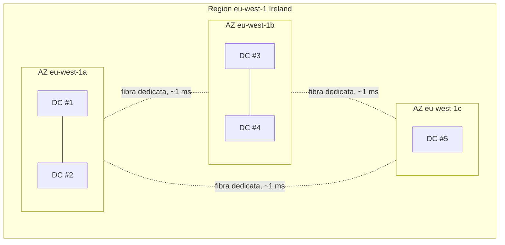

# Infrastruttura globale: Region, AZ, Edge

Quando dici "ho lanciato un'EC2", stai implicitamente dicendo "in una specifica Availability Zone, dentro una specifica Region". Capire la geografia AWS è il prerequisito per parlare di latenza utente, resilienza, costi di trasferimento dati e compliance (GDPR ti dice dove possono stare i dati).

## 1. Region: l'unità di isolamento

Una **Region** è un'area geografica con un nome (`us-east-1` = North Virginia, `eu-west-1` = Ireland, `eu-south-1` = Milano). Ogni Region è composta da almeno 3 (di solito 3-6) **Availability Zone**, ed è **completamente isolata dalle altre**.

Caratteristiche fondamentali da memorizzare:

- **Dati isolati**: se lanci un bucket S3 in `eu-west-1`, i suoi oggetti non lasciano mai Irlanda salvo che tu attivi cross-region replication esplicita.
- **API isolate**: l'endpoint S3 di Irlanda è `s3.eu-west-1.amazonaws.com`. Se chiami quello di Tokyo (`s3.ap-northeast-1.amazonaws.com`) per leggere lo stesso bucket, non lo trovi.
- **Servizi non sono tutti ovunque**: nuovi servizi escono prima in `us-east-1` e si propagano. Verifica sempre con la [Region table](https://aws.amazon.com/about-aws/global-infrastructure/regional-product-services/).
- **Pricing varia per Region**: stessa EC2 costa il 10-30% in più a São Paulo che in Virginia (cap-ex regionale, costo elettricità, tasse).

Al 2026 AWS ha **34+ regioni commerciali** + GovCloud (US) + China (gestita da partner locali per legge). Ne escono 1-3 nuove all'anno.

## 2. Availability Zone: data center fisicamente separati

Una **AZ** è un cluster di uno o più data center fisicamente distinti, con alimentazione, rete e raffreddamento indipendenti, dentro la stessa Region. Sono collegate tra loro da fibra dedicata a bassa latenza (~1–2 ms) e alta banda. Le AZ sono **identificate da una lettera** (`eu-west-1a`, `eu-west-1b`, `eu-west-1c`).

**Punto sottile**: la lettera `a` di un account non è la stessa AZ fisica della lettera `a` di un altro account. AWS randomizza il mapping per bilanciare il carico. Per riferirsi a un'AZ fisica deterministicamente, usa l'**AZ ID** (`use1-az1`, `use1-az2`, …) che lo stesso in tutti gli account.

**Regola d'oro per HA**: distribuisci sempre su **almeno 2 AZ**. Se hai un load balancer ALB con 2 EC2 nella stessa AZ e quella AZ va giù (capitato con `us-east-1` dicembre 2021), il tuo servizio è offline. Con 1 EC2 per AZ × 2 AZ, sopravvivi.

## 3. Edge location e PoP

Le **Edge location** sono ~600 mini-data center in 90+ città del mondo (Milano, Roma, Bologna in Italia). Non runnano EC2 generici. Servono **CloudFront** (CDN), **Route 53** (DNS), **Global Accelerator** (anycast networking), **AWS WAF**, **Shield** e **Lambda@Edge / CloudFront Functions** (codice eseguito vicino all'utente).

Modello mentale: le Region servono per **fare** cose (computare, salvare); le Edge servono per **distribuire** quelle cose all'utente con bassa latenza.

## 4. Tipologie speciali

| Tipo | Cosa è | Quando serve |
|---|---|---|
| **Local Zone** | AZ "filiali" in città non-Region (Los Angeles, Phoenix, Miami, ecc.) | bassa latenza per utenti urbani specifici |
| **Wavelength Zone** | data center *dentro* la rete di un operatore 5G (Verizon, KDDI, Vodafone) | app 5G a latenza single-digit ms (AR/VR, gaming) |
| **Outposts** | rack AWS fisico installato nel tuo data center | compliance / latenza on-prem ma con API AWS |
| **Local Gateway** | gateway che esce dal tuo Outposts verso la tua LAN | hybrid cloud |
| **AWS Snow Family** | hardware portatile (Snowcone, Snowball, Snowmobile) | trasferire petabyte offline (es. quando l'upload via internet richiederebbe mesi) |

## 5. Servizi globali vs regionali

| Categoria | Esempi |
|---|---|
| **Globali** (nessuna Region da scegliere) | IAM, Route 53, CloudFront, WAF (per CloudFront), Organizations, STS (endpoint globale + regionali), Health Dashboard |
| **Regionali** (vivono in una Region) | EC2, S3, RDS, Lambda, DynamoDB (può essere Global Tables), VPC, KMS, Secrets Manager |
| **Per-AZ** (ti scegli l'AZ) | EBS (un volume vive in 1 AZ), EFS (vive in più AZ ma con mount target per AZ), istanze EC2, subnet di un VPC |

Un errore tipico da junior: creare uno snapshot EBS in `eu-west-1a` e provare a montarlo da una EC2 in `eu-west-1b`. Non si può: gli snapshot sono regionali ma i volumi sono per-AZ. Devi **creare un nuovo volume dallo snapshot nella seconda AZ**.

## 6. Latenza: ordini di grandezza

| Tipo di hop | Tempo |
|---|---|
| RAM access | 100 ns |
| SSD NVMe locale | 100 µs |
| Stesso AZ (server-to-server) | 0.1–0.5 ms |
| Cross-AZ (stessa Region) | 1–2 ms |
| Cross-Region intra-continente (eu-west-1 → eu-central-1) | 15–30 ms |
| Cross-Region intercontinentale (eu-west-1 → ap-northeast-1) | 200–250 ms |
| Edge → utente (CloudFront) | 5–40 ms |

**Implicazione**: una chat real-time tra utenti su due continenti diversi è limitata dalla velocità della luce, non da AWS. Inseguire latenze sub-50 ms in workload globali richiede Edge logic (CloudFront Functions, Lambda@Edge) o partition by geography.

## 7. Cosa scegliere

Tre criteri:

1. **Vicinanza utenti**: 70% utenti in Italia? `eu-south-1` (Milano) o `eu-central-1` (Frankfurt) o `eu-west-1` (Ireland). Tutte e tre vanno bene; Milano ha latenza più bassa per Italia ma è regione nuova (servizi a volte ritardatari).
2. **Compliance**: GDPR esige che certi dati personali stiano in EU. UE = qualsiasi Region EU; Germany sovereignty può richiedere Frankfurt specificamente.
3. **Costo**: Virginia (`us-east-1`) è quasi sempre la più economica e ha **tutti** i servizi al day-zero. Per workload non sensibili alla latenza utente (es. batch notturni, AI training) è spesso la scelta giusta.

Anti-pattern: cominciare in `us-east-1` "perché tutti i tutorial usano quella" e poi accorgersi che hai utenti italiani e devi migrare tutto. La migrazione cross-region è dolorosa: snapshot, replica, change DNS, sync. Pensa prima.

## 8. Esercizio

Hai un'app utente in Italia con DB principale a Milano e disaster recovery. Quale Region per DR?

**Soluzione.** Per DR vuoi una Region **abbastanza lontana** da non condividere rischio fisico (terremoto, blackout, attacco) ma **non così lontana** da rendere il replication lag insostenibile.

- **Buone scelte**: `eu-west-1` (Ireland) o `eu-central-1` (Frankfurt). Distanza ~1000–1500 km. Latenza RTT ~15–25 ms. Si possono replicare dati con DMS/Aurora Global o cross-region snapshot.
- **Cattive scelte**: `eu-south-2` (Spagna) se entrambe finiscono nella stessa zona di rischio (es. blackout pan-europeo improbabile ma…), o `us-east-1` (troppo lontana — RTT 80+ ms rallenta tutto).
- **Costo**: hai costi doppi su tutto ciò che replichi + traffico inter-Region a ~$0.02/GB.

Perché AWS sconsiglia di usare la AZ "a" se devi distribuire su 3 AZ?

**Soluzione.** Non lo sconsiglia. Il punto è: **non assumere che `a` sia la stessa AZ fisica per tutti gli account**. AWS mappa randomicamente le lettere alle AZ fisiche (per bilanciare il carico tra clienti). Se il tuo team ha 3 account (dev, staging, prod) e tutti deployano "su `a, b, c`", potrebbero finire fisicamente nella stessa AZ.

Per riferimenti deterministici, usa l'AZ ID (`use1-az1`) restituito da `aws ec2 describe-availability-zones`.

> **Riassunto**: Region = isolamento (dati, API, billing); AZ = data center fisicamente separati dentro una Region; Edge = distribuzione veloce all'utente. Multi-AZ è per HA dentro una Region; multi-Region è per disaster recovery o vicinanza utenti globali. Conoscere dove vive un dato è il primo passo per parlare di latenza, costi e compliance.
