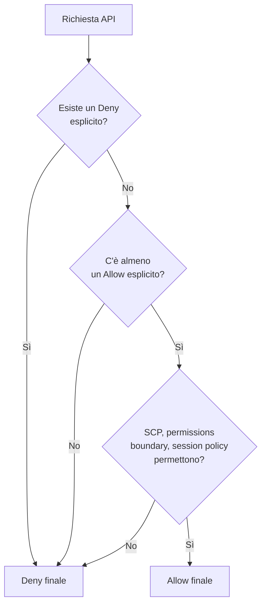

# IAM — fondamenti

IAM (Identity and Access Management) è il **muro intorno a tutto**. Senza permessi IAM espliciti, nessuna chiamata API riesce. Capirlo a fondo non è opzionale: il 90% dei breach AWS in giro è "IAM mal configurato" (chiavi in repository pubblici, policy con `*`, ruoli condivisi tra account senza condizioni).

## 1. I quattro tipi di principal

Un **principal** è chi (o cosa) fa una chiamata API. AWS ne riconosce quattro:

| Tipo | Esempio | Quando |
|---|---|---|
| **Root user** | l'email/password di registrazione | mai, dopo il setup |
| **IAM user** | utente con username + (password o access key) | umano singolo (legacy) |
| **IAM role** | ruolo assunto temporaneamente via STS | EC2/Lambda/cross-account |
| **Federated user** | identità da IdP esterno (Google, Okta, ADFS, IAM Identity Center) | SSO aziendale |

Best practice 2026: **IAM users sono legacy**. Per umani usa **IAM Identity Center** (ex AWS SSO). Per macchine usa **ruoli**: niente chiavi statiche, credenziali a tempo via STS.

## 2. I tre tipi di policy

Le policy sono documenti JSON che descrivono permessi.

| Tipo | Allegata a | Esempio |
|---|---|---|
| **Identity-based** | IAM user/group/role | `AmazonS3ReadOnlyAccess` allegata a un ruolo |
| **Resource-based** | risorsa (bucket S3, queue SQS, KMS key) | bucket policy che consente cross-account |
| **Permissions boundary** | identity (cap il massimo) | "questo ruolo non potrà mai fare più di S3+DynamoDB" |
| **SCP (Service Control Policy)** | account/OU in Organizations | "in questo OU vietato lanciare EC2 fuori EU" |
| **Session policy** | sessione STS | restringe ulteriormente una sessione assumed |

## 3. Struttura di una policy

```json
{
  "Version": "2012-10-17",
  "Statement": [
    {
      "Sid": "ReadProdLogsBucket",
      "Effect": "Allow",
      "Action": ["s3:GetObject","s3:ListBucket"],
      "Resource": [
        "arn:aws:s3:::prod-logs",
        "arn:aws:s3:::prod-logs/*"
      ],
      "Condition": {
        "StringEquals": {"aws:PrincipalTag/Team": "platform"},
        "Bool": {"aws:MultiFactorAuthPresent": "true"}
      }
    }
  ]
}
```

Cinque elementi:

1. **Effect**: `Allow` o `Deny`.
2. **Action**: cosa si può fare (es. `s3:GetObject`, `ec2:RunInstances`). Granularità per API.
3. **Resource**: su quali risorse (ARN). `*` significa "qualunque" — pericoloso.
4. **Condition** (opzionale): vincoli aggiuntivi (tag, MFA, IP, ora del giorno, encryption type).
5. **Principal** (solo nelle resource-based): chi può.

## 4. La regola di valutazione



Punti chiave:

- **Default deny**: se nessuna policy dice "Allow", la chiamata fallisce.
- **Deny esplicito vince sempre**. Un `Allow *` + un `Deny s3:DeleteBucket` = non puoi cancellare bucket.
- **L'intersezione di SCP + boundary + session policy + identity-based policy + resource-based policy** deve consentire la chiamata.

## 5. Utenti, gruppi e ruoli

- **IAM User**: identità a lungo termine con credenziali (password console, access key CLI). Da evitare in nuovi setup.
- **Gruppo**: insieme di utenti che condividono policy. Non è un principal: serve solo a non duplicare policy.
- **Role**: identità senza credenziali fisse, assunta on-demand via `sts:AssumeRole`. Restituisce credenziali temporanee (15 min – 12 ore).

Usi tipici dei role:

| Use case | Esempio |
|---|---|
| EC2 instance role | l'EC2 ottiene credenziali via metadata service (`http://169.254.169.254/latest/meta-data/iam/security-credentials/`) |
| Lambda execution role | la function ottiene `AWS_ACCESS_KEY_ID`/`AWS_SECRET_ACCESS_KEY`/`AWS_SESSION_TOKEN` da env vars |
| Cross-account access | l'account A assume un role nell'account B per accedere a risorse di B |
| Federated SSO | un utente Okta assume un role temporaneo via SAML |

## 6. Best practice da memorizzare

1. **Least privilege**: parti negando tutto e aggiungi solo ciò che serve. AWS Access Analyzer genera policy a partire dall'uso reale (CloudTrail).
2. **Mai access key statiche su EC2/Lambda/ECS**: usa i role.
3. **MFA su tutti gli umani**, condition `aws:MultiFactorAuthPresent` su azioni sensibili.
4. **Permissions boundary** sui dev: anche se aggiungono policy a sé stessi, non superano il limite.
5. **Naming**: prefissi consistenti (`role/svc-`, `role/human-`, `role/cross-acct-`) per audit veloce.
6. **Rotazione access key** se proprio devi usarle (max 90 giorni, idealmente automatica via Lambda).
7. **Non versionare mai chiavi in git** (GitGuardian/TruffleHog scansionano repo pubblici; AWS le revoca automaticamente se le pubblichi su GitHub).

## 7. Esempi pratici

```bash
# Crea un IAM user e gli assegna una policy gestita AWS
aws iam create-user --user-name alice
aws iam attach-user-policy \
  --user-name alice \
  --policy-arn arn:aws:iam::aws:policy/ReadOnlyAccess

# Crea un role assumibile da Lambda
aws iam create-role --role-name lambda-s3-reader \
  --assume-role-policy-document '{
    "Version":"2012-10-17",
    "Statement":[{
      "Effect":"Allow",
      "Principal":{"Service":"lambda.amazonaws.com"},
      "Action":"sts:AssumeRole"
    }]
  }'

# Assume role da CLI (cross-account)
aws sts assume-role \
  --role-arn arn:aws:iam::222222222222:role/cross-acct-read \
  --role-session-name alice-prod-read \
  --external-id "shared-secret-XYZ"
```

## 8. Esercizio

<details>
<summary>Un dev ha la policy `AdministratorAccess`. Tu vuoi che non possa cancellare bucket S3 con nome che inizia per `prod-`. Come?</summary>

Aggiungi una policy con `Deny` esplicito allegata allo stesso user/role:

```json
{
  "Version":"2012-10-17",
  "Statement":[{
    "Effect":"Deny",
    "Action":["s3:DeleteBucket","s3:DeleteObject"],
    "Resource":["arn:aws:s3:::prod-*","arn:aws:s3:::prod-*/*"]
  }]
}
```

Il Deny esplicito vince sull'Allow del `AdministratorAccess`. Alternative più scalabili: SCP a livello Organization, oppure permissions boundary sul dev role.
</details>

<details>
<summary>EC2 in account A deve leggere bucket S3 in account B. Configurazione minima?</summary>

Due opzioni:

**A) Bucket policy in B che consente al role di A**:
```json
{
  "Version":"2012-10-17",
  "Statement":[{
    "Effect":"Allow",
    "Principal":{"AWS":"arn:aws:iam::111111111111:role/ec2-app-role"},
    "Action":"s3:GetObject",
    "Resource":"arn:aws:s3:::bucket-in-b/*"
  }]
}
```
+ la EC2 in A deve avere `s3:GetObject` sul bucket nella sua identity policy.

**B) Cross-account role**: in B crei un role `s3-reader` che fida il role di A; la EC2 chiama `sts:AssumeRole` per ottenere credenziali temporanee in B, poi legge S3.

Per il pattern "leggi un singolo bucket", A è più semplice. Per "accedi a molte risorse in B", B (cross-account role) è più pulito.
</details>

> **Riassunto**: ogni chiamata API AWS passa IAM. Default deny; Allow esplicito; Deny esplicito vince. Principal = chi chiama; policy = JSON con effect+action+resource+condition. Best practice: niente access key statiche, ruoli per le macchine, IAM Identity Center per gli umani, MFA, least privilege, boundary sui dev.
