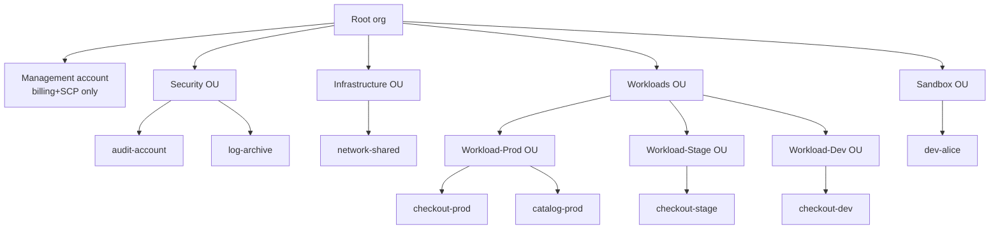

# AWS Organizations & strategia multi-account

Una volta superato l'account "personale", la prima domanda di un'azienda è: "quanti account devo avere?". La risposta moderna è **molti, organizzati in una gerarchia**. Un account = un confine di isolamento per billing, IAM, blast radius. Mettere prod e dev nello stesso account è come tenere il PIN del bancomat scritto sul retro della carta.

## 1. Perché multi-account

| Beneficio | Cosa risolve |
|---|---|
| Isolamento blast radius | un dev cancella tutto in `dev`: prod resta vivo |
| Limiti hard | molti limiti AWS sono per-account (es. 5 VPC, 1000 IAM users) |
| Billing separato | cost allocation chiara: 1 account = 1 line item nel CUR |
| Compliance | un account "data clinico" può avere SCP che vieta cross-account share |
| Audit | CloudTrail di prod isolato, write-only |
| Liberty di sperimentare | dev/sandbox con SCP soft, prod con SCP severissime |

## 2. Strutture tipiche



Best practice (Control Tower default):

- **Management account**: ZERO workload. Solo Organizations, billing, SCP. Iper-protetto.
- **Log archive**: bucket S3 immutabile (Object Lock) per CloudTrail e Config di tutta l'org.
- **Audit/security**: account dove GuardDuty, Security Hub, IAM Access Analyzer aggregano findings.
- **OU per ambiente/criticità**: Prod, Stage, Dev, Sandbox. SCP più severe man mano che sali.

## 3. AWS Organizations

Servizio gratis che:

- Crea/invita account in una "organization".
- Permette **billing consolidato** (singola fattura, sconti volume condivisi tra account).
- Applica **SCP** (Service Control Policy) a livello OU/account.
- Abilita servizi cross-account come Config aggregator, GuardDuty multi-account, Security Hub.

## 4. Service Control Policies (SCP)

SCP **non concedono permessi**: definiscono il **massimo possibile** dentro un account. È IAM al rovescio: prima IAM decide se l'azione è permessa, poi SCP filtra.

Esempi di SCP utilissime:

```json
// Vieta di disabilitare CloudTrail
{
  "Version":"2012-10-17",
  "Statement":[{
    "Effect":"Deny",
    "Action":["cloudtrail:StopLogging","cloudtrail:DeleteTrail"],
    "Resource":"*"
  }]
}

// Solo Region EU
{
  "Effect":"Deny",
  "NotAction":["iam:*","s3:*","cloudfront:*","route53:*","support:*"],
  "Resource":"*",
  "Condition":{
    "StringNotEquals":{"aws:RequestedRegion":["eu-west-1","eu-central-1","eu-south-1"]}
  }
}

// Niente IAM user creation (forza solo Identity Center)
{
  "Effect":"Deny",
  "Action":["iam:CreateUser","iam:CreateAccessKey"],
  "Resource":"*"
}
```

Le SCP più comuni: deny on dangerous actions (root creds, cloudtrail off, MFA off), region restriction, mandatory tags, prevent leaving the org.

## 5. Control Tower e Landing Zone

**Control Tower** è il "fast forward" multi-account: in 1 ora crea Organization + management + log-archive + audit + alcune SCP guardrail + account factory per nuovi account.

Le **guardrail** sono SCP predefinite (preventive) + AWS Config rules (detective):

| Tipo | Esempio |
|---|---|
| Preventive (SCP) | vieta disabilitare CloudTrail, vieta S3 pubblico |
| Detective (Config) | rileva EBS non cifrato, rileva root login |

Account Factory crea nuovi account in pochi minuti, con baseline standard (VPC, IAM, CloudTrail già configurati).

## 6. Network sharing — AWS Resource Access Manager (RAM)

Una pattern standard è "centralized networking": **1 account "network"** che possiede il Transit Gateway, le route table e le VPC condivise. Gli account workload non hanno un proprio TGW, ma usano quello condiviso via RAM. Risparmi e centralizzi il routing.

```bash
# Condividi un Transit Gateway con un OU
aws ram create-resource-share \
  --name shared-tgw \
  --resource-arns arn:aws:ec2:eu-west-1:111111111111:transit-gateway/tgw-abc \
  --principals arn:aws:organizations::123456789012:ou/o-xxxx/ou-yyyy
```

## 7. Account vending machine

Pattern moderno: gli ingegneri richiedono un account via un form interno → CI/CD chiama Service Catalog / Control Tower Account Factory → in 15 minuti hai account nuovo, baseline applicata, accesso via Identity Center, account già "production-ready" (CloudTrail, GuardDuty, Config, baseline VPC).

Senza vending machine, ogni nuovo account = 2 settimane di setup manuale. Con vending machine = 15 minuti automatici.

## 8. Esercizio

<details>
<summary>Una startup di 30 persone con 1 prodotto in produzione. Quanti account?</summary>

Minimo 4–6:

- **management** (Organizations, billing, SCP).
- **log-archive** (S3 Object Lock per audit log).
- **security-audit** (GuardDuty/Security Hub aggregator).
- **prod** (workload).
- **stage** (replica scala 1:1 di prod).
- **dev** (ambiente condiviso degli sviluppatori) e/o **sandbox per-dev** (1 account a testa, ripulito ogni 30 giorni).

Bonus: **shared-services** (artifact storage, CI/CD, DNS root domain).
</details>

<details>
<summary>Vuoi impedire che un dev qualsiasi possa lanciare EC2 fuori da `eu-west-1` E senza tag `Owner`. Strategia?</summary>

Due SCP al livello dell'OU Dev:

1. Region restriction (esempio §4 sopra).
2. Tag mandatory:
```json
{
  "Effect":"Deny",
  "Action":"ec2:RunInstances",
  "Resource":"arn:aws:ec2:*:*:instance/*",
  "Condition":{"Null":{"aws:RequestTag/Owner":"true"}}
}
```

Inoltre AWS Config rule `required-tags` per scoprire risorse già esistenti senza tag.
</details>

> **Riassunto**: account = blast radius + billing + IAM tenant. Multi-account è la norma (Prod/Stage/Dev/Sandbox + log + audit + network + management). Organizations applica SCP che CAPpano i permessi a livello OU. Control Tower automatizza la landing zone. RAM condivide risorse (TGW, subnet) tra account. Account vending machine = ingegneri felici, infra consistente.
