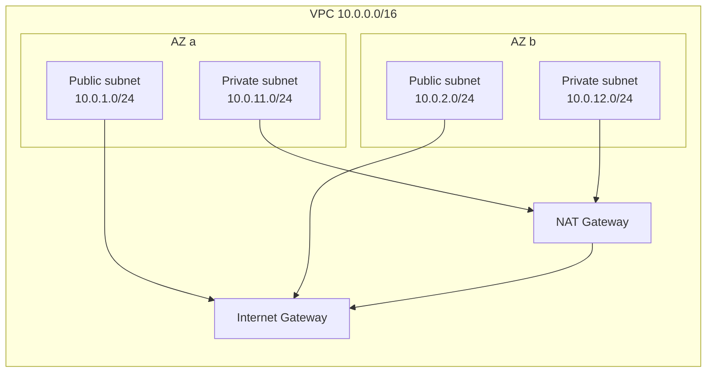

# VPC — fondamenti

Il VPC (Virtual Private Cloud) è la rete logica isolata dove vivono tutte le tue risorse. Nessuna EC2 esiste "fuori da un VPC" (anche le default sono dentro un VPC creato automaticamente). Capire VPC, subnet, route table e security group è la skill non negoziabile per chiunque deploii qualcosa più complesso di una Lambda standalone.

## 1. CIDR — il piano IP

Quando crei un VPC scegli un **CIDR block** (range IPv4), per es. `10.0.0.0/16` = 65 536 indirizzi. Range raccomandati (RFC1918):

- `10.0.0.0/8` (16M IP)
- `172.16.0.0/12` (1M IP)
- `192.168.0.0/16` (65k IP)

Punti chiave:

- **Non sovrapporre** CIDR di VPC diversi se in futuro vorrai peering/TGW.
- **Lascia spazio per crescere**: un /16 è meglio di un /22.
- **AWS riserva i primi 4 + l'ultimo IP** di ogni subnet (es. in `10.0.1.0/24`: `.0` network, `.1` router, `.2` DNS, `.3` riservato, `.255` broadcast → 251 IP usabili).
- **Secondary CIDR**: puoi aggiungere CIDR aggiuntivi a un VPC esistente (utile quando finisci gli IP).
- **IPv6**: opzionale, range fornito da AWS (`/56`).

## 2. Subnet: pubbliche e private

Una **subnet** è una porzione di CIDR del VPC legata a una specifica AZ. Una subnet è "pubblica" o "privata" non per un attributo, ma per la **route table** che ha associata:

- **Pubblica**: route table con `0.0.0.0/0 → Internet Gateway`. Le istanze qui possono ricevere/inviare traffico Internet.
- **Privata**: route table senza IGW. Per uscire serve un NAT Gateway (o VPC endpoint per servizi AWS).



Layout tipico: **2 subnet pubbliche** (load balancer, bastion, NAT) + **2 subnet private** (app server, RDS), una coppia per AZ.

## 3. Route table

Tabella che dice "traffico verso CIDR X va al target Y". Target possibili: `Internet Gateway`, `NAT Gateway`, `Transit Gateway`, `VPC Peering`, `VPC Endpoint`, `Virtual Private Gateway` (VPN). Una route table è associata a 0+ subnet; una subnet ha sempre **esattamente 1 route table attiva** (quella esplicitamente associata o quella main del VPC).

Esempio route table privata:

| Destination | Target |
|---|---|
| `10.0.0.0/16` | `local` (auto, non rimovibile) |
| `0.0.0.0/0` | `nat-0123abc` |
| `pl-xxxxxx` (Prefix List S3) | `vpce-yyy` (Gateway Endpoint) |

## 4. Internet Gateway vs NAT Gateway

**IGW**: gateway logico, gratuito, scalabile. Permette traffico bidirezionale Internet ↔ VPC, ma le istanze devono avere un **IP pubblico** (oppure Elastic IP) per essere raggiungibili da fuori. Sì, è quasi gratis e ridondato.

**NAT Gateway**: gateway gestito che fa Network Address Translation: le istanze private escono verso Internet con l'IP pubblico del NAT, ma da fuori non sono raggiungibili. Costa: **$0.045/h ≈ $32/mese** + **$0.045/GB processato**. Una per AZ per HA (sennò AZ-dependency).

NAT alternativi:

- **NAT Instance**: EC2 self-managed (cheap ma manutenzione).
- **VPC Endpoint Gateway** per S3/DynamoDB: GRATIS, evita traffico tramite NAT.
- **VPC Endpoint Interface** per altri servizi AWS: a pagamento ($0.01/h per AZ + dati), ma evita NAT.

## 5. Security Group vs NACL

| | Security Group | NACL |
|---|---|---|
| Livello | istanza (ENI) | subnet |
| Stateful? | **Sì** (return traffic auto-allowed) | **No** (devi consentire entrambe le direzioni) |
| Regole | solo `Allow` | `Allow` e `Deny` |
| Valutazione | tutte le regole valutate, basta 1 match | numeriche per ordine (lowest first) |
| Default | inbound deny all, outbound allow all | inbound allow all, outbound allow all (default NACL) |

Best practice 2026: usa **solo security group** per il 95% dei casi. NACL solo per blacklist IP a livello subnet (es. bloccare un /24 malintenzionato per tutta la subnet senza modificare ogni SG).

Esempio SG per un web server:

```
Inbound:
  - HTTPS 443 da 0.0.0.0/0
  - HTTP 80 da 0.0.0.0/0 (per redirect a HTTPS)
  - SSH 22 da SG `bastion-sg`
Outbound:
  - tutto verso 0.0.0.0/0 (default)
```

**Trucco potente**: source di una regola SG può essere **un altro SG** (es. `db-sg` permette 5432 da `app-sg`). Non scrivi IP: AWS espande dinamicamente. Sopravvive ad auto-scaling.

## 6. DNS dentro un VPC

VPC ha DNS interno (`amazon-provided DNS server`) all'IP `VPC_CIDR + 2` (es. `10.0.0.2`). Due flag:

- `enableDnsSupport` (default true): risoluzione DNS funziona.
- `enableDnsHostnames` (default false per non-default VPC): le EC2 ottengono un hostname `ip-10-0-1-23.eu-west-1.compute.internal`.

Per private DNS (es. risolvere `my-db.internal.acme.com` solo dentro il VPC): **Route 53 Private Hosted Zone** associata al VPC.

## 7. Comandi base

```bash
# Crea VPC
aws ec2 create-vpc --cidr-block 10.0.0.0/16 \
  --tag-specifications 'ResourceType=vpc,Tags=[{Key=Name,Value=acme-prod}]'

# Subnet pubblica + privata in AZ a
aws ec2 create-subnet --vpc-id vpc-xxx --availability-zone eu-west-1a \
  --cidr-block 10.0.1.0/24 --tag-specifications 'ResourceType=subnet,Tags=[{Key=Name,Value=public-a}]'
aws ec2 create-subnet --vpc-id vpc-xxx --availability-zone eu-west-1a \
  --cidr-block 10.0.11.0/24 --tag-specifications 'ResourceType=subnet,Tags=[{Key=Name,Value=private-a}]'

# IGW
aws ec2 create-internet-gateway
aws ec2 attach-internet-gateway --vpc-id vpc-xxx --internet-gateway-id igw-yyy

# Route table pubblica
aws ec2 create-route-table --vpc-id vpc-xxx
aws ec2 create-route --route-table-id rtb-pub --destination-cidr-block 0.0.0.0/0 --gateway-id igw-yyy
aws ec2 associate-route-table --subnet-id subnet-pub-a --route-table-id rtb-pub
```

In produzione **non scrivere queste cose a mano**: usa Terraform/CDK (vedi sezione 34).

## 8. Esercizio

<details>
<summary>App web 3-tier (frontend, app, db). Disegna la rete minima resiliente.</summary>

VPC `10.0.0.0/16` su 2 AZ:

- 2 subnet **public** (`10.0.1.0/24` AZ-a, `10.0.2.0/24` AZ-b): contengono ALB.
- 2 subnet **private app** (`10.0.11.0/24` AZ-a, `10.0.12.0/24` AZ-b): contengono EC2/Fargate.
- 2 subnet **private data** (`10.0.21.0/24` AZ-a, `10.0.22.0/24` AZ-b): contengono RDS Multi-AZ.

- 1 NAT Gateway **per AZ** (HA, ma costoso). Per dev: 1 NAT solo basta.
- Security group: `alb-sg` (443 da 0/0), `app-sg` (8080 da `alb-sg`), `db-sg` (5432 da `app-sg`).
- VPC Gateway Endpoint per S3 + DynamoDB (gratis, riduce traffico via NAT).

Quel disegno regge: morte AZ-a → traffico via AZ-b. Sicurezza: solo ALB esposto, app/db privati.
</details>

<details>
<summary>Hai bisogno di SSH solo da rete aziendale. Come?</summary>

Due opzioni:

1. **Security group con source CIDR aziendale**: `22 from 203.0.113.0/24`. Semplice ma rivela l'IP dell'EC2 e richiede di mantenere la lista IP.
2. **SSM Session Manager** (raccomandato): nessuna porta 22 aperta, accesso via API IAM. L'EC2 deve avere SSM Agent + role con `AmazonSSMManagedInstanceCore`. Audit log automatico in CloudTrail.
3. **Bastion host** in subnet pubblica con SG ristretto, e da lì SSH alle istanze private. Pattern legacy ma ancora usato.

Best practice: SSM Session Manager. Niente porte aperte, niente chiavi SSH da gestire.
</details>

> **Riassunto**: VPC = rete logica isolata; subnet = pezzo di VPC in 1 AZ; pubblica vs privata dipende dalla route table; IGW per traffico Internet (free), NAT Gateway per uscita da subnet private ($$); SG = stateful per-istanza, NACL = stateless per-subnet (usali raramente); SG source = altro SG è il pattern killer. Multi-AZ è obbligatorio per HA.
