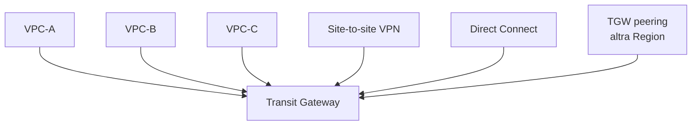
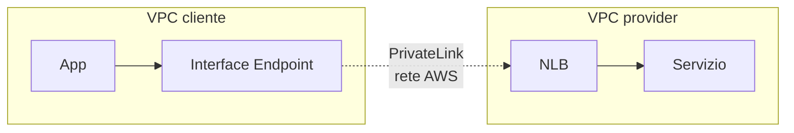

# VPC avanzato

Una volta che hai più di un VPC (o più di un account, o servizi che dovrebbero parlare senza Internet), entri nel regno dei meccanismi di connettività. Ne esistono cinque principali, ciascuno con trade-off di costo, complessità e scalabilità.

## 1. VPC Peering

Connessione 1-a-1 tra due VPC (stesso account, cross-account, cross-Region). Non transitivo (A↔B + B↔C ≠ A↔C). CIDR **non sovrapposti** obbligatori.

```bash
aws ec2 create-vpc-peering-connection \
  --vpc-id vpc-aaa --peer-vpc-id vpc-bbb \
  --peer-region eu-central-1
# poi accettare nel peer
aws ec2 accept-vpc-peering-connection --vpc-peering-connection-id pcx-zzz
# poi aggiornare route table: VPC-B CIDR → pcx-zzz
```

**Costo**: gratis l'oggetto, paghi solo il traffico (intra-Region same-AZ free; cross-AZ $0.01/GB; cross-Region $0.02/GB).

**Quando**: 2 VPC che parlano spesso, no need per scala multi-VPC. Sopra i 5–10 VPC, peering esplode (mesh O(N²)).

## 2. Transit Gateway (TGW)

Hub centrale: ogni VPC si attacca al TGW e routes attraverso esso. Scala fino a migliaia di VPC, supporta VPN/Direct Connect, peering inter-Region.



**Costo**: ~$0.05/h per ogni VPC attachment (~$36/mese a VPC) + $0.02/GB processato. Su 10 VPC sono ~$360/mese fissi.

**Quando**: ≥ 3-5 VPC, scenari hybrid (VPN/DX), multi-account con RAM-sharing. Il pattern standard per medie e grandi org.

## 3. VPC Endpoints — Gateway

Servizio gratuito, *solo per S3 e DynamoDB*. Aggiunge una route nella tua route table verso una **prefix list** del servizio. Il traffico va al servizio senza uscire dalla rete AWS, **senza NAT**.

```bash
aws ec2 create-vpc-endpoint \
  --vpc-id vpc-xxx \
  --service-name com.amazonaws.eu-west-1.s3 \
  --route-table-ids rtb-private-a rtb-private-b
```

**Quando**: SEMPRE per S3 e DynamoDB se hai NAT. Risparmi soldi su NAT processing.

## 4. VPC Endpoints — Interface (powered by PrivateLink)

ENI con IP privato dentro la tua subnet, che fa da "proxy" al servizio AWS (es. SSM, ECR, Secrets Manager, CloudWatch Logs). Costo: ~$0.01/h per AZ per endpoint + $0.01/GB. Non gratis.

**Quando**: workload in subnet completamente private (no NAT) che devono parlare con servizi AWS.

```bash
aws ec2 create-vpc-endpoint \
  --vpc-type Interface \
  --vpc-id vpc-xxx \
  --service-name com.amazonaws.eu-west-1.secretsmanager \
  --subnet-ids subnet-priv-a subnet-priv-b \
  --security-group-ids sg-endpoint
```

## 5. PrivateLink — pubblicare il tuo servizio

Hai una API privata in un VPC. Vuoi che altri VPC (anche di altri clienti) la consumino senza attraversare Internet. Crei un **VPC Endpoint Service** dietro un NLB. I consumatori creano un Interface Endpoint che si connette al tuo NLB attraverso la rete AWS.

**Use case real**: Snowflake, Datadog, Atlassian. Tu compri il loro servizio e ti danno un endpoint PrivateLink — il traffico non passa mai dall'Internet pubblica.



## 6. Egress-only IGW (IPv6)

Equivalente del NAT Gateway per IPv6: consente egress IPv6 mantenendo bloccato l'ingress. Gratis. Solo IPv6.

## 7. Reachability Analyzer

Servizio diagnostico che simula il percorso di un pacchetto e ti dice **perché** non arriva. Salva ore di "perché non risponde questa porta?".

```bash
aws ec2 create-network-insights-path \
  --source eni-aaa --destination eni-bbb \
  --protocol tcp --destination-port 5432
aws ec2 start-network-insights-analysis \
  --network-insights-path-id nip-xxx
```

Restituisce il path step-by-step o l'esatto SG/NACL/route table che blocca.

## 8. Esercizio

<details>
<summary>5 account workload + 1 account network condiviso. Architettura?</summary>

**Hub-and-spoke** classico:
- Account network ha 1 Transit Gateway, condiviso via **RAM** all'OU workload.
- Ogni account workload ha la sua VPC, attaccata al TGW shared.
- TGW route table: traffico inter-workload bloccato per default; consenti solo ciò che serve.
- Site-to-site VPN e Direct Connect terminati sul TGW shared.
- VPC Gateway Endpoint per S3/DynamoDB in ogni VPC.
- Centralized egress: 1 sola VPC con NAT Gateway, le altre VPC fanno egress via TGW → VPC egress → NAT (riduce NAT cost, ma aggiunge $0.02/GB di TGW data).

Trade-off: TGW costs ~$36/VPC/mese fissi + traffic. Per <3 VPC, peering è più economico.
</details>

<details>
<summary>App in subnet privata chiama Secrets Manager. Timeout. Cosa controllare?</summary>

1. **Route table** della subnet privata: ha route a NAT? O VPC Interface Endpoint per Secrets Manager?
2. Se Interface Endpoint: SG dell'endpoint consente porta 443 dalla SG dell'app.
3. **DNS resolution**: l'endpoint privato richiede `enableDnsHostnames=true` su VPC altrimenti il client risolve l'endpoint pubblico.
4. **Reachability Analyzer** tra ENI app e ENI endpoint per pinpoint.
5. Verifica IAM: la EC2 role ha `secretsmanager:GetSecretValue` sul segreto specifico.
</details>

> **Riassunto**: Peering 1-a-1 free ma esplode mesh; TGW hub centrale con costo fisso ma scalabile; VPC Gateway Endpoint (S3/DynamoDB) free e da usare sempre; Interface Endpoint per altri servizi AWS in subnet private; PrivateLink per pubblicare/consumare servizi private; Reachability Analyzer per debug.
