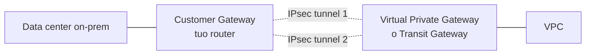
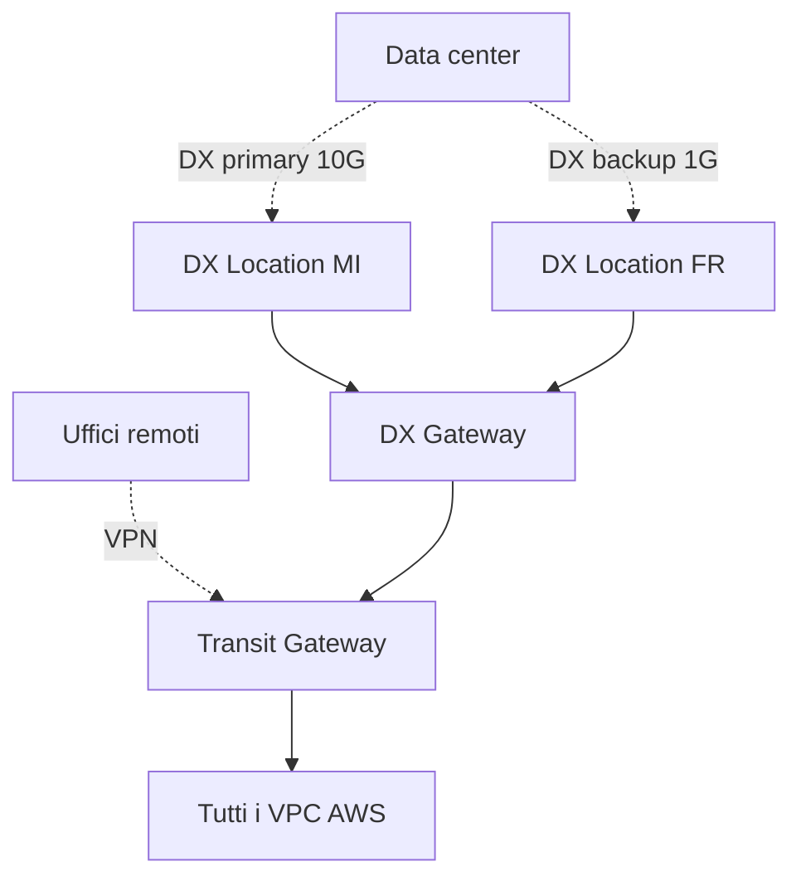

# Hybrid: VPN, Direct Connect, PrivateLink

Il cloud puro è un'eccezione: la maggior parte delle aziende ha data center, uffici, fabbriche, store, e li deve connettere ad AWS. AWS offre tre meccanismi principali (VPN, DX, PrivateLink) che si combinano per costruire **hybrid cloud** robusto.

## 1. Site-to-Site VPN

Tunnel IPsec sopra Internet. Veloce da configurare (minuti), pagato per ora ($0.05/h ≈ $36/mese) + traffic.

- 2 tunnel HA per default (uno per AZ AWS).
- Banda fino a ~1.25 Gbps per tunnel.
- BGP dinamico raccomandato (annunci automatici delle subnet, failover automatico).

**Limiti**: latency variabile (è Internet), troughput non garantito, non SLA stretto. OK per workload non-critical o come backup DX.

## 2. Direct Connect (DX)

Fibra dedicata da una partner location (es. Equinix MI3 Milano, Frankfurt Interxion) verso una **DX location** AWS. Connessione fisica privata, latenza stabile, fino a 100 Gbps.

Tre setup possibili:

| Tipo | Banda | Quando |
|---|---|---|
| **Dedicated** | 1/10/100 Gbps fisica | grande consumo |
| **Hosted** (via partner) | 50 Mbps – 25 Gbps logico | piccoli/medi |
| **Public VIF** | accesso a servizi AWS pubblici (S3, DynamoDB) via DX | bypass Internet per egress massivo |
| **Private VIF** | accesso al tuo VPC (via VGW o DX Gateway/TGW) | il caso comune |

**Costi**: ~$0.30/h per porta 1 Gbps dedicata (~$220/mese) + traffic via DX (~$0.02/GB egress, molto meno di Internet $0.09).

**HA pattern**: 2 connessioni DX in 2 DX location diverse + VPN come backup ulteriore. Single point of failure DX è la mancata ridondanza.

## 3. VPN over DX

Tunnel IPsec costruito *sopra* la fibra DX. Vantaggi:

- **Encryption** end-to-end (DX non è criptato di default).
- Fail over più rapido tra link.

Standard per workload regulated (banking, healthcare).

## 4. Direct Connect Gateway

Un DX Gateway è un hub virtuale che connette **una DX connection a VPC in Region diverse**. Senza DXGW, una connessione DX vede solo VPC nella sua Region. Con DXGW, vede tutto il mondo (con limiti).

## 5. Hybrid DNS con Route 53 Resolver

Tre scenari tipici:

- **Resolver Inbound endpoint**: on-prem può fare query DNS verso il VPC AWS (risolvere `db.internal.acme.aws`).
- **Resolver Outbound endpoint + rules**: VPC può inoltrare query per `corp.acme.com` verso il DNS on-prem.
- **Conditional forwarding** tra i due.

Permette name resolution **bidirezionale** senza esporre nulla pubblicamente.

## 6. Pattern hybrid completo

## 7. PrivateLink hybrid

PrivateLink (sezione 10) può essere consumato anche da on-prem **se passi attraverso DX o VPN**. Es: i tuoi server on-prem chiamano Snowflake via PrivateLink endpoint dentro AWS — il traffico va on-prem → DX → AWS → endpoint → Snowflake, mai dall'Internet pubblica.

## 8. Esercizio

3 data center on-prem in EU. Devi avere HA + criptazione + low latency verso AWS. Setup?

- **2 DX connessioni** verso DX location diverse (Milano + Frankfurt) per ridondanza geografica.
- **VPN over DX** su entrambe per criptazione.
- **VPN su Internet** come 3° backup (low cost, attivato in failover totale DX).
- **Transit Gateway** in AWS come hub: ogni DX + VPN si attacca a TGW.
- BGP per failover automatico (DX primary, DX secondary, VPN backup) basato su AS-PATH prepending.
- **Route 53 Resolver** inbound/outbound per nome.

Latenza on-prem ↔ VPC AWS è 200 ms su Internet, 8 ms su DX. Perché?

- **Internet VPN**: traffico passa per multiple ISP, tunneling IPsec encapsulation overhead, congestione public Internet.
- **DX**: fibra dedicata privata da partner location ad AWS Region, distanza fisica diretta. La latenza è essenzialmente $\sim \frac{d}{c \cdot 0.66}$ (velocità della luce in fibra). 1000 km ≈ 5 ms RTT.

Per workload database o RPC chiacchierone (es. centinaia di query per richiesta utente), 200 ms vs 8 ms è la differenza tra "inusabile" e "trasparente".

> **Riassunto**: VPN per partire veloce e backup; DX per banda alta, latenza stabile, costi inferiori a Internet egress su volumi grandi; VPN over DX per encryption; DX Gateway o TGW per scalare a multi-Region/multi-VPC; Route 53 Resolver per name resolution bidirezionale hybrid; PrivateLink consumabile anche da on-prem via DX/VPN.
