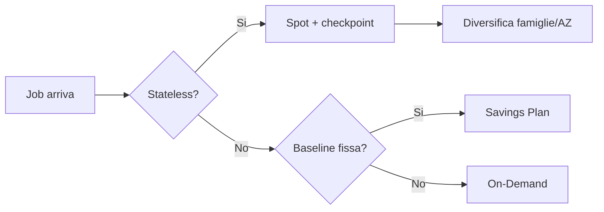

# EC2 avanzato

Dopo aver visto i fondamenti, qui entriamo nei dettagli che fanno la differenza in produzione: come **pagare meno** (Spot, RI, SP), come **collocare** le istanze (placement groups), cosa offre la generazione **Nitro** e come **proteggere** i metadati.

## 1. Modelli di acquisto

| Modello | Sconto vs On-Demand | Commitment | Quando |
|---|---|---|---|
| **On-Demand** | 0% | nessuno | dev, traffico imprevedibile |
| **Spot** | fino al 90% | nessuno, ma interruzione possibile | batch, CI, stateless, big data |
| **Reserved (Standard)** | ~40-72% | 1 o 3 anni, tipo fisso | baseline costante, server long-lived |
| **Compute Savings Plan** | ~54-66% | 1 o 3 anni, $/h committed | flessibile (anche Fargate/Lambda!) |
| **EC2 Instance Savings Plan** | ~72% | 1/3 anni, famiglia+region fissa | baseline noto, vuoi più sconto |
| **Dedicated Host** | premium | a host | licensing BYOL (Oracle, Windows core-based) |

Regola pratica 2026: **Compute Savings Plan** per la baseline (copre EC2 di qualsiasi famiglia + Fargate + Lambda) + **Spot** per il workload elastico. Reserved Instance è quasi sempre subottimale rispetto a SP.

## 2. Spot Instances

AWS vende la capacità inutilizzata a sconto enorme, riprendendosela quando le serve. Avviso di interruzione: **2 minuti** via instance metadata.

```bash
# Recupera notifica interruzione dal metadata service (IMDSv2)
TOKEN=$(curl -s -X PUT "http://169.254.169.254/latest/api/token" \
  -H "X-aws-ec2-metadata-token-ttl-seconds: 21600")
curl -s -H "X-aws-ec2-metadata-token: $TOKEN" \
  http://169.254.169.254/latest/meta-data/spot/instance-action
```

Strategie di allocazione (per Spot Fleet / ASG):
- `price-capacity-optimized` — **default consigliato**: bilancia prezzo e probabilità di interruzione.
- `capacity-optimized`: minimizza interruzioni (workload long-running).
- `lowest-price`: massimo sconto, più interruzioni.



Calcolo risparmio Spot: $\text{saving} = (1 - p_{spot}/p_{ondemand}) \cdot \text{ore}$. Con Spot a $0.012/h vs On-Demand $0.12/h ottieni $90\%$ di sconto.

## 3. Placement Groups

Controllano dove AWS mette fisicamente le tue istanze.

| Tipo | Layout | Use case |
|---|---|---|
| **Cluster** | stesso rack, stessa AZ, network 10/100 Gbps low-latency | HPC, MPI |
| **Spread** | host fisici diversi (max 7 per AZ) | DB critici, alta disponibilità |
| **Partition** | gruppi di rack separati (fino a 7 partizioni/AZ) | HDFS, Cassandra, Kafka |

```bash
aws ec2 create-placement-group --group-name my-hpc --strategy cluster
aws ec2 run-instances --placement GroupName=my-hpc --instance-type c7i.16xlarge ...
```

## 4. Nitro hypervisor

Da circa il 2018, la maggior parte delle famiglie nuove (m5/c5/r5 e successive, tutte le 6/7) gira su **Nitro**: hypervisor leggero basato su KVM + chip dedicati Nitro per network, storage e security.

Vantaggi:
- **NVMe nativo** per EBS (latenza più bassa, IOPS più alti).
- **ENI multipli** ad alta banda (fino a 15 ENI, 100+ Gbps su istanze grosse).
- **Enhanced networking** (SR-IOV) sempre attivo.
- **Nitro Enclaves**: TEE isolate per workload sensibili (chiavi, KYC).
- Baseline di sicurezza migliore: niente accesso del provider all'OS guest.

## 5. Hibernation

Salva la RAM su un volume EBS criptato e spegne. Al restart riprende dall'esatto stato precedente.

Requisiti: AMI supportata, EBS root cifrato, RAM <= 150 GB, abilitato a launch time.

```bash
aws ec2 run-instances ... --hibernation-options Configured=true \
  --block-device-mappings '[{"DeviceName":"/dev/xvda","Ebs":{"Encrypted":true,"VolumeSize":50}}]'
```

Quando ha senso: workload che richiedono molti minuti per warmup (cache in-memory grande, JVM warmed up) e che vuoi scalare a zero la notte.

## 6. Dedicated Hosts vs Dedicated Instances

- **Dedicated Instance**: hardware non condiviso con altri account, ma AWS lo gestisce.
- **Dedicated Host**: hai visibilità del fisico (socket, core), necessario per **BYOL** di Windows Server, Oracle, SQL Server "core-based".

Costa di più, sceglilo solo per esigenze di licensing o compliance.

## 7. IMDSv2 (obbligatorio)

L'Instance Metadata Service è l'endpoint `169.254.169.254` che espone metadati e **credenziali del ruolo IAM**. IMDSv1 era vulnerabile a SSRF (Capital One 2019). IMDSv2 richiede session token via PUT.

```bash
# Forza IMDSv2 only su un'istanza esistente
aws ec2 modify-instance-metadata-options \
  --instance-id i-xxx \
  --http-tokens required \
  --http-put-response-hop-limit 1
```

Best practice: `http-tokens=required`, `hop-limit=1` (impedisce ai container di accedere all'IMDS del host), e auditing con SSM Inventory.

## 8. Esercizio

<details>
<summary>Hai un job batch di rendering video che gira 6h al giorno, costa 2k$/mese On-Demand. Come ottimizzi?</summary>

Pipeline ideale:
1. Job stateless + checkpoint su S3 → **Spot**: ~90% di sconto, porta i costi a ~200$/mese.
2. Strategia `price-capacity-optimized`, diversifica 3-4 famiglie compatibili (c7i, c6i, m7i) e tutte le AZ.
3. Gestisci l'interruzione: hook a 2 min per salvare il chunk corrente, ASG con `capacity-rebalance` lancia rimpiazzo prima dell'interruzione.

Bonus: usa **EC2 Fleet** o **AWS Batch** (vedi sezione 18) per gestire automaticamente l'allocazione.
</details>

<details>
<summary>Cluster Kafka 3 nodi: che placement group?</summary>

**Partition placement group** con 3 partizioni: ogni broker su una partition diversa, separazione fisica del rack. Se un rack/switch muore, perdi al massimo un broker, e Kafka tiene il quorum (RF=3). Cluster placement sarebbe sbagliato (tutto sullo stesso rack = single point of failure).
</details>

> **Riassunto**: Spot per sconto fino al 90% su workload stateless; Compute Savings Plan per la baseline; placement groups (cluster/spread/partition) per controllo del topology; Nitro = standard moderno (NVMe, ENI multipli, enclaves); hibernation per warmup pesanti; IMDSv2 obbligatorio per evitare SSRF.
