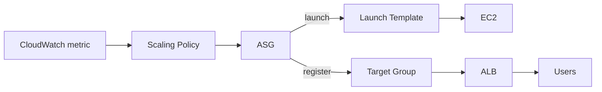
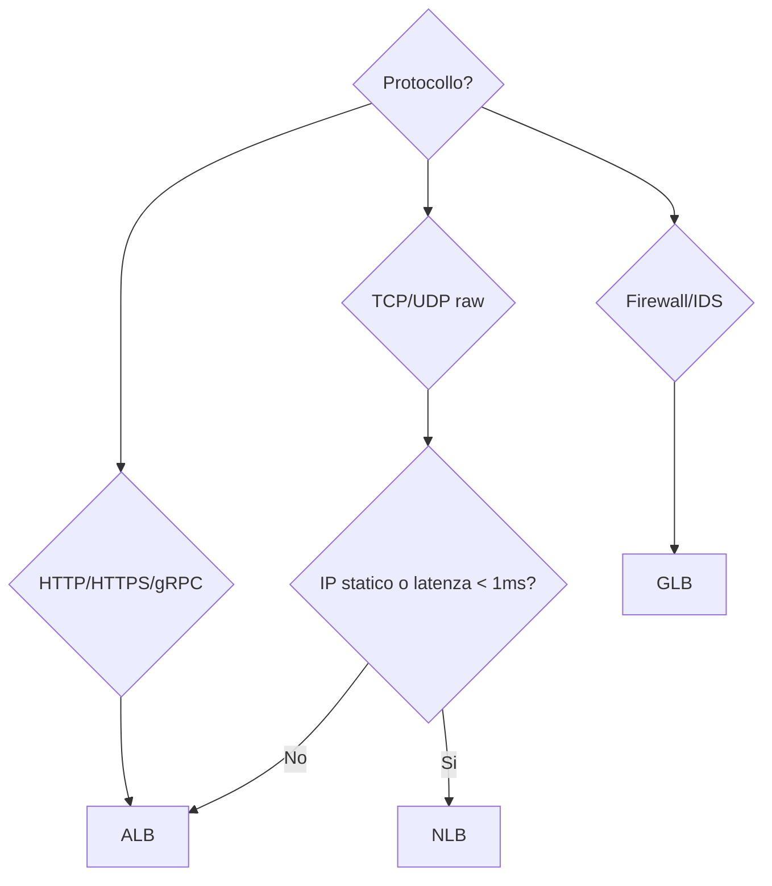

# Auto Scaling Groups + ELB

ASG e ELB sono il duo che rende EC2 "elastico": ELB distribuisce il traffico, ASG aggiunge/rimuove istanze in base al carico. Senza queste due, EC2 è solo un'altra VM in cloud.

## 1. Launch Template

Il "blueprint" delle istanze (AMI, tipo, SG, user-data, IAM role). Sostituisce la vecchia Launch Configuration. Supporta versioning e mix di tipi (multiple instance types + Spot + On-Demand mix).

```bash
aws ec2 create-launch-template \
  --launch-template-name web-tpl \
  --version-description v1 \
  --launch-template-data '{
    "ImageId": "ami-0abcd",
    "InstanceType": "t3.small",
    "SecurityGroupIds": ["sg-xxx"],
    "IamInstanceProfile": {"Name": "web-role"},
    "UserData": "'"$(base64 -w0 bootstrap.sh)"'"
  }'
```

## 2. Auto Scaling Group

Definisce **dove** (subnet/AZ), **quanti** (min/max/desired), **come** (launch template), **cosa monitorare** (health check) e **quando** scalare.



Parametri chiave:

| Campo | Significato |
|---|---|
| `min/max/desired` | bound del numero istanze |
| `health-check-type` | `EC2` (status check) o `ELB` (più affidabile) |
| `health-check-grace-period` | secondi prima di considerare health (default 300) |
| `termination-policies` | `OldestInstance`, `NewestInstance`, `Default`, `AllocationStrategy` |
| `lifecycle-hooks` | pausa launch/terminate per setup/teardown custom |
| `warm-pool` | istanze pre-inizializzate in stato Stopped, ridotto cold start |

### Policy di scaling

| Policy | Trigger | Quando |
|---|---|---|
| **Target tracking** | mantiene metrica al target (es. CPU 50%) | default, 80% dei casi |
| **Step scaling** | aggiunge N istanze se metrica in range | scaling non-lineare |
| **Scheduled** | cron-based (es. +10 ogni lunedì 9:00) | pattern noti |
| **Predictive** | ML su pattern storici | traffico stagionale chiaro |

Formula target tracking: il controller calcola $n_{new} = n_{current} \cdot \frac{m_{current}}{m_{target}}$ con dead-band per evitare flapping.

## 3. ALB — Application Load Balancer

Layer 7 (HTTP/HTTPS/gRPC). Routing intelligente.

| Feature | Dettaglio |
|---|---|
| Listener rules | path-based (`/api/*` -> TG-api), host-based (`api.example.com`), header, query |
| SNI | certificati multipli sullo stesso listener 443 |
| Target groups | EC2/IP/Lambda/ECS |
| Health check | HTTP path + status code expected |
| Sticky sessions | cookie `AWSALB` (load balancer-generated) o app-managed |
| Authentication | OIDC/Cognito integrato (no codice in app) |
| WAF | integrazione nativa per OWASP rules |

```bash
aws elbv2 create-load-balancer --name web-alb --type application \
  --subnets subnet-a subnet-b --security-groups sg-alb

aws elbv2 create-target-group --name web-tg --protocol HTTP --port 80 \
  --vpc-id vpc-xxx --health-check-path /healthz --target-type instance
```

## 4. NLB — Network Load Balancer

Layer 4 (TCP/UDP/TLS). Latenza ultra-bassa (<100ms p99), milioni di RPS, **IP statico per AZ** (utile per whitelisting client).

Caratteristiche:
- Preserva l'**IP client** (no X-Forwarded-For necessario).
- Target type `ip` per puntare a IP on-prem (con DX/VPN).
- TLS termination opzionale (altrimenti pass-through).
- Cross-zone load balancing **disabilitato di default** (evita egress charges, ma può causare hot-spot).

## 5. GLB — Gateway Load Balancer

Layer 3. Pensato per inserire **firewall di terze parti** (Palo Alto, Fortinet) o IDS/IPS in-line con traffico tramite GENEVE encapsulation. Non lo usi per app web normali; serve per architetture security-centric.

## 6. Quando usare quale



| Use case | LB |
|---|---|
| Web app pubblica | ALB |
| API gRPC | ALB (supporta gRPC) |
| Game server UDP | NLB |
| MQTT/IoT volume alto | NLB |
| Whitelist IP client | NLB |
| Inspection traffico via appliance | GLB |
| WebSocket | ALB (ok) o NLB |

## 7. Health checks, sticky e cross-zone

- **Health checks**: usa endpoint dedicato (`/healthz`) che verifica solo le dipendenze critiche, NON l'intera app (evita cascading failure).
- **Sticky sessions**: solo se l'app richiede affinità (stato in-memory non condiviso). Meglio: stato esterno (ElastiCache, DynamoDB).
- **Cross-zone**: ALB sempre on (gratis). NLB off di default — abilitalo per bilanciamento perfetto ma occhio al data transfer inter-AZ.

## 8. Esercizio

<details>
<summary>Web app a 3 layer dietro ALB; quando aggiungere Cognito vs WAF vs sticky?</summary>

- **WAF**: sempre, per protezione OWASP top 10, bot mitigation, rate limit per IP. Integrazione one-click su ALB.
- **Cognito**: se vuoi gestire auth utente senza scrivere codice di login. ALB redirige a Cognito Hosted UI; se utente autenticato, passa header `x-amzn-oidc-data` (JWT firmato).
- **Sticky**: solo se l'app è stateful (sessioni in-memory). Soluzione corretta è esternalizzare la sessione in Redis/ElastiCache, così ogni istanza serve qualsiasi richiesta.
</details>

<details>
<summary>ASG con 10 istanze, scaling target tracking su CPU 50%, ma si vede "flapping". Cause?</summary>

Possibili cause:
1. **Health-check-grace-period** troppo basso (l'istanza non finisce il boot in tempo).
2. Metrica CPU oscilla per via di **GC pause** (JVM) o cron jobs → meglio una metrica composta (RequestCount + CPU).
3. **Cooldown** breve: ogni scale-out triggera un altro check immediato. Usa `default-cooldown` 300-600s.
4. Tipo di istanza piccolo, troppo sensibile a singole request pesanti → istanze più grosse riducono variance.
5. Aggiungi **warm pool** per ridurre il tempo da "launching" a "in service".
</details>

> **Riassunto**: Launch Template + ASG (min/max/desired, lifecycle hooks, scaling policy target tracking, warm pool) per elasticità; ALB = layer 7 default per web/API/gRPC; NLB = layer 4 per latenza/IP statico/UDP; GLB per inserire appliance security; health-check su endpoint dedicato; sticky solo se necessario; cross-zone trade-off costo vs bilanciamento.
