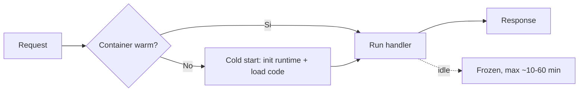

# Lambda deep dive

Lambda è il "compute serverless" di AWS: scrivi una funzione, AWS si occupa di scalarla, eseguirla in containers effimeri e pagare al millisecondo. Qui vediamo il *sotto-il-cofano* che fa la differenza tra una Lambda lenta e una che vola.

## 1. Modello di esecuzione

Ogni invocazione esegue un **handler** (entry point) all'interno di un **runtime** (Node.js, Python, Java, .NET, Go, Ruby o custom OCI). L'**execution context** (container) viene **riusato** tra invocazioni della stessa funzione concorrente: variabili globali, connessioni DB e SDK clients sopravvivono.

```python
# Best practice: inizializza fuori dall'handler
import boto3
s3 = boto3.client("s3")  # reused tra invocazioni (warm)

def handler(event, context):
    return s3.list_buckets()
```



## 2. Cold start

Quando non c'è un container caldo disponibile, AWS deve crearne uno. Tempi tipici:

| Runtime | Cold start tipico |
|---|---|
| Python/Node leggeri | 100-300 ms |
| Java/.NET | 500-3000 ms |
| Java + Spring Boot | 3-10 s |
| Container image | 200-1500 ms |
| Funzione in VPC (post hyperplane) | +50-150 ms |

Mitigazioni:
- **Provisioned Concurrency (PC)**: tieni N container caldi h24, $/h fisso. Ideale per app web con SLA stretto.
- **SnapStart** (Java/Python/.NET): AWS fa snapshot della JVM/runtime già inizializzata, restore < 200 ms. Gratis.
- **Lambda SnapStart + priming**: inizializza connessioni DB nel `beforeCheckpoint` hook.
- Mantieni il package piccolo, evita dipendenze pesanti.
- Container image: cache layer di base + bootstrap rapido.

## 3. Configurazione

| Limite | Valore (2026) |
|---|---|
| Memoria | 128 - 10 240 MB (in step di 1 MB) |
| Durata max | 15 minuti |
| Package size (zip) | 50 MB diretto / 250 MB unzipped |
| Container image | 10 GB |
| Layers | 5 per funzione, 250 MB totali |
| `/tmp` | 512 MB - 10 240 MB (configurabile) |
| Env vars | 4 KB totali, criptate con KMS |
| Payload sync | 6 MB |
| Payload async | 256 KB |

CPU scala linearmente con la memoria: a 1769 MB hai 1 vCPU pieno; a 10 240 MB hai ~6 vCPU.

```bash
aws lambda update-function-configuration \
  --function-name my-fn \
  --memory-size 1024 \
  --timeout 30 \
  --environment 'Variables={DB_URL=...}' \
  --kms-key-arn arn:aws:kms:...:key/abcd
```

Trucco di costo: spesso **aumentare la memoria riduce il costo** perché la funzione finisce molto prima (più CPU). Usa **Lambda Power Tuning** per trovare il sweet spot.

## 4. Pricing

$$\text{cost} = N_{request} \cdot 0.20/10^6 + \text{GB-sec} \cdot 0.0000166667$$

Con $N$ request al mese e durata $t$ ms a $m$ MB: $\text{GB-sec} = N \cdot t/1000 \cdot m/1024$.

Esempio: 10M req, 200 ms, 512 MB → ~$2 di request + ~$17 di compute = $19/mese.

## 5. Trigger e pattern

| Tipo | Trigger | Behavior errore |
|---|---|---|
| **Sync** | API Gateway, ALB, Function URL, SDK invoke | errore torna al client |
| **Async** | S3 event, SNS, EventBridge | retry x2 + DLQ/destination |
| **Poll-based** | SQS, Kinesis, DynamoDB Streams, MSK, MQ | Lambda fa polling; errore = batch rifatto |

Per async/poll: configura **Dead Letter Queue** (SQS/SNS) o, meglio, **Destinations** (success+failure verso SQS/SNS/EventBridge/Lambda).

```bash
aws lambda put-function-event-invoke-config \
  --function-name my-fn \
  --destination-config '{
    "OnFailure": {"Destination": "arn:aws:sqs:eu-west-1:123:dlq"},
    "OnSuccess": {"Destination": "arn:aws:events:eu-west-1:123:event-bus/main"}
  }'
```

## 6. VPC, layers, container

**VPC**: serve solo se devi raggiungere risorse private (RDS, ElastiCache). Dal 2019 AWS usa **Hyperplane ENI** condivise, eliminando i 10s di cold start storico. Comunque costa ~50-150 ms in più.

**Layers**: pacchetti riutilizzabili (es. SDK custom, deps Python). Versionati, max 5 per funzione.

**Container image**: deploy un OCI image fino a 10 GB. Utile per ML model heavy o quando lo zip non basta. Usa la **base AWS Lambda image** (include Runtime Interface Client).

```dockerfile
FROM public.ecr.aws/lambda/python:3.12
COPY requirements.txt .
RUN pip install -r requirements.txt
COPY app.py ${LAMBDA_TASK_ROOT}
CMD ["app.handler"]
```

## 7. Function URL vs API Gateway vs Lambda@Edge

| Feature | Function URL | API Gateway REST | API Gateway HTTP | Lambda@Edge |
|---|---|---|---|---|
| Costo | gratis | $$ | $ | $$ |
| Auth | IAM o public | IAM, Cognito, custom auth | JWT, IAM | nessuna nativa |
| WAF | no (metti CF davanti) | si | si | tramite CF |
| Throttle/quota | no | si granulare | si | no |
| Latenza globale | regionale | regionale | regionale | edge globale |

Lambda@Edge gira su CloudFront edges (più di 600 location), runtime Node/Python, no env vars custom, payload 1 MB. Use case: A/B testing, URL rewrite, edge auth.

## 8. Esercizio

<details>
<summary>Lambda Python con cold start 4 secondi: cause e fix?</summary>

Cause comuni:
1. **Pacchetto enorme** (es. `pandas + scikit-learn` = 200 MB). Spostali in layer o, meglio, container image.
2. **Imports pesanti** a livello modulo. Lazy-load: importa dentro l'handler se serve solo in alcuni casi.
3. **VPC config** che usa subnet senza NAT/endpoint giusti (timeout DNS).
4. **Connessioni DB** ricostruite ogni cold start. Inizializzale fuori dall'handler (riuso warm).

Fix:
- Aumenta memoria a 1024+ MB → più CPU → init più rapido.
- Provisioned Concurrency su 2-5 unità nelle ore di picco.
- Per Java: SnapStart (gratis, 10x miglioramento).
</details>

<details>
<summary>Lambda triggerata da S3 ObjectCreated, vuoi garantire processing exactly-once. Come?</summary>

Lambda async ha retry automatico → posso avere duplicati. Soluzioni:
- **Idempotency key**: usa `bucket+key+etag` come ID; salva su DynamoDB con condition `attribute_not_exists`.
- Powertools for AWS Lambda (Python/Node/Java) ha decorator `@idempotent` che fa esattamente questo.
- DLQ/Destinations su failure per non perdere eventi dopo i 2 retry.
</details>

> **Riassunto**: Lambda = compute event-driven, paghi per ms · GB; container warm riusato (init fuori dall'handler); cold start mitigato con Provisioned Concurrency o SnapStart; max 15 min / 10 GB RAM / 10 GB image; trigger sync/async/poll con DLQ+Destinations; aumentare memoria spesso costa meno (CPU lineare); Function URL per casi semplici, API GW HTTP per API moderne, Lambda@Edge per edge logic.
