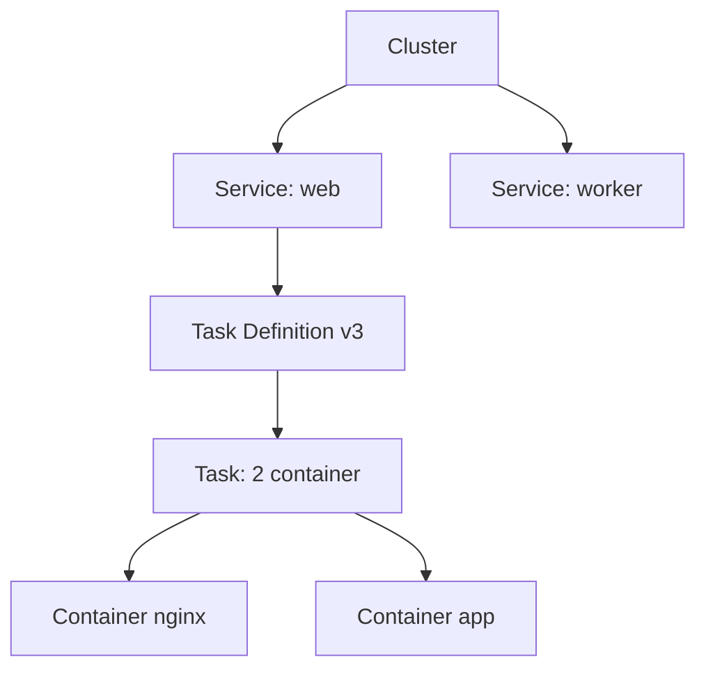
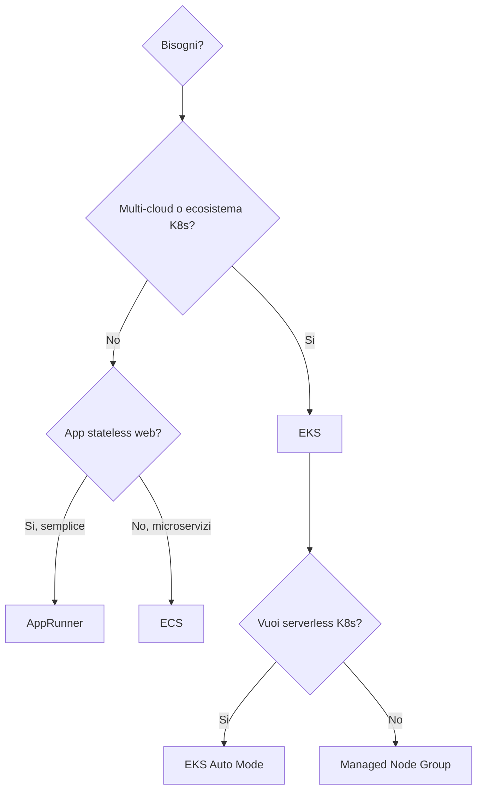

# Containers su AWS

AWS ha 3 modi principali per girare container: **ECS** (orchestrator AWS-native), **EKS** (Kubernetes managed) e **Fargate** (compute serverless usato da entrambi). Aggiungiamo **ECR** come registry e **App Runner** come opzione "ancora più managed".

## 1. ECR — Elastic Container Registry

Registry privato OCI/Docker. Integrato con IAM (niente Docker login con password long-lived).

| Feature | Note |
|---|---|
| Lifecycle policy | elimina tag vecchi (es. tieni ultime 10) |
| Image scanning | Basic (gratis, OS) o Enhanced (Inspector, OS + libs) |
| Replication | cross-region o cross-account auto |
| Pull-through cache | proxy a Docker Hub / Quay / GitHub |
| Signing | sigstore/cosign integration |

```bash
aws ecr get-login-password --region eu-west-1 | \
  docker login --username AWS --password-stdin 123.dkr.ecr.eu-west-1.amazonaws.com

docker build -t my-app .
docker tag my-app:latest 123.dkr.ecr.eu-west-1.amazonaws.com/my-app:v1
docker push 123.dkr.ecr.eu-west-1.amazonaws.com/my-app:v1
```

## 2. ECS — Elastic Container Service

Orchestrator proprietario AWS, semplice e profondamente integrato.

Gerarchia:



- **Cluster**: gruppo logico.
- **Task Definition**: JSON con immagine, CPU, RAM, env, IAM role, network mode.
- **Service**: mantiene N task running, integra con ALB/Service Discovery, gestisce rolling/blue-green deploy.

Launch type:

| Tipo | Gestione | Quando |
|---|---|---|
| **EC2** | tu gestisci i nodi | controllo fine, GPU, Spot custom |
| **Fargate** | serverless | default 2026 per la maggior parte |
| **External (ECS Anywhere)** | nodi on-prem | hybrid edge |

Network mode:
- `awsvpc` (default Fargate): ogni task ha la sua ENI e IP.
- `bridge` (EC2 only): Docker bridge classico.
- `host`: condivide la rete dell'host.

## 3. EKS — Elastic Kubernetes Service

Kubernetes upstream-compliant, control plane gestito da AWS ($0.10/h per cluster). Tu (o EKS) gestisci i worker.

Opzioni di compute:

| Tipo | Descrizione |
|---|---|
| **Managed Node Group** | EC2 gestiti da EKS (auto-upgrade, ASG sotto) |
| **Self-managed nodes** | tu gestisci tutto |
| **Fargate profile** | pod su Fargate, no node |
| **EKS Auto Mode** (2024+) | AWS gestisce nodi+addons+upgrade end-to-end |

**EKS Auto Mode** è la novità importante: dichiari il cluster, AWS prende le decisioni di node provisioning (Karpenter sotto), addons (CoreDNS, kube-proxy, CNI, EBS CSI), patching. Avvicina EKS al modello GKE Autopilot.

**IRSA (IAM Roles for Service Accounts)**: lega un ServiceAccount K8s a un ruolo IAM via OIDC. Niente più credenziali condivise sul nodo.

```bash
eksctl create cluster --name prod --region eu-west-1 --version 1.30 \
  --nodegroup-name mng-1 --node-type m7g.large --nodes 3

# IRSA: lega ServiceAccount a IAM
eksctl create iamserviceaccount --cluster prod --namespace app \
  --name s3-reader --attach-policy-arn arn:aws:iam::aws:policy/AmazonS3ReadOnlyAccess \
  --approve
```

## 4. Fargate

Compute serverless per container. Niente EC2 da patchare. Paghi per vCPU + RAM al secondo (con minimo 1 minuto).

Caratteristiche:
- Isolamento per task (microVM Firecracker).
- Niente daemonset privilegiati possibili (su EKS limita certe operazioni).
- Cold start tipico 30-60 s (più lento di Lambda).
- Compatibile con Spot (Fargate Spot, ~70% sconto).
- Limiti: 16 vCPU, 120 GB RAM, ephemeral storage configurabile fino 200 GB.

## 5. App Runner

PaaS per container web. Punti a un'immagine ECR (o repo GitHub) e App Runner deploya, scala, gestisce TLS. Vicino a Cloud Run.

Quando: web service stateless senza voglia di gestire ALB+ASG+ECS. Limite: meno controllo (no sidecar, no VPC ingress complesso).

## 6. ECS vs EKS — scelta

| Criterio | ECS | EKS |
|---|---|---|
| Curva apprendimento | bassa | alta |
| Portabilità multi-cloud | bassa | alta (k8s standard) |
| Ecosistema (Helm, operators, etc.) | limitato | ricco |
| Costo control plane | gratis | $73/mese per cluster |
| Velocità di deploy iniziale | minuti | ore-giorni |
| Skill team | "so AWS" | "so K8s" |

Regola: se non hai un motivo forte per K8s (multi-cloud, team che già lo conosce, ecosistema Helm) → **ECS+Fargate**. Altrimenti EKS, e considera Auto Mode per ridurre l'overhead operativo.



## 7. Integrazione: ALB, Service Discovery, Secrets

- **ALB**: target group `ip` (per Fargate) o `instance` (per ECS-EC2 bridge). Su EKS, usa AWS Load Balancer Controller per Ingress.
- **Service Discovery**: ECS Service Connect (preferito) o Cloud Map (DNS A/SRV). Su EKS, kube-dns + headless service.
- **Secrets**: monta da Secrets Manager / Parameter Store via `secrets` field nella task def (ECS) o External Secrets Operator (EKS).
- **Auto-scaling**: Application Auto Scaling per ECS service (target CPU, RequestCountPerTarget); HPA + Karpenter per EKS.

## 8. Esercizio

<details>
<summary>Microservizio Python stateless, devi deployarlo. ECS-Fargate, EKS o App Runner?</summary>

Decisione:
- **1 servizio, niente sidecar, no requisiti K8s** → **App Runner**. Più semplice possibile, ALB+TLS+autoscale incluso.
- **Più microservizi, vuoi ALB shared e service discovery** → **ECS-Fargate**. Setup più ricco ma ancora gestibile, niente K8s da imparare.
- **Team che già usa K8s, Helm charts esistenti, multi-cloud** → **EKS** (Auto Mode se vuoi serverless).

Costo grossolano per 1 servizio sempre on, 0.5 vCPU + 1 GB:
- App Runner: ~$36/mese
- Fargate (sempre on): ~$25/mese
- EKS Fargate: ~$25/mese + $73/mese cluster
</details>

<details>
<summary>EKS, pod deve leggere da S3 bucket. Come configuri permessi senza access key?</summary>

**IRSA** (IAM Roles for Service Accounts):
1. Abilita OIDC provider sul cluster.
2. Crea un ruolo IAM con trust policy che permette al ServiceAccount specifico (`system:serviceaccount:app:s3-reader`) di assumerlo.
3. Annota il ServiceAccount con `eks.amazonaws.com/role-arn`.
4. Il pod che monta quel SA riceve token OIDC, l'SDK AWS lo scambia con credenziali temporanee via STS.

In alternativa, dal 2023 c'è **EKS Pod Identity** (più semplice, niente OIDC manuale, solo agent EKS).
</details>

> **Riassunto**: ECR per registry (con scanning + lifecycle); ECS = AWS-native, semplice, profondo con Fargate; EKS = Kubernetes managed, ricco ma complesso (Auto Mode lo semplifica nel 2024+); Fargate = serverless container per entrambi; App Runner = PaaS per web semplici; IRSA/Pod Identity per permessi senza access key; scegli ECS+Fargate di default, EKS se hai motivi K8s.
