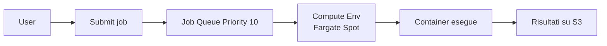
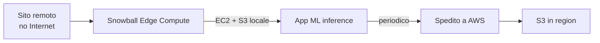

# Specialty compute

Oltre a EC2, Lambda e container ci sono servizi specifici per esigenze particolari: workload batch scientifici, edge computing 5G, hardware on-prem, VPS managed, PaaS classico. Conoscerli evita di "reinventare la ruota" con EC2 da zero.

## 1. AWS Batch

Orchestratore di job batch (HPC, simulazioni, genomica, ML training). Tu definisci i job, AWS gestisce compute provisioning (EC2 o Fargate, Spot incluso), schedulazione e retry.

Componenti:

| Concetto | Descrizione |
|---|---|
| **Compute Environment** | pool di compute (EC2 ASG, Fargate, EKS). Managed o Unmanaged |
| **Job Queue** | coda con priorità, mappata a uno o più CE |
| **Job Definition** | template del job (immagine, vCPU, RAM, retry, env) |
| **Job** | istanza concreta sottomessa alla queue |



```bash
aws batch submit-job --job-name render-001 \
  --job-queue prod-queue \
  --job-definition render:3 \
  --container-overrides '{"environment":[{"name":"CHUNK","value":"42"}]}'
```

Pattern utili:
- **Array job**: lancia N copie con indice (`AWS_BATCH_JOB_ARRAY_INDEX`).
- **Multi-Node Parallel (MNP)**: 1 job che usa N nodi MPI (HPC).
- **Job dependencies**: DAG di dipendenze (`--depends-on`).
- Compute env su Spot + retry strategy con `evaluateOnExit` per gestire interruzioni.

## 2. Lightsail

VPS managed con pricing a fascia fissa (es. $5/mese = 1 vCPU + 2 GB + 60 GB SSD + 2 TB transfer). Pensato per:
- Piccoli siti WordPress / web statici.
- Sviluppatori che non vogliono toccare VPC/IAM/SG.
- Demo, prototipi, side project.

Differenze chiave da EC2:
- UI semplificata, "blueprint" pre-pacchettizzati (LAMP, Node, WordPress).
- Pricing prevedibile (no GB-mese di EBS o GB di egress complicati).
- Limiti: niente integrazione profonda con resto di AWS (puoi fare peering con VPC ma è limitato).

Quando passare a EC2: appena serve auto-scaling, ALB, IAM granulare o integrazioni multi-servizio.

## 3. Outposts

Rack fisici AWS che AWS spedisce e installa nel **tuo data center**. Stessa API di AWS in cloud, gestiti da AWS via control plane in regione.

| Form factor | Descrizione |
|---|---|
| **Outposts 42U rack** | rack pieno, da 5 a 100+ kVA |
| **Outposts servers** | 1U/2U, per piccoli siti (ufficio remoto, edge) |

Use case: latenza single-digit ms verso sistemi locali (factory floor, hospital, broadcast), data residency rigida (dati non devono lasciare la sede), migrazione graduale.

Servizi disponibili sull'Outpost: EC2, EBS, ECS/EKS, RDS, S3 on Outposts. Niente Lambda, niente DynamoDB locali (fanno hop alla region).

## 4. Wavelength e Local Zones

| Servizio | Distanza dal carrier | Use case |
|---|---|---|
| **Wavelength** | dentro la rete 5G (Verizon, KDDI, Vodafone) | gaming mobile, AR/VR, V2X |
| **Local Zones** | metropolitan area (Milano, Boston, etc.) | latenza utente <10 ms, regulatory locale |
| **Outposts** | tuo DC | hybrid on-prem |

Wavelength espone EC2, EBS, ECS dentro la zona del carrier; il traffico dal device 5G non esce mai dalla rete del carrier verso Internet.

## 5. Snow family per edge compute

Non solo trasporto dati: i dispositivi Snow possono **eseguire EC2/Lambda** offline.

| Device | Storage | Compute | Use case |
|---|---|---|---|
| **Snowcone** | 8/14 TB | 4 vCPU 4 GB | edge militare, droni, mobile lab |
| **Snowball Edge Storage** | ~80 TB | leggero | bulk transfer |
| **Snowball Edge Compute** | ~42 TB | 52 vCPU + GPU opz. | edge ML inference, IoT aggregation |



## 6. AWS App Runner — revisited

Già visto in sezione 17. Mettiamolo nel contesto degli specialty: è il "PaaS containerizzato" di AWS. Comparazione veloce:

| Servizio | Codice o container? | Gestione network |
|---|---|---|
| Lambda | code (zip/image) | gestita |
| App Runner | container | gestita |
| Elastic Beanstalk | code | EC2 + ALB esposti |
| Lightsail | VPS | semplificata |

## 7. Elastic Beanstalk

PaaS "legacy" (2011) ma utile per chi non vuole IaC: carichi uno zip (Java, Python, .NET, Node, PHP, Ruby, Go, Docker) e Beanstalk crea EC2 + ALB + ASG + RDS + CloudWatch dietro le quinte.

Vantaggi:
- Zero IaC per partire.
- Rolling update, blue-green, swap URL.
- Vedi e modifichi le risorse sottostanti (EC2, ASG) in console.

Svantaggi:
- Magico: difficile debugare quando qualcosa va storto.
- Lock-in concettuale: rifare in CDK/Terraform poi è lavoro.
- Velocità di iterazione bassa rispetto a App Runner o ECS.

```bash
eb init -p python-3.12 my-app --region eu-west-1
eb create my-env --instance-type t3.small
eb deploy
```

Quando: PoC veloce, team senza ops, app monolitica classica. Per nuovi greenfield 2026 considera prima App Runner o ECS+Fargate.

## 8. Esercizio

<details>
<summary>Pipeline ML training con 10k job paralleli di varia durata. Quale servizio?</summary>

**AWS Batch** è ottimo per questo:
1. Compute environment **Fargate Spot** (o EC2 Spot con istanze GPU se serve).
2. Job queue con priorità (es. preview vs prod).
3. Job definition con immagine container del trainer, retry strategy che gestisce interruzione Spot.
4. **Array job** da 10k istanze, ogni `AWS_BATCH_JOB_ARRAY_INDEX` legge un chunk diverso da S3.
5. Dipendenze per il merge finale (`--depends-on type=N_TO_N`).

Alternative: SageMaker Training Jobs (più ML-focused), Step Functions Map (per orchestrazione complessa con altre integrazioni).
</details>

<details>
<summary>Hospital con requisito: dati pazienti non devono lasciare l'edificio, ma vogliono usare AWS. Cosa?</summary>

**AWS Outposts** (rack o server):
- Hardware AWS installato in loco.
- Stessa API e tooling di AWS region.
- Dati restano fisicamente nell'edificio (compliance HIPAA/GDPR locale).
- Servizi EC2/EBS/ECS/RDS in locale; eventuale uplink criptato verso region per backup o servizi non disponibili.

Alternativa per edge più piccolo: Snowball Edge Compute (mobile, no rack permanente).
</details>

> **Riassunto**: AWS Batch per job batch/HPC (CE + queue + job def, array job + Spot); Lightsail = VPS managed semplificato per piccoli use case; Outposts = AWS nel tuo DC (compliance, latenza single-digit ms); Wavelength = edge 5G; Local Zones = metropolitan; Snow family per edge offline; Elastic Beanstalk = PaaS legacy ma utile per partire senza IaC; App Runner = PaaS moderno per container web.
