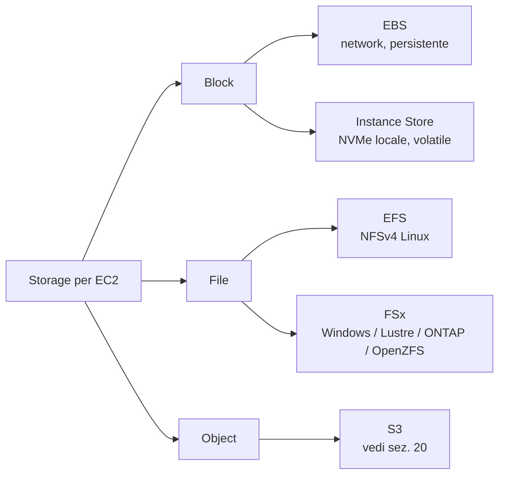

# EBS, EFS, FSx, Instance Store

Sotto a EC2 (e a molti altri servizi) c'è una scelta di storage tutt'altro che banale: blocco persistente di rete, filesystem condivisi, NVMe locale effimero. Sbagliare qui significa pagare 5x quello che servirebbe o perdere dati al primo `stop`.

## 1. La mappa mentale



Regola spannometrica: single-instance persistente → EBS; condiviso Linux → EFS; condiviso Windows AD → FSx Windows; HPC/ML scratch → FSx Lustre o Instance Store; cache effimera ad altissime IOPS → Instance Store.

## 2. EBS — tipi di volume

| Tipo | Tecnologia | IOPS max | Throughput max | Caso d'uso |
|---|---|---|---|---|
| **gp3** | SSD | 16.000 (default 3.000) | 1.000 MB/s (default 125) | default moderno, web/app/DB piccoli |
| **gp2** | SSD | 16.000 (3 IOPS/GB) | 250 MB/s | legacy, ~20% più caro di gp3 a parità |
| **io2 Block Express** | SSD NVMe | 256.000 per volume | 4.000 MB/s | DB mission-critical, SAP HANA |
| **st1** | HDD | 500 | 500 MB/s | big data sequenziale, log |
| **sc1** | HDD cold | 250 | 250 MB/s | archive raro |

Punti chiave:
- **gp3** disaccoppia GB da IOPS/throughput → paghi solo quello che ti serve.
- **io2 Block Express** supporta **multi-attach** (stesso volume su più EC2 nella stessa AZ) per cluster SAN-like (es. Oracle RAC). Filesystem cluster-aware obbligatorio (GFS2, OCFS2), altrimenti corruzione garantita.
- Un EBS vive in **una sola AZ**: per cross-AZ devi snapshottare e ricreare.

## 3. Snapshot, FSR, DLM

Snapshot EBS = backup incrementale su S3 (gestito da AWS, non vedi il bucket). Solo i blocchi cambiati dall'ultimo snapshot vengono salvati, ma puoi cancellare lo snapshot N e mantenere N+1 senza perdere dati (AWS gestisce le dipendenze).

```bash
# snapshot manuale
aws ec2 create-snapshot --volume-id vol-abc --description "pre-upgrade"

# Fast Snapshot Restore: pre-warm in AZ specifica
aws ec2 enable-fast-snapshot-restores \
  --availability-zones eu-west-1a \
  --source-snapshot-ids snap-xyz
```

**Fast Snapshot Restore (FSR)**: senza FSR il primo accesso a un blocco di un volume creato da snapshot è lento (lazy load da S3). FSR pre-carica e dà performance piene da subito — utile per disaster recovery testato. Costa caro (~$0.75/AZ/h per snapshot).

**DLM (Data Lifecycle Manager)**: schedula snapshot automatici con retention policy. Sostituisce gli script cron e funziona via tag.

Encryption: KMS at-rest (chiave AWS-managed o CMK), trasparente. Snapshot di volume encrypted → snapshot encrypted. Per condividere snapshot encrypted cross-account devi condividere anche la CMK.

## 4. EFS — NFS managed

Filesystem NFSv4 condiviso tra centinaia di EC2 (e Lambda, ECS, EKS). Scala a petabyte automaticamente, pay-per-GB.

| Modalità | Quando |
|---|---|
| Performance: **General Purpose** | default, latenza più bassa |
| Performance: **Max I/O** | >7000 op/s aggregate, leggermente più alta latenza |
| Throughput: **Bursting** | scala con la size |
| Throughput: **Provisioned** | fissi MB/s indipendente da size |
| Throughput: **Elastic** | scala automaticamente fino a 10 GB/s, paghi solo l'uso |

**Lifecycle**: file non acceduti per N giorni vanno in **IA** (Infrequent Access, ~92% cheaper) o **Archive** (~50% in più di sconto). Riacceso? Torna automaticamente in Standard se attivi "intelligent tiering".

**Access Points**: viste applicative del filesystem con UID/GID e root directory forzati, ottimi per multi-tenant. **Mount target per AZ**: ne crei uno per ogni AZ, le EC2 montano quello locale (latenza minore + niente cross-AZ data transfer).

```bash
sudo mount -t efs -o tls fs-0123abc:/ /mnt/efs
```

## 5. FSx — quattro file system managed

| Variante | Protocollo | Caso d'uso |
|---|---|---|
| **FSx for Windows File Server** | SMB | share Windows con AD integration, ACL native, DFS |
| **FSx for Lustre** | Lustre POSIX | HPC, ML training, scratch ad alta banda, link a S3 |
| **FSx for NetApp ONTAP** | NFS+SMB+iSCSI | lift-and-shift di filer NetApp on-prem, snapshot, dedup |
| **FSx for OpenZFS** | NFS | snapshot istantanei, clone, alta compressione |

**FSx for Lustre** è speciale: monta un bucket S3 come backing store, lazy-load dei file dal bucket al filesystem, write-back asincrono. Risultato: HPC vede POSIX ma i dati persistono in S3.

## 6. Instance Store

NVMe fisicamente attaccato all'host: ~1M IOPS, ~10 GB/s aggregati, latenza sub-millisecondo. Disponibile solo su famiglie `i*`, `d*`, `h*`, `m6id`, `c7gd`, ecc.

Gotcha brutali:
- **Volatile**: stop, terminate, host failure → dati persi.
- Non snapshottabile.
- Non puoi attaccare/staccare a caldo.

Casi d'uso legittimi: cache locale (Redis cluster con replica altrove), scratch HPC, shuffle Spark, indici ricostruibili (Elasticsearch con replica), database con replica sincrona (Cassandra, Aerospike).

## 7. Quando uso cosa — cheat sheet

| Scenario | Scelta |
|---|---|
| Root disk EC2 | EBS gp3 |
| DB OLTP heavy | io2 Block Express |
| Shared content per 20 web server PHP | EFS |
| Share Windows con utenti AD | FSx for Windows |
| Training ML su 50 TB di immagini | FSx for Lustre + bucket S3 |
| Cache Redis effimera 800k IOPS | Instance Store (i4i) |
| Log sequenziale tipo Kafka data dir | st1 (o gp3 grosso) |
| Cluster Oracle RAC due nodi | io2 Block Express multi-attach |

## 8. Esercizio

<details>
<summary>Avete 12 EC2 stateless dietro ALB che servono PDF dinamici da template comuni. Quale storage condiviso per i template?</summary>

**EFS Elastic throughput** + lifecycle a IA dopo 30 giorni.

Perché:
- 12 client Linux → NFS naturale.
- I template cambiano raramente, accesso prevalentemente read.
- Elastic throughput evita di provisionare e paga solo l'effettivo (read burst quando deploy).
- Lifecycle IA per template vecchi che restano linkati ma raramente serviti.

Anti-pattern: copiare i template su EBS di ogni istanza al boot via user-data — diventa un incubo quando aggiorni 100 template e devi ricreare la AMI.
</details>

<details>
<summary>DB Postgres single-node con 4 TB e ~30k IOPS sustained. Quale EBS?</summary>

**io2 Block Express** da 4 TB con 30.000 IOPS provisioned.

Conti:
- gp3 max 16k IOPS → insufficiente.
- io2 Block Express scala fino a 256k IOPS, latenza sub-ms costante.
- Snapshot giornalieri via DLM + FSR pre-warm in AZ secondaria per DR rapido.
- Cifratura con CMK dedicata al workload.

Alternativa "managed": RDS Postgres su io1/io2, ti porta via la gestione di backup/PITR (sezione 23).
</details>

> **Riassunto**: EBS = block di rete persistente, oggi default gp3, io2 Block Express per i carichi cattivi, snapshot incrementali con DLM + FSR; EFS = NFS multi-istanza con lifecycle a IA/Archive; FSx copre Windows/Lustre/ONTAP/OpenZFS; Instance Store = NVMe locale velocissimo ma volatile. La scelta sbagliata costa o perde dati: pensa prima a persistenza, condivisione, IOPS richieste.
