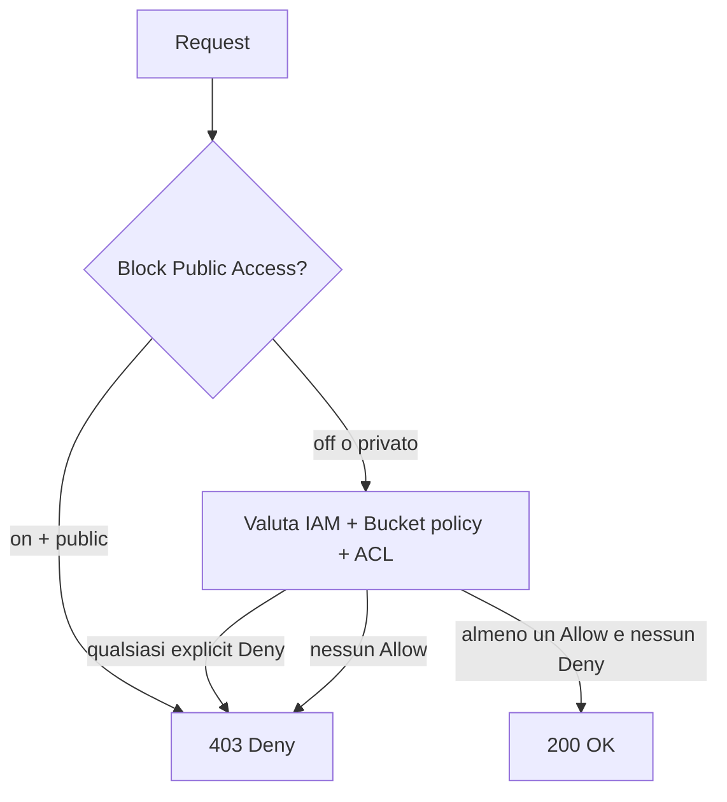

# S3 — deep dive

S3 (Simple Storage Service) è il primo servizio AWS (2006) e ancora la *spina dorsale* di praticamente ogni architettura cloud: data lake, backup, static hosting, log archive, asset CDN-friendly, lake-house Iceberg/Hudi. Sotto la semplicità c'è una superficie funzionale enorme.

## 1. Primitive

- **Bucket**: contenitore globalmente univoco (nome unico al mondo), regionale.
- **Object**: blob fino a **5 TB** (multipart upload >5 GB obbligatorio, raccomandato >100 MB).
- **Key**: stringa fino a 1024 byte, l'illusione delle "cartelle" arriva da `/` nella key.
- **Durabilità**: **11 nove** (99.999999999%) — perdere un oggetto è praticamente leggenda.
- **Disponibilità**: 99.99% per Standard (SLA 99.9%).
- **Consistenza**: dal dicembre 2020 **strong read-after-write** su tutte le operazioni (prima era eventual su overwrite/delete). Niente più hack di delay artificiali.

## 2. Storage class

| Classe | Cost storage | Retrieval | Min duration | Tipico |
|---|---|---|---|---|
| **Standard** | $0.023/GB | nessuno | nessuna | hot data |
| **Standard-IA** | $0.0125/GB | $0.01/GB | 30 gg | backup ricomponibili |
| **One Zone-IA** | $0.01/GB | $0.01/GB | 30 gg | replica ri-creabile, 1 AZ sola |
| **Intelligent-Tiering** | dinamico | nessuno | 30 gg | accesso imprevedibile |
| **Glacier Instant Retrieval** | $0.004/GB | $0.03/GB ms | 90 gg | archive ma accesso istantaneo |
| **Glacier Flexible Retrieval** | $0.0036/GB | $0.01-0.10/GB, 1-5 min o 3-5h | 90 gg | archive con SLA recovery |
| **Glacier Deep Archive** | $0.00099/GB | $0.02/GB, 12 h | 180 gg | "il magazzino", compliance fiscale |

**Intelligent-Tiering** è oggi il *default raccomandato* per workload generici: AWS sposta automaticamente fra tier (Frequent, Infrequent, Archive Instant, Archive, Deep Archive) in base agli accessi, costa solo $0.0025/1000 oggetti di monitoring. Nessuna retrieval fee fra i tier "istantanei".

## 3. Lifecycle, versioning, MFA delete

```bash
aws s3api put-bucket-lifecycle-configuration --bucket app-logs --lifecycle-configuration '{
  "Rules":[{
    "ID":"logs-tiering",
    "Status":"Enabled",
    "Filter":{"Prefix":"raw/"},
    "Transitions":[
      {"Days":30,"StorageClass":"STANDARD_IA"},
      {"Days":180,"StorageClass":"GLACIER"}
    ],
    "Expiration":{"Days":2555},
    "NoncurrentVersionExpiration":{"NoncurrentDays":90}
  }]
}'
```

**Versioning**: ogni overwrite/delete crea una nuova versione, la "delete" è un *delete marker* recuperabile. Indispensabile prima di abilitare Object Lock o Replication. **MFA Delete**: richiede MFA per cancellare versioni, abilitabile solo dal root account via CLI.

## 4. Replication

- **CRR** (Cross-Region Replication): copia async in region diversa per DR / latenza utenti / compliance dato.
- **SRR** (Same-Region Replication): tipicamente per separare prod/log o cambiare account proprietario.
- **RTC** (Replication Time Control): SLA 99.99% replica entro **15 minuti**, con metriche CloudWatch.

Richiede versioning su entrambi i bucket. Non replica oggetti pre-esistenti (devi fare batch replication separato).

## 5. Encryption

Tutto S3 è cifrato a riposo by default da gennaio 2023 (SSE-S3 di base).

| Modalità | Chi gestisce la chiave | Audit | Costo |
|---|---|---|---|
| **SSE-S3** | AWS (AES-256) | no | incluso |
| **SSE-KMS** | KMS CMK | CloudTrail completo | KMS API costs |
| **DSSE-KMS** | KMS, doppia cifratura | sì | KMS x2 |
| **SSE-C** | tu fornisci la chiave ad ogni request | no | incluso |

**Bucket Key**: data-key cached a livello bucket → 99% in meno di chiamate a KMS per workload write-heavy. Quasi sempre da attivare con SSE-KMS.

In transit: HTTPS-only via bucket policy con `aws:SecureTransport=false` deny.

## 6. Policy, ACL, Block Public Access

Tre layer di accesso, controintuitivi insieme:

1. **IAM policy** (su utente/ruolo): "io chi sono e cosa posso?".
2. **Bucket policy** (su bucket): "questo bucket cosa concede a chi?".
3. **ACL** (legacy, oggetto/bucket): granularità object-level, oggi sconsigliato.

**Block Public Access** è un interruttore master sopra tutto: se attivo (default dal 2023), anche se policy/ACL danno public, S3 nega. Disabilitalo solo con consapevolezza chirurgica.



## 7. Feature avanzate

- **Object Lock** (WORM): retention immutabile in modalità **Governance** (override con permesso speciale) o **Compliance** (immutabile anche per root, per regolatori). Richiede versioning.
- **Pre-signed URL**: link temporaneo che concede put/get, firmato con le tue credenziali. Pattern classico: upload diretto dal browser senza esporre credenziali.
- **S3 Select**: SQL su singolo oggetto CSV/JSON/Parquet, risparmi banda e CPU.
- **Access Points**: endpoint con policy dedicata per applicazione/team, evita una bucket policy gigante.
- **Multi-Region Access Points**: endpoint globale con failover automatico fra bucket replicati in più region.
- **S3 Object Lambda**: trasformi al volo l'oggetto in get (redaction PII, ridimensionamento immagini, format conversion).
- **Storage Lens**: dashboard organization-wide su utilizzo, classi, anomalie, raccomandazioni cost.
- **Event Notifications**: trigger su PUT/DELETE verso **SQS / SNS / Lambda / EventBridge** (EventBridge è la via moderna, più filtri).
- **Transfer Acceleration**: upload via edge CloudFront, utile da continenti lontani.
- **Multipart Upload**: parti da 5 MB-5 GB, resume e parallelizzazione. Obbligatorio >5 GB, raccomandato >100 MB. **Ricorda**: gli upload incompleti restano e li paghi — abilita la lifecycle rule "AbortIncompleteMultipartUpload".

## 8. Esercizio

<details>
<summary>Devi servire upload di video utente fino a 10 GB con thumbnail automatiche. Architettura?</summary>

1. **Pre-signed URL** generato da API Gateway+Lambda → browser fa **multipart upload** diretto su S3 (no banda backend).
2. **Bucket policy** HTTPS-only + Block Public Access on.
3. **Event Notification** `s3:ObjectCreated:CompleteMultipartUpload` → EventBridge → Lambda di transcodifica/thumbnail (o MediaConvert).
4. Thumbnail scritte in bucket dedicato con **CloudFront** in front (vedi sez. 11).
5. Lifecycle rule: video originali → IA dopo 60 gg → Glacier Flexible dopo 180.
6. Multipart "AbortIncompleteMultipartUpload" a 7 gg per pulire parti orfane.
</details>

<details>
<summary>Compliance fiscale: 10 anni di documenti immutabili, accesso raro ma quando serve serve subito.</summary>

- **Versioning** on + **Object Lock Compliance** mode, retention 10 anni.
- Storage class **Glacier Instant Retrieval**: $0.004/GB con accesso ms (perfetto per "raro ma immediato").
- **SSE-KMS** con CMK dedicata, key policy che esclude tutti dal `kms:Disable`.
- **Replication CRR** verso region secondaria con stesso Object Lock (DR).
- **CloudTrail data events** sul bucket per audit completo.

Anti-pattern: Glacier Deep Archive — costa meno ma 12h di retrieve violano "subito".
</details>

> **Riassunto**: S3 è object store a 11×9 di durabilità, con classi dal Standard al Deep Archive (gestite via lifecycle o Intelligent-Tiering); versioning + Object Lock per immutabilità; CRR/SRR/RTC per DR; encryption SSE-S3 default, SSE-KMS+Bucket Key per audit/multi-tenant; sicurezza = Block Public Access + bucket policy + IAM; feature avanzate (Access Points, Object Lambda, Storage Lens, event notifications) lo rendono molto più di un "disco infinito".
