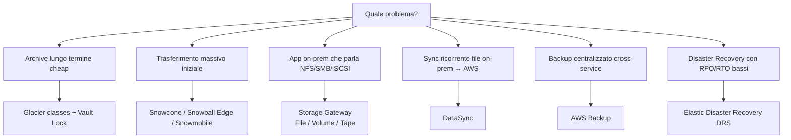

# Glacier, Snow, Storage Gateway, DataSync, AWS Backup

S3 e EBS/EFS coprono lo storage "online". Per casi estremi — archivio compliance a 25 anni, migrazione di 500 TB da un datacenter senza rete decente, share NFS che però vive ancora on-prem, backup unificati di 30 servizi, DR cross-region — AWS offre una galassia di servizi dedicati. Vediamoli insieme perché spesso si combinano.

## 1. Mappa decisionale



## 2. Glacier — le tre classi

| Classe | Retrieval | Costo storage | Min duration | Caso d'uso |
|---|---|---|---|---|
| **Glacier Instant Retrieval** | ms | $0.004/GB | 90 gg | archive ma serve subito (compliance medico) |
| **Glacier Flexible Retrieval** | Expedited 1-5 min / Standard 3-5h / Bulk 5-12h | $0.0036/GB | 90 gg | archive con SLA flessibile (log, video raw) |
| **Glacier Deep Archive** | Standard 12h / Bulk 48h | $0.00099/GB | 180 gg | "il magazzino" — backup fiscali 10+ anni |

Glacier è un **tier di S3**: ti raggiungi via API S3 (e lifecycle), non c'è più "Glacier Vault" separato per i nuovi progetti (esiste ancora per legacy).

**Vault Lock** (S3 Object Lock in Compliance mode è l'equivalente moderno): policy WORM immutabile anche per il root, una volta lockata non si toglie. Per regolatori SEC 17a-4, MiFID II, GDPR retention.

## 3. Snow family — trasferimento fisico

Quando hai centinaia di TB e una connessione internet da 100 Mbps, fare i conti: 100 TB su 100 Mbps "puri" sono ~92 giorni. AWS ti spedisce hardware:

| Device | Capacità | Form factor | Caratteristica |
|---|---|---|---|
| **Snowcone** | 8 TB | tascabile (~2 kg) | edge, batteria opzionale, IoT |
| **Snowball Edge Storage Optimized** | 80 TB usable | valigia industriale | il workhorse della migrazione |
| **Snowball Edge Compute Optimized** | 28 TB + GPU + 104 vCPU | valigia | edge compute (navi, miniere) |
| **Snowmobile** | 100 PB | container 14 m su camion | deprecato 2024 ma da conoscere per cultura |

Flusso tipico: ordini dalla console → AWS spedisce → carichi (Snowball CLI / NFS / S3 adapter) → rispedisci con E-Ink label che si aggiorna automaticamente → AWS ingerisce in S3 → certificato di distruzione dati. Cifratura 256-bit obbligatoria con chiavi KMS.

## 4. Storage Gateway — il bridge ibrido

VM (o appliance hardware) che gira on-prem ed espone protocolli locali ai server, persistendo dietro le quinte su S3/EBS/Glacier.

| Modalità | Protocollo on-prem | Backing store AWS | Uso |
|---|---|---|---|
| **File Gateway** (S3 / FSx) | NFS, SMB | S3 (o FSx) | share file con backup cloud nativo |
| **Volume Gateway — Cached** | iSCSI | S3 (hot cache locale) | working set in cache, capacità infinita |
| **Volume Gateway — Stored** | iSCSI | EBS snapshot | dato primario in locale, snapshot su AWS |
| **Tape Gateway** (VTL) | iSCSI VTL | S3 + Glacier | sostituisce librerie nastri fisici |

Tipico: applicazioni legacy Windows che scrivono su `\\fileserver\share` continuano a farlo, ma in realtà i file finiscono in S3 con lifecycle a Glacier.

## 5. DataSync — sync online accelerato

Servizio managed per migrare/sincronizzare dataset tra storage **on-prem ↔ AWS** (e tra servizi AWS). Differenze chiave vs `rsync` o `aws s3 sync`:

- **Throughput**: fino a 10x più veloce su WAN grazie a parallelismo, compression, encryption integrate.
- **Verifica integrità** end-to-end automatica.
- **Bandwidth throttling** e **scheduling** built-in.
- Source/target: NFS, SMB, HDFS, oggetti self-hosted, S3, EFS, FSx (tutte le varianti).
- Pagamento per GB trasferito (~$0.0125/GB).

```bash
aws datasync create-task \
  --source-location-arn arn:aws:datasync:eu-west-1:111:location/loc-nfs-on-prem \
  --destination-location-arn arn:aws:datasync:eu-west-1:111:location/loc-s3-target \
  --options TransferMode=CHANGED,VerifyMode=ONLY_FILES_TRANSFERRED \
  --schedule ScheduleExpression="cron(0 2 * * ? *)"
```

Combo classica: **DataSync** per ongoing delta, **Snowball** per il bulk iniziale.

## 6. AWS Backup — backup centralizzato

Servizio orchestratore che mette sotto un'unica console e policy il backup di: EBS, EFS, FSx, RDS, Aurora, DynamoDB, S3, DocumentDB, Neptune, EC2 (AMI), Storage Gateway, Redshift, Timestream, VMware on-prem.

Concetti:
- **Backup plan**: schedula (es. ogni giorno 02:00), retention (es. 35 gg daily + 12 mesi monthly), copy cross-region/cross-account.
- **Backup vault**: contenitore cifrato (CMK propria) dove vivono i recovery point.
- **Vault Lock**: rende il vault WORM, retention immutabile (anche root non può ridurre o cancellare prima del termine) — per audit finanziari/sanitari.
- **Backup policy via Organizations**: applichi una policy a tutti gli account dell'OU.

| Funzione | Vantaggio |
|---|---|
| Tag-based selection | "tutto ciò che ha tag `backup=daily`" |
| Cross-region copy | DR geografico nativo |
| Cross-account copy | bunker account isolato (anti-ransomware) |
| Audit Manager integration | report compliance pronti |

Anti-pattern: snapshot manuali "all'occorrenza" su tre servizi diversi, senza retention. Garantito: in due anni perdi traccia, paghi tre volte, restore non testato.

## 7. AWS Elastic Disaster Recovery (DRS)

Erede di CloudEndure. Replica continua **block-level** di server on-prem o cloud verso una *staging area* a basso costo in AWS (EBS spenti). Al disastro:

- **RPO**: secondi (replica continua).
- **RTO**: minuti (avvio EC2 da volumi staging).
- **Drill**: failover di test isolato in VPC dedicata senza impattare produzione.
- **Failback**: replica inversa per rientrare on-prem una volta risolto.

Caso d'uso: business continuity di applicazioni legacy che non puoi rifare cloud-native a breve, ma di cui hai bisogno di un DR plan credibile.

## 8. Esercizio

<details>
<summary>Banca italiana: 800 TB di documenti scansionati on-prem, da migrare in AWS, retention 10 anni WORM, accesso annuale per audit.</summary>

1. **Snowball Edge Storage Optimized** x ~10 dispositivi (80 TB cad.) per ingest iniziale → S3 Standard.
2. Lifecycle policy → **Glacier Instant Retrieval** dopo 7 giorni (accesso ms, costa pochissimo).
3. **Object Lock Compliance mode** retention 10 anni (immutabile anche al root).
4. **SSE-KMS** con CMK dedicata, key policy che blocca disable/delete.
5. **CRR** verso region secondaria (eu-south-1) con stesso Object Lock per DR.
6. **AWS Backup vault** separato con **Vault Lock** per metadata index DynamoDB.
7. **DataSync** per i nuovi documenti incrementali post-migrazione.
</details>

<details>
<summary>SaaS B2B con stack su AWS: serve un DR plan con RPO < 5 min e RTO < 30 min, ma il customer chiede region failover testato ogni trimestre.</summary>

- **AWS Backup** con backup plan giornaliero + copy cross-region (CRR vault) per RDS, EFS, DynamoDB → RPO 24h non basta da solo.
- **Aurora Global Database** o **DynamoDB Global Tables** per i DB → RPO secondi cross-region.
- **S3** Cross-Region Replication con **RTC** (SLA 15 min).
- **Elastic Disaster Recovery** per EC2/ECS stateful → RPO secondi, RTO ~10 min.
- **Route 53 health check + failover** (sez. 11) per cutover DNS.
- **Drill trimestrale**: usa la feature di DRS "recovery instances in isolated subnet" → non tocca produzione, genera report.

Risultato: RPO secondi-minuti, RTO 20-30 min, evidenza audit per il cliente.
</details>

> **Riassunto**: Glacier (3 classi) per archive a freddo + Object Lock per WORM; Snow family per migrazione fisica massiva; Storage Gateway come bridge ibrido NFS/SMB/iSCSI/VTL verso S3; DataSync per trasferimenti online accelerati ricorrenti; AWS Backup orchestra il backup cross-service con vault lock e copia cross-account/region; Elastic Disaster Recovery offre RPO secondi/RTO minuti per DR enterprise. Spesso si combinano: Snowball iniziale + DataSync delta + AWS Backup + CRR + DRS = una storia completa.
