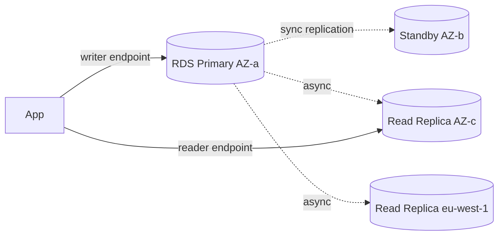

# RDS — relational DB managed

RDS (Relational Database Service) ti toglie di mano patching, backup, failover e replica per i DB SQL classici. Tu pensi a schema, query e indici; AWS gestisce host, OS, replication topology, manutenzione. È il "db boring" che vuoi in produzione quando NON hai bisogno di Aurora.

## 1. Engine supportati

Sei motori, ognuno con quirks di licenza e feature:

| Engine | Licenza | Note |
|---|---|---|
| **PostgreSQL** | open source | l'engine "moderno" preferito; estensioni `pg_stat_statements`, `pgvector`, PostGIS |
| **MySQL** | open source (community) | versioni 5.7 / 8.0; compat ampia |
| **MariaDB** | open source | fork MySQL, meno feature recenti |
| **Oracle** | BYOL o License Included | Enterprise/Standard; opzioni TDE, OEM |
| **SQL Server** | License Included (Express → Enterprise) | Multi-AZ via Mirroring/Always On |
| **Db2** | License Included | aggiunto 2023, target migrazioni IBM |

Per Postgres/MySQL spesso conviene Aurora (sezione 23). RDS "vanilla" resta utile quando vuoi pieno controllo su versione minore, replicare via logical replication esterna, o usare estensioni non supportate da Aurora.

## 2. Single-AZ vs Multi-AZ



- **Single-AZ**: 1 istanza, 1 AZ. Downtime su failure o patching. Solo dev/test.
- **Multi-AZ instance** (classic): primary + standby sincrono in altra AZ, **standby NON leggibile**. Failover automatico 60-120 s, DNS swap. Costo 2x.
- **Multi-AZ DB Cluster** (Postgres/MySQL): 1 writer + 2 **readable standby** sincroni, failover ~35 s, puoi servire letture dagli standby. Costo ~2.5x.

Regola: produzione = sempre Multi-AZ. Non spegnerlo "per risparmiare 50€".

## 3. Read Replicas

Asincrone (lag tipico < 1 s, ma può crescere a minuti sotto carico). Fino a **15** per DB primario. Cross-AZ, cross-region, persino cross-account (Aurora). Casi d'uso:

- Scaricare letture analitiche pesanti dal primary.
- Disaster recovery cross-region (promuovi la replica a standalone).
- Reporting su engine diverso (Postgres → Postgres read replica → engine logico).

Promozione: una read replica può essere **promossa** a standalone, rompendo la replica. Operazione irreversibile.

## 4. Backup e restore

- **Automated backup**: snapshot giornaliero + transaction log continuo. Retention 1-35 giorni. Permette **Point-In-Time Recovery (PITR)** al secondo.
- **Manual snapshot**: lo crei tu, durata illimitata, sopravvive al delete del DB.
- **Restore**: crea **una nuova istanza** dal backup. Non puoi "restore in place".

```bash
aws rds restore-db-instance-to-point-in-time \
  --source-db-instance-identifier prod-db \
  --target-db-instance-identifier prod-db-restored \
  --restore-time 2026-05-21T10:15:00Z
```

Trappola: al `delete` dell'istanza con `--skip-final-snapshot` perdi tutto. Mai. Usare sempre `final-snapshot-identifier`.

## 5. Sicurezza ed encryption

- **At rest**: KMS, abilitato alla creazione (non puoi attivarlo dopo — devi fare snapshot + copia encrypted + restore).
- **In transit**: SSL/TLS con certificato `rds-ca-rsa2048-g1`. Forza con `rds.force_ssl=1` (Postgres).
- **IAM database authentication**: login con token IAM invece di password (Postgres/MySQL). Token valido 15 min.
- **Secrets Manager rotation**: rotazione automatica password via Lambda.
- Network: sempre in subnet privata, SG che apre porta DB solo agli app SG.

## 6. Parameter group, option group, maintenance

- **Parameter group**: tutti i flag engine (`max_connections`, `shared_buffers`, ecc.). Default è read-only — devi clonarlo.
- **Option group**: feature extra Oracle/SQL Server (TDE, S3 integration).
- **Maintenance window**: 30 min/settimana, AWS patcha minor version e OS. Puoi forzare/posticipare.

## 7. RDS Proxy e blue/green

**RDS Proxy**: pooling connessioni gestito davanti al DB. Indispensabile per Lambda (che apre/chiude connessioni a ogni invocation → satura `max_connections` velocemente). Riduce failover-induced errors mantenendo le connessioni client durante uno swap.

**Blue/green deployment**: AWS crea un ambiente "green" copia del "blue" con la nuova versione/parameter group, le tiene in sync via logical replication, e con uno switchover < 1 minuto promuove green a primario. Game-changer per upgrade major version Postgres.

Altre feature da conoscere:
- **Performance Insights**: dashboard wait events, top SQL, gratuita 7 giorni di retention.
- **RDS Custom** (Oracle/SQL Server): ti dà accesso SSH/RDP al sistema operativo. Compromesso tra EC2 puro e RDS managed.
- **Storage Auto Scaling**: aumenta gp3/io1 automaticamente fino a un cap.

## 8. Esercizio

<details>
<summary>Hai Lambda che apre 5k connessioni/sec a un RDS Postgres con max_connections=200. Cosa fai?</summary>

Il pattern Lambda-RDS senza proxy esaurisce `max_connections` quasi subito (ogni cold start = nuova connessione). Soluzioni:

1. **RDS Proxy**: pool gestito, le Lambda parlano col proxy, lui multiplexa su poche connessioni reali al DB. Latenza extra ~5 ms ma elimina il problema.
2. **Aumentare max_connections** non basta: serve RAM proporzionale, e il DB rallenta con migliaia di connessioni idle.
3. **Connection reuse intra-warm-container**: variabile globale fuori dall'handler. Aiuta ma non risolve i picchi.

In produzione: RDS Proxy + connection reuse + monitor `DatabaseConnections` in CloudWatch.
</details>

<details>
<summary>Devi fare upgrade major Postgres 14→16 con downtime < 5 minuti. Strategia?</summary>

**Blue/green deployment**:
1. Crea blue/green: AWS deploya un cluster green su PG 16 e lo sincronizza via logical replication.
2. Test l'app contro l'endpoint green (read-only initially).
3. Triggera lo **switchover**: AWS blocca brevemente le scritture sul blue, attende che la replication recuperi, e ribalta gli endpoint. Tipicamente < 1 min.
4. Il blue resta disponibile per qualche ora se serve rollback.

Alternative peggiori: in-place upgrade (downtime 10-30 min, no rollback rapido) o pg_dump/restore (downtime ore).
</details>

> **Riassunto**: RDS = DB SQL managed (6 engine); produzione = Multi-AZ (instance o cluster); read replicas async fino a 15; backup automatico abilita PITR 1-35 gg; encryption KMS solo alla creazione; RDS Proxy obbligatorio davanti a Lambda; blue/green per upgrade major con downtime < 1 min.
