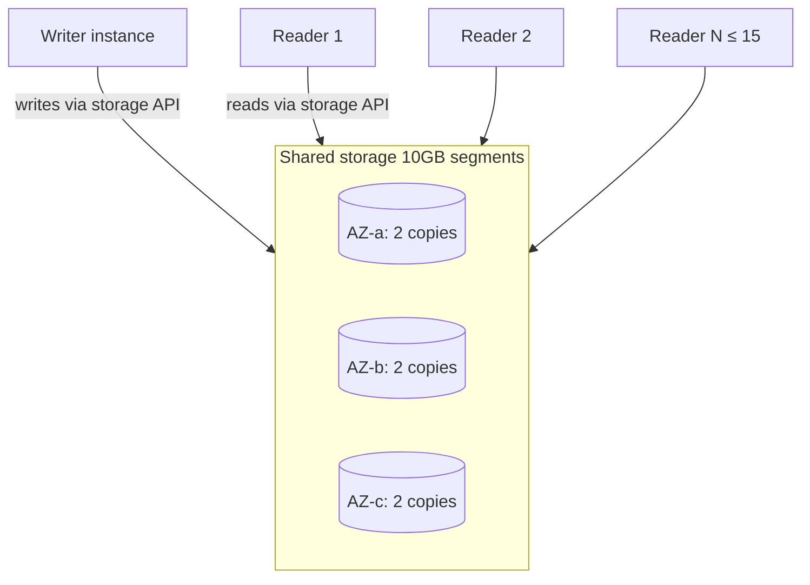

# Aurora deep dive

Aurora è il DB relazionale "AWS-native": parla protocollo Postgres/MySQL ma sotto il cofano ha uno **storage layer custom distribuito** che cambia le regole su durability, replica e scaling. È il default per nuovi workload OLTP serie su AWS.

## 1. Architettura



Idee chiave:
- **Compute e storage separati**. Le istanze sono "stateless": vedono lo stesso volume logico via storage API.
- Lo storage è **distribuito in 10GB segments**, **6 copie su 3 AZ** (4-of-6 quorum write, 3-of-6 read). Sopravvive a perdita di 1 AZ + 1 copia senza data loss.
- Il writer non scrive a un file: invia redo log records al layer storage, che li applica. Niente full page writes, niente fsync di datafile → molto meno I/O del Postgres/MySQL classico.
- Le **read replica** leggono lo *stesso* storage, non una copia replicata. Lag tipico **< 100 ms**, fino a **15** replica per cluster.
- **Failover ~30 s**: una replica viene promossa a writer in caso di crash, niente re-stream di dati perché lo storage è condiviso.

## 2. Aurora Postgres vs MySQL

| Feature | Aurora Postgres | Aurora MySQL |
|---|---|---|
| Versioni compatibili | 13-17 | 5.7 / 8.0 |
| Backtrack (rewind in-place) | no | sì, fino a 72h |
| Babelfish (T-SQL) | sì | no |
| pgvector / estensioni | sì (50+ extensions) | limitato a plugin MySQL |
| Parallel Query | no | sì |

Postgres-Aurora è più feature-rich per nuovi progetti (vector search, JSONB, extensions). MySQL-Aurora vince per migrazioni MySQL legacy e per Backtrack.

## 3. Aurora Serverless v2

Capacity misurata in **ACU** (Aurora Capacity Units, ~2 GB RAM + CPU/network proporzionali). Setti **min e max ACU** (0.5 → 256). Aurora scala **continuamente** (frazioni di ACU), in millisecondi, senza chiudere connessioni. v1 era step-function 10x scaling con cold start; v2 è production-grade.

- **Auto-pause** (min ACU = 0): si addormenta dopo inattività, primo accesso paga cold start ~15 s. Solo per dev/sandbox.
- **Costo**: ACU/ora + storage + I/O (a meno di I/O Optimized).
- Mix: nel cluster puoi avere writer Serverless v2 + reader provisioned, o viceversa.

Quando usarlo: traffico bursty/imprevedibile, ambienti di staging, multi-tenant SaaS con tenant idle.

## 4. Global Database

```bash
aws rds create-global-cluster \
  --global-cluster-identifier my-app-global \
  --source-db-cluster-identifier arn:aws:rds:eu-west-1:111:cluster:primary
```

- **1 primary region** (read/write) + fino a **5 secondary region** (read-only).
- Replication via storage layer dedicato, lag tipico **< 1 s** cross-region (vs ~10 s con read replica classica).
- **Failover regionale** in 1-2 minuti (managed planned failover) o RTO < 1 minuto con switchover.
- Use case: DR multi-region, letture geo-distribuite a bassa latenza, compliance data residency.

## 5. Feature avanzate

- **Backtrack** (solo MySQL): "ctrl+Z" del DB. Imposti una `BacktrackWindow` (es. 24h) e puoi rollback in-place a un timestamp senza restore. Utile contro `DELETE FROM accounts WHERE 1=1`.
- **Parallel Query** (MySQL): push-down query analitiche al layer storage che esegue in parallelo sui segment. Speedup 10x+ su scan grandi.
- **Aurora Limitless** (Postgres, GA 2024): sharding nativo gestito. Una table viene partizionata trasparentemente su più "shard groups". Pensato per workload write-heavy oltre il singolo writer.
- **Babelfish** (Postgres): listener sulla porta 1433 che parla T-SQL e protocollo TDS, così client SQL Server si collegano senza modifiche. Migrazioni SQL Server senza riscrivere SP (entro i limiti di compatibility).
- **Aurora I/O Optimized**: pricing alternativo dove paghi più compute (~30%) e storage (~125%) ma **zero charge per I/O**. Conviene se gli I/O sono > 25% della bolletta Aurora.
- **RDS Data API**: HTTP API senza connessione, ideale per Lambda+Aurora Serverless v2 senza pooling.

## 6. Tabella decisionale

| Scenario | Scelta |
|---|---|
| OLTP serio, alta TPS, multi-AZ richiesta | Aurora provisioned |
| Traffico bursty o multi-tenant SaaS | Aurora Serverless v2 |
| App globale con utenti in 3 continenti | Aurora Global Database |
| Migrazione SQL Server senza riscrivere | Aurora Postgres + Babelfish |
| Workload write oltre 1 writer | Aurora Limitless (Postgres) |
| Engine Oracle / SQL Server | RDS classico, non Aurora |

## 7. Pricing e gotchas

- Provisioned: `db.r6g.large` ~ $0.29/h + storage $0.10/GB-mese + I/O $0.20 per milione (no I/O Optimized).
- Serverless v2: ~ $0.12 per ACU-ora (0.5 ACU = $0.06/h minimo se non auto-pause).
- Cross-region replication per Global Database ha cost di network egress aggiuntivo.

Anti-pattern reali:
- **Read replica lag > 100ms cronico**: spesso writer sovraccarico, non Aurora. Controllare `AuroraReplicaLag`.
- **Connections esauste**: anche Aurora ha `max_connections` proporzionale alla RAM. Davanti a Lambda: **RDS Proxy** o **Data API**.
- **Backup retention 1 giorno**: default troppo basso, alzare a 7-14.

## 8. Esercizio

<details>
<summary>App SaaS multi-tenant: 200 tenant, di cui 5 attivi 24/7, 195 con burst saltuari. Aurora provisioned o Serverless v2?</summary>

**Serverless v2** è il fit naturale:

- Min ACU 1, max ACU 32 → scali per i 5 attivi e bursti per gli altri.
- Niente over-provisioning per il caso "tutti attivi insieme" (raro).
- Auto-pause off in prod (cold start visibile agli utenti), ma puoi mettere staging in auto-pause.
- Costo tipico: 1-3 ACU base medio + spike controllato.

Provisioned `db.r6g.xlarge` costerebbe ~$430/mese flat anche di notte. Serverless v2 può dimezzarlo se il carico è veramente bursty.

Misurare con CloudWatch `ServerlessDatabaseCapacity` dopo 2 settimane e tarare min/max.
</details>

<details>
<summary>Disastro: alle 14:23 un dev ha lanciato `UPDATE orders SET status='cancelled'` senza WHERE su Aurora MySQL. Cosa fai?</summary>

Se hai abilitato **Backtrack** (con `BacktrackWindow` > 1h):

```bash
aws rds backtrack-db-cluster \
  --db-cluster-identifier prod-orders \
  --backtrack-to 2026-05-21T14:20:00Z
```

In ~1-2 minuti il cluster torna indietro nel tempo **in-place**, senza creare nuove istanze, senza cambiare endpoint. Le scritture dalle 14:23 in poi sono perse — ok, era il punto.

Se NON hai Backtrack (Postgres o MySQL senza window): unica via è PITR → restore in nuovo cluster → ripuntare app o export/import dati. Downtime e operazione lunga.

Lezione: per Aurora MySQL prod, **abilita sempre Backtrack** (costa poco, salva la vita).
</details>

> **Riassunto**: Aurora separa compute da storage shared 6x3AZ; fino a 15 replica con lag <100ms; Serverless v2 scala continuo in ACU; Global Database per DR e geo-letture <1s; Backtrack solo MySQL; Babelfish per migrare SQL Server; I/O Optimized se I/O > 25% della bolletta.
