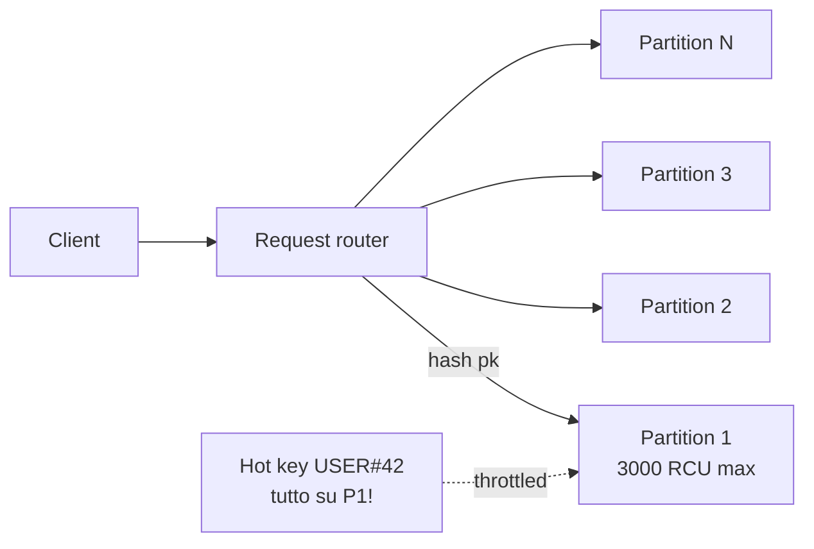

# DynamoDB deep dive

DynamoDB è il NoSQL serverless di AWS: latenza single-digit ms a qualunque scala, zero server da gestire, modello key-value/document. È un'altra mentalità rispetto al SQL: si modella **per access pattern**, non per entità.

## 1. Modello dati

Ogni **table** ha una **primary key**:
- **Partition key (PK)** sola: hash key, item univoco per PK.
- **PK + Sort key (SK)**: composite key, più item con stessa PK ordinati per SK.

Ogni **item** è un dict con attributi tipizzati (`S`, `N`, `B`, `BOOL`, `L`, `M`, `SS`, `NS`, `BS`). Schema-less oltre la chiave. **Max 400 KB per item**.

```bash
aws dynamodb put-item --table-name Orders --item '{
  "pk": {"S": "USER#42"},
  "sk": {"S": "ORDER#2026-05-21#001"},
  "amount": {"N": "129.90"},
  "status": {"S": "PAID"}
}'
```

Operazioni base:
- `GetItem` / `PutItem` / `UpdateItem` / `DeleteItem`: O(1), 1 item.
- `Query`: tutti gli item con stessa PK, filtrabili per range su SK. Veloce.
- `Scan`: legge **tutta la tabella**. Da evitare in produzione.

## 2. Capacity: on-demand vs provisioned

| Modalità | Quando | Costo |
|---|---|---|
| **On-demand** | traffico imprevedibile, spike, dev | ~$1.25 per milione write, $0.25 per milione read (eventual) |
| **Provisioned + auto scaling** | traffico prevedibile e steady | RCU/WCU fissi, ~70% sconto vs on-demand a regime |

Unità:
- **WCU** (Write Capacity Unit) = 1 scrittura/sec di item ≤ 1 KB (item più grandi consumano più WCU).
- **RCU** (Read Capacity Unit) = 2 letture eventually-consistent/sec o 1 strongly-consistent, su item ≤ 4 KB.

Switch on-demand ↔ provisioned: ammesso 1x ogni 24h per tabella.

## 3. Partition fisico e hot partition

DynamoDB distribuisce i dati su **partition fisiche** (storage shard) sulla base dell'hash della PK. Ogni partizione ha un **hard limit**:

- **3000 RCU** e **1000 WCU** per partition.
- Se concentri 90% del traffico su una PK, quella partition è "hot" → throttle (`ProvisionedThroughputExceededException`), anche se la capacity di tabella basta.



**Anti-pattern reali**:
- PK = `tenant_id` con un tenant gigante e 1000 piccoli.
- PK = `event_date` con tutti gli eventi di oggi sulla stessa partition.
- Counter globale con PK fissa.

**Soluzioni**: write sharding (suffix random 0-9 alla PK), bucketing temporale (`USER#42#2026-05-21`), oppure usare un GSI con PK diversa.

## 4. Single-table design

Pattern dove **tutte le entità** di un'app stanno in **una sola tabella**, distinte da prefissi sulla PK/SK (`USER#42`, `ORDER#2026...`, `PRODUCT#abc`). Vantaggi:

- 1 `Query` su PK = recupero tutte le entità correlate a un'aggregate (utente + suoi ordini + suo carrello).
- Niente JOIN client-side, niente roundtrip.

Svantaggi: il modello è denso, va disegnato su carta (NoSQL Workbench aiuta) partendo dagli access pattern. Migrazione di schema è un esercizio non banale.

## 5. GSI vs LSI

| Aspetto | LSI (Local Secondary Index) | GSI (Global Secondary Index) |
|---|---|---|
| PK | stessa della base table | qualsiasi attributo |
| SK | diversa | qualsiasi attributo |
| Consistency | strong consistent possibile | **only eventual** |
| Capacity | condivisa con tabella | **separata** (RCU/WCU propri) |
| Quando si crea | **solo a creazione tabella** | anytime, fino a 20 per tabella |
| Limite numero | 5 per tabella | 20 per tabella |

Regola: **default GSI**. LSI solo se sai dall'inizio che vuoi strong consistency su query alternative.

## 6. Streams, Global Tables, DAX, transactions

- **Streams**: CDC sulle modifiche. Retention **24h**. Si consuma con Lambda trigger o KCL. Use case: index secondario in OpenSearch, audit log, denormalizzazione, fan-out eventi.
- **Global Tables**: tabella replicata **active-active** in N region. Scrivi ovunque, leggi ovunque. Conflict resolution: last-writer-wins (timestamp). Built on Streams.
- **DAX** (DynamoDB Accelerator): cache write-through/read-through in memoria, **latency in microsec** (vs ms di Dynamo). Solo client SDK supportati. Cluster con node `dax.r5.large`+.
- **Transactions**: `TransactWriteItems` e `TransactGetItems` (fino a 100 item, 4MB totali). Costo **2x** delle ops normali. Garantisce ACID across item/tables.
- **TTL**: setti un attributo numerico (epoch sec); Dynamo cancella l'item entro 48h dalla scadenza, **gratis**. Cancellazione apparente subito al `GetItem` (filtrata).
- **Backup PITR**: continuous, 35 giorni indietro, restore in nuova tabella.
- **Contributor Insights**: dashboard top-keys e top-keys-throttled.

## 7. Pricing tipico

| Componente | Costo (eu-west-1, indicativo) |
|---|---|
| On-demand write | $1.25 per milione WRU |
| On-demand read eventual | $0.25 per milione RRU |
| Storage | $0.25 per GB-mese (prima 25 GB free su tier) |
| Streams read | $0.02 per 100k GetRecords |
| DAX `dax.r5.large` | ~$0.30/h |
| Global Tables | si paga write-replica WCU per ogni region extra |

## 8. Esercizio

<details>
<summary>App IoT logga 50k sensori, 1 sample/sec. Schema Dynamo per query "ultimi 100 sample del sensore X"?</summary>

**Anti-pattern**: PK = `sensorId`, SK = `timestamp`. Sembra ok ma diventa hot: ogni sample finisce nella stessa partition del sensore. Con sensori molto attivi e item piccoli, però, il vero rischio è il **growth illimitato** di una singola PK (Dynamo non lo blocca, ma le partition crescono).

**Pattern raccomandato**: PK = `SENSOR#<id>#<bucket>` dove bucket = `2026-05-21-14` (ora). SK = `timestamp`.

- Query "ultimi 100 sample" → `Query` su PK = `SENSOR#X#2026-05-21-14` con `Limit=100 ScanIndexForward=false`. Se servono più ore, query parallela su 2-3 bucket.
- Distribuisce le scritture su molte partition (bucket cambia ogni ora).
- TTL su sample > 30 giorni per costi.

GSI opzionale per query trasversali "tutti i sample con valore > soglia in 1h": PK = `ALERT#<hour-bucket>`, SK = `value#sensorId`.
</details>

<details>
<summary>Hai un counter "totale ordini" che riceve 5000 incrementi/sec con PutItem/UpdateItem. Throttling continuo. Cosa fare?</summary>

Classico hot partition: tutti gli `UpdateItem ADD #count :1` finiscono su 1 partition (PK = `COUNTER#orders`), che ha limite 1000 WCU.

**Write sharding**:
1. PK diventa `COUNTER#orders#<n>` con n in `0..49` (50 shard).
2. Su scrittura: scegli n casuale, aggiorni `count` del shard.
3. Su lettura: `BatchGetItem` di tutti i 50 shard e sommi i count.

Distribuisce 5000 scritture su 50 partition (100/s ciascuna, ampiamente sotto limite). Lettura costa 50 RCU.

Alternative:
- **Aggregare lato app**: buffer in Lambda/SQS, flush batch ogni 5s.
- **Atomic counter via Streams**: log raw eventi, conta aggregata in altra tabella in async.
</details>

> **Riassunto**: Dynamo = NoSQL serverless ms-latency; modella per access pattern; PK+SK con limite 3000 RCU/1000 WCU per partition (hot partition trap); GSI > LSI come default; single-table design potente ma da disegnare; Streams 24h per CDC; Global Tables active-active; DAX per microsec; transactions costano 2x.
