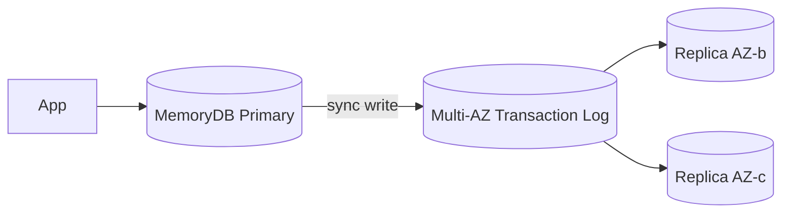

# Purpose-built DB

AWS spinge il principio "**purpose-built database**": invece di forzare Postgres a fare il tuttofare, scegli il DB giusto per ogni workload. Qui copriamo cache, graph, document, wide-column, time-series e ledger.

## 1. ElastiCache Redis

Redis managed, single-digit ms in memoria.

| Topology | Pro | Contro |
|---|---|---|
| **Single node** | semplice, cheap | nessuna HA |
| **Cluster mode disabled** + 1-5 replica | failover automatico, read replica | dataset cap = RAM di 1 node |
| **Cluster mode enabled** (sharded) | scala oltre 1 TB, multi-shard | client complesso, no MULTI cross-shard |

Feature: snapshot S3, AUTH password, encryption in transit (TLS) e at rest (KMS), online cluster resize, **data tiering** (DRAM hot + NVMe cold per ridurre costo).

Use case classici: session cache, cache di query DB, leaderboard, rate limiting, pub/sub leggero.

## 2. ElastiCache Memcached

Vecchio Memcached managed. **Multi-thread** (sfrutta tutti i core), sharding **client-side** via consistent hashing. **Nessuna persistence**, nessuna replica → un node muore, il suo shard si perde. Niente strutture dati (solo string).

Quando preferirlo a Redis: cache PURA monolitica dove vuoi sfruttare 32+ core di 1 node senza preoccuparti di persistence. Per tutto il resto, Redis vince.

## 3. MemoryDB for Redis

Redis-compatible **con durability**. Aggiunge un **multi-AZ transaction log** sotto cui ogni scrittura è committata su 3 AZ **prima** di rispondere. RTO secondi, **zero data loss** a differenza di ElastiCache Redis (dove la replica è async).



Trade-off: latenza write leggermente più alta di ElastiCache (~ms vs sub-ms). Pricing più alto.

Use case: quando vuoi un **primary database** in memoria con durability, non solo cache. App low-latency con SLA dati (es. trading book, sessioni critiche).

## 4. Neptune (graph)

DB graph managed. Supporta **3 query language**:
- **Gremlin** (property graph, TinkerPop).
- **openCypher** (compat Neo4j).
- **SPARQL** (RDF triple store).

Architettura simile ad Aurora: storage shared 6x3AZ, fino a 15 read replica, failover < 30 s.

Use case: social graph, fraud detection (cycle/path detection), knowledge graph, recommendation engine, identity resolution.

## 5. DocumentDB (MongoDB-compatible)

API MongoDB **4.0 / 5.0** (non 6.0+). Storage layer Aurora-style, separato dal compute. Replica fino a 15.

Quando ha senso: hai un'app MongoDB legacy e vuoi managed AWS senza Atlas. Quando NON: stai partendo da zero — valuta Aurora Postgres con JSONB, spesso vince per costo e feature.

## 6. Keyspaces (Cassandra-compatible)

Implementazione AWS-managed del protocollo CQL Cassandra. **Serverless** (on-demand) o **provisioned**. Dietro le quinte usa tecnologia DynamoDB, non Cassandra reale → alcune feature mancano (LWT batch limitate), ma è 100% gestito.

Use case: migrazioni Cassandra esistenti senza gestire cluster. Per nuovi progetti wide-column, DynamoDB è più nativo AWS.

## 7. Timestream e QLDB

**Timestream**: time-series serverless. **Tiering automatico**: dati recenti in **memory store** (query fast), poi spostati a **magnetic store** (cheap, long-term). Query SQL-like con funzioni time-series native (`bin`, `interpolate`, `derivative`).

```sql
SELECT bin(time, 1h) AS hour,
       avg(temperature) AS avg_temp
FROM "iot"."sensors"
WHERE sensor_id = 's-42'
  AND time > ago(7d)
GROUP BY bin(time, 1h)
ORDER BY hour;
```

Use case: telemetria IoT, metriche app custom, monitoring industriale.

**QLDB** (Quantum Ledger Database): DB ledger immutable con journal append-only e cryptographic verification (proof tramite hash chain). **In deprecation: end-of-support luglio 2025**. AWS suggerisce migrazione a **Aurora Postgres con audit logging** (`pgaudit`) + hash chain custom in application layer per chi serve.

Use case storico: registri finanziari, supply chain, audit trail tamper-evident.

## 8. Tabella decisionale + esercizio

| Workload | Servizio |
|---|---|
| Cache hot DB queries | **ElastiCache Redis** cluster mode disabled |
| Cache pura monolitica multi-core | **ElastiCache Memcached** |
| In-memory primary con durability | **MemoryDB** |
| Social graph, fraud rings | **Neptune** |
| Migrazione MongoDB legacy | **DocumentDB** |
| Migrazione Cassandra legacy | **Keyspaces** |
| Telemetria IoT 100k punti/sec | **Timestream** |
| Audit ledger tamper-evident | Aurora Postgres + pgaudit (QLDB deprecato) |
| OLAP in-memory su MySQL | **HeatWave on RDS MySQL** |

Nota: **HeatWave on RDS MySQL** è un acceleratore analitico in-memory: stessa istanza RDS MySQL può servire query OLTP (storage tradizionale) e OLAP (HeatWave) senza ETL verso Redshift.

<details>
<summary>App fintech: session token critici (perdere uno = utente sloggato, no big deal) + saldi conto in tempo reale (perdere = disastro). Stesso DB?</summary>

No, due servizi diversi.

- **Session token**: ElastiCache Redis cluster mode disabled + 1 replica. Failover automatico, se la replica perde l'ultima scrittura sync async fallita l'utente fa login. Costo basso.
- **Saldi conto real-time**: **MemoryDB**. Write committed multi-AZ via transaction log prima del ACK. Zero data loss. Latenza sub-ms in lettura. Costa di più ma rispetta lo SLA.

Anti-pattern: usare ElastiCache Redis come "source of truth" per dati che non sopporti perdere. Async replica = finestra di data loss.
</details>

<details>
<summary>Sistema antifrode bancario: vuoi rilevare ring di 5+ conti che si scambiano bonifici in cerchio entro 24h. Quale DB?</summary>

**Neptune** (graph).

Modello: nodes = `Account`, edges = `Transfer { amount, ts }`.

Gremlin query "trova cicli di lunghezza 3-7 con flusso totale > 10k€ in 24h":

```gremlin
g.V().hasLabel('Account').
  repeat(outE('Transfer').has('ts', gt(yesterday)).inV().simplePath()).
    times(7).emit().
  filter(__.path().count(local).is(gt(3))).
  filter(__.path().unfold().hasLabel('Account').
         is(eq(__.start())))   // cycle close
```

Su Postgres servirebbero CTE ricorsive lente. Su DynamoDB sarebbe full-scan. Neptune nasce per questo: cycle/path detection in O(edges visitati) con indici grafici.

Alternative: Amazon Neptune ML può fare embedding + anomaly detection su pattern complessi.
</details>

> **Riassunto**: ElastiCache Redis per cache HA, Memcached per cache pura multi-core, MemoryDB quando serve durability in-memory; Neptune per graph (Gremlin/openCypher/SPARQL); DocumentDB per MongoDB legacy, Keyspaces per Cassandra legacy; Timestream per IoT/metrics; QLDB deprecato 2025 → Aurora Postgres con audit; HeatWave per OLAP in-place su RDS MySQL.
