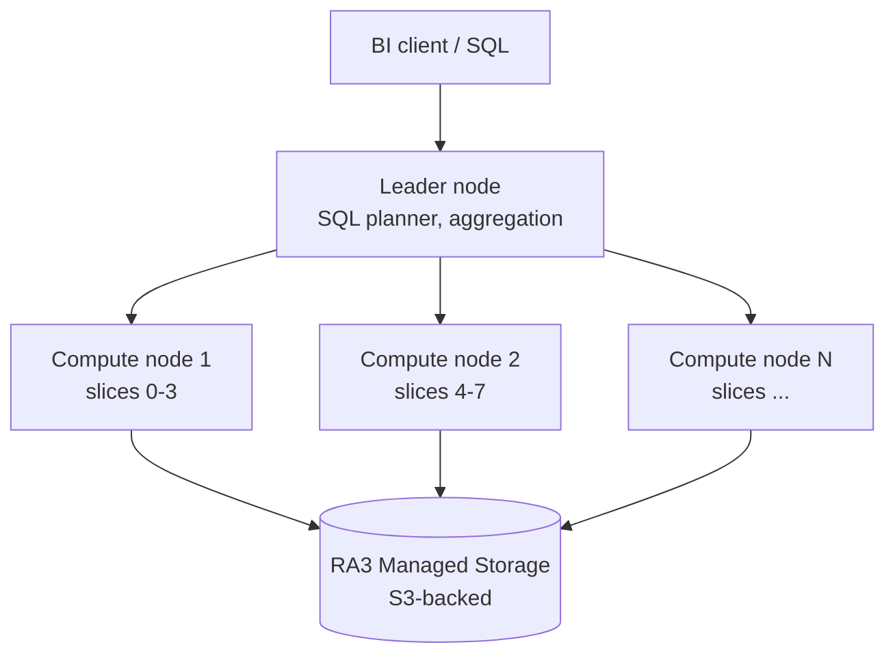

# Redshift — data warehousing

Redshift è il data warehouse managed di AWS: SQL colonnare **MPP** (Massively Parallel Processing) pensato per query analitiche su TB-PB di dati. Non sostituisce un OLTP — sostituisce un Teradata/Snowflake.

## 1. Architettura MPP



- **Leader node**: parsing, planning, distribuzione fasi ai compute, aggregazione finale. Non interroghi mai i compute direttamente.
- **Compute nodes**: ognuno diviso in **slice** (1 slice per vCPU). Ogni slice esegue la sua fase in parallelo sui dati locali.
- **Storage colonnare**: stessa colonna di milioni di righe in pochi blocchi compressi. Query analitica scansiona solo le colonne richieste.

## 2. Node types e Redshift Serverless

| Tipo | Storage | Quando |
|---|---|---|
| **RA3** (ra3.xlplus, ra3.4xlarge, ra3.16xlarge) | **Managed storage** (S3 + cache locale SSD), pay-per-GB indipendente da compute | default moderno, separa scaling compute da storage |
| **DC2** (dc2.large, dc2.8xlarge) | SSD locale fisso | legacy, per dataset < 1 TB con priorità latency, in fase di phase-out |
| **Redshift Serverless** | RA3 managed storage | no cluster da gestire; capacity in **RPU** (Redshift Processing Units), pay-per-second |

Redshift Serverless: ideale per workload spiky o nuovi progetti. Setti base RPU (8-512) e max, paghi quando query attive. Cold start ~5-10 s alla prima query dopo idle.

## 3. Distribution e sort key

**Distribution style**: come Redshift distribuisce le righe sui slice.

| Style | Quando |
|---|---|
| **AUTO** (default) | Redshift sceglie da sé in base alle dimensioni — buono per partire |
| **KEY** | distribuisci per colonna (es. `user_id`) → JOIN co-locati sulla stessa key sono veloci, no shuffle |
| **ALL** | la tabella **intera replicata su ogni node** → solo per dimension table piccole (<2-3M righe) |
| **EVEN** | round-robin, no JOIN co-located ma load bilanciato |

**Sort key**: come ordinare fisicamente i blocchi per **zone-map pruning** (saltare blocchi che non matchano la WHERE).

- **Compound** (default): efficace se filtri sempre col primo campo. Es. sort key `(event_date, user_id)` ottimo per `WHERE event_date='2026-05-21'`.
- **Interleaved**: pesa ogni colonna ugualmente. Buona per query ad-hoc su qualsiasi campo della key, ma overhead in VACUUM.

```sql
CREATE TABLE events (
  event_id   BIGINT,
  user_id    BIGINT,
  event_date DATE,
  payload    SUPER
)
DISTKEY (user_id)
SORTKEY (event_date, user_id);
```

## 4. Spectrum, federated query, zero-ETL

**Redshift Spectrum**: query su dati esterni in **S3** via `EXTERNAL TABLE` (Parquet/ORC). Catalog su AWS Glue. Paghi $5 per TB scansionato (come Athena). Pattern data lake: hot data in Redshift managed, cold/storico in S3 + Spectrum.

```sql
CREATE EXTERNAL SCHEMA spectrum_logs
FROM DATA CATALOG DATABASE 'logs_db'
IAM_ROLE 'arn:aws:iam::111:role/RedshiftSpectrumRole';

SELECT date_trunc('day', ts), COUNT(*)
FROM spectrum_logs.access_logs
WHERE ts > '2026-01-01'
GROUP BY 1;
```

**Federated query**: `SELECT` diretto su Aurora/RDS Postgres senza copiare dati. Push-down dei filtri quando possibile.

**Zero-ETL integration**: AWS replica automaticamente dati operativi in Redshift senza pipeline custom.
- **Aurora → Redshift**: change data capture continuo, lag tipico secondi.
- **DynamoDB → Redshift**: idem, eventi Streams convertiti.
- Salta il classico stack Glue/Kinesis/Lambda per "portare i dati nel warehouse".

## 5. Materialized Views, concurrency scaling, WLM

- **Materialized Views**: precomputate, refresh `INCREMENTAL` o `FULL`. Auto-refresh con `AUTO REFRESH YES`. Il planner riscrive query automaticamente per usarle.
- **Concurrency scaling**: quando la coda WLM si riempie, Redshift spinna cluster **transienti** che servono query extra. Pay-per-second, 1h gratis al giorno.
- **Workload Management (WLM)**: code di query con priorità e memoria assegnata. **Automatic WLM** (default moderno) gestisce dinamicamente; manual WLM per controllo fine.
- **AQUA** (Advanced Query Accelerator): cache hardware in front of S3 per query Spectrum. Auto-abilitato su RA3.

## 6. Redshift ML e analytics

Crei modelli ML direttamente in SQL, training su SageMaker dietro le quinte:

```sql
CREATE MODEL churn_predictor
FROM (SELECT age, plan, last_login_days, churn FROM customers)
TARGET churn
FUNCTION ml_fn_predict_churn
IAM_ROLE 'arn:...'
SETTINGS (S3_BUCKET 'my-ml-bucket');

SELECT customer_id, ml_fn_predict_churn(age, plan, last_login_days)
FROM customers;
```

Casi: forecasting, classification, regression, anomaly detection — senza tirare i dati fuori dal warehouse.

## 7. Snapshot, cross-region copy, security

- **Snapshot automatici**: ogni 8h o ogni 5 GB di cambio. Retention 1-35 gg.
- **Manual snapshot**: retention illimitata, condivisibili cross-account.
- **Cross-region snapshot copy** per DR: copia continua a una secondary region.
- **Encryption** KMS at-rest, SSL in-transit.
- **VPC routing**: cluster in subnet privata, enhanced VPC routing forza tutto il traffico COPY/UNLOAD attraverso VPC (per VPC endpoints S3).

## 8. Esercizio

<details>
<summary>Migrazione: 5 TB di event log in Postgres on-prem, query analitiche prendono ore. Target Redshift. Che dimensionamento e schema?</summary>

**Sizing**:
- 5 TB iniziali, crescita 200 GB/mese → RA3 con managed storage scala indipendentemente.
- Start: 2x `ra3.xlplus` (32 GB RAM, 4 vCPU each) o **Redshift Serverless** base 32 RPU se workload spiky.
- Concurrency scaling per query interattive multiple.

**Schema fact table `events`**:
- `DISTKEY (user_id)` se i JOIN principali sono su user; altrimenti `DISTSTYLE EVEN` per spread uniforme.
- `SORTKEY (event_date, event_type)` — quasi tutte le query analitiche filtrano per date range.
- Storage colonnare auto-comprime; usa `ANALYZE COMPRESSION` post-import.
- Dimension table piccole (`users`, `products`): `DISTSTYLE ALL`.

**Migrazione dati**:
- Export Postgres a Parquet → S3.
- `COPY events FROM 's3://.../' IAM_ROLE '...' FORMAT PARQUET;` (parallelo su tutte le slice).
- Hot data ultimo anno in Redshift; storico in S3 + Spectrum.

**Costo stimato**: ~$1.5k/mese provisioned, oppure $400-800/mese Serverless con workload 30% del giorno attivo.
</details>

<details>
<summary>Devi alimentare Redshift in tempo reale da DynamoDB (orders) + Aurora Postgres (users). Pipeline?</summary>

Vecchio mondo (3+ servizi): DynamoDB Streams → Lambda → Kinesis Firehose → S3 → Glue → COPY into Redshift. Aurora: Debezium o Kinesis Data Streams → idem. Manutenzione costante, lag 5-15 min.

**2026 way: zero-ETL integration**:

1. Console Redshift → "Integrations" → crea integrazione **DynamoDB → Redshift** sul table `orders`. AWS replica automatic.
2. Crea **Aurora → Redshift zero-ETL** sul cluster Aurora Postgres `users`. CDC continuo.
3. In Redshift query JOIN-ano `orders` + `users` con lag tipico **secondi**.

Zero codice ETL, zero infra da mantenere, lag analitico ridotto da 15 min a < 30 s. Costo extra solo lo storage Redshift (compute è quello che hai già).

Limiti zero-ETL: schema source deve essere "ragionevole" (no tipi esotici), DDL changes vanno gestite, throughput soggetto a quote.
</details>

> **Riassunto**: Redshift = data warehouse MPP colonnare; RA3 con managed storage o Serverless RPU; distribution KEY/ALL/EVEN/AUTO + sort key per zone-map pruning; Spectrum query su S3 esterno; federated query su Aurora/RDS; zero-ETL Aurora/DynamoDB → Redshift senza pipeline custom; Materialized Views auto-refresh; concurrency scaling per spike; Redshift ML in SQL via SageMaker.
