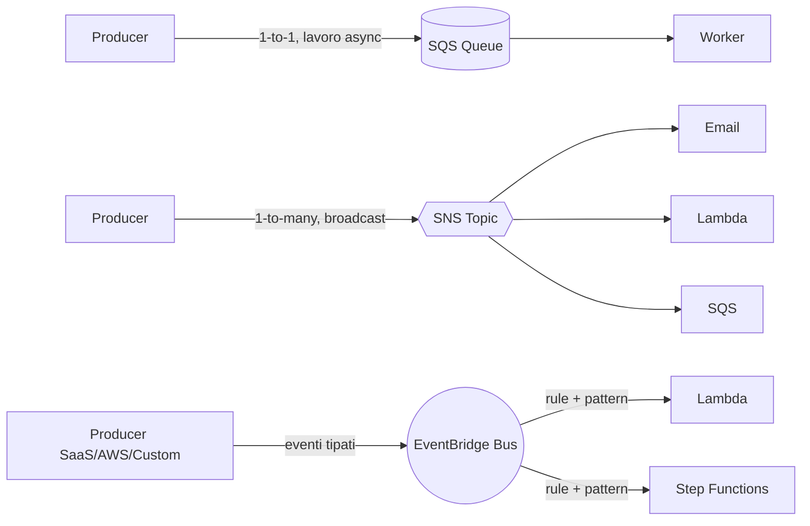

# SQS, SNS, EventBridge

Disaccoppiare i componenti è il primo passo per scalare. AWS offre tre primitive: **SQS** (code punto-a-punto), **SNS** (topic pub/sub) ed **EventBridge** (bus eventi con pattern matching). Capire quando usare cosa evita architetture pasticciate.

## 1. Quando usare cosa



Regola pratica: **SQS** se il consumer fa lavoro a quantità (job queue), **SNS** se devi fanout statico a pochi destinatari, **EventBridge** se vuoi filtrare per contenuto e dirigere a target dinamici.

## 2. SQS — code gestite

Due tipi:

| Caratteristica | Standard | FIFO |
|---|---|---|
| Throughput | illimitato | 300 TPS (3000 con batching), 70k con high-throughput mode |
| Ordering | best-effort | garantito per MessageGroupId |
| Delivery | at-least-once | exactly-once (dedup window 5 min) |
| Prezzo | $0.40/M | $0.50/M |

Concetti chiave:
- **Visibility timeout**: quando un consumer fa `ReceiveMessage`, il messaggio diventa invisibile per N secondi. Se non viene cancellato entro quel tempo, torna visibile. Default 30s, max 12h.
- **Long polling** (`WaitTimeSeconds=20`): riduce richieste vuote e costi. Usare sempre.
- **Dead-Letter Queue (DLQ)**: dopo N tentativi (`maxReceiveCount`), il messaggio finisce in una coda separata per analisi.
- **Delay queue**: ritardo iniziale 0-900s.
- **Message size**: max 256 KB. Per payload più grandi, **Extended Client Library** mette il body in S3 e in coda viaggia solo il puntatore.

```bash
aws sqs send-message \
  --queue-url https://sqs.eu-west-1.amazonaws.com/123/jobs \
  --message-body '{"orderId":"o-42"}' \
  --message-attributes 'priority={DataType=String,StringValue=high}'
```

## 3. SNS — pub/sub topic

Un publisher pubblica su un **topic**, N subscriber ricevono. Protocolli supportati: HTTP/HTTPS, email, SMS, push mobile, **SQS**, **Lambda**, Kinesis Firehose. Pattern **fan-out** classico: SNS → N code SQS, ognuna processata indipendentemente da un servizio diverso.

- **FIFO topic** + FIFO queue per ordering end-to-end.
- **Message filtering**: ogni subscription può avere una filter policy JSON, riceve solo eventi che matchano.
- **Message Data Protection**: maschera PII automaticamente.

Gotcha: senza filter policy ogni subscriber riceve tutto e paga ogni delivery.

## 4. EventBridge — il bus eventi

3 tipi di bus:
- **Default bus**: eventi nativi AWS (EC2 state change, S3 object created se attivato, ecc.).
- **Custom bus**: i tuoi eventi applicativi.
- **Partner bus**: eventi da SaaS (Datadog, Auth0, Shopify, Zendesk…).

Una **rule** definisce un **event pattern** (JSON) e fino a 5 **target**.

```json
{
  "source": ["myapp.orders"],
  "detail-type": ["OrderPlaced"],
  "detail": { "amount": [{ "numeric": [">", 1000] }] }
}
```

Feature avanzate:
- **Schema Registry**: discover automatico dei tipi di evento, genera codice.
- **Archive + Replay**: registra tutti gli eventi e ri-iniettali per debug o backfill.
- **Pipes**: source → (filter + enrich) → target, sostituisce molto codice glue Lambda. Source può essere SQS, Kinesis, DynamoDB Streams, MSK.
- **Scheduler**: cron managed con scala a milioni di schedule (sostituisce CloudWatch Events Rules per cron).

## 5. Latenza e throughput

| Servizio | Latenza tipica | Throughput |
|---|---|---|
| SQS Standard | 10-100 ms | illimitato |
| SNS Standard | 30-100 ms | molto alto |
| EventBridge | 0.5-2 s end-to-end | 10k/s per region (raise) |

EventBridge **non** è per real-time sub-secondo. Per quello SNS o Kinesis.

## 6. Anti-pattern

- Usare SQS come "buffer per evitare di scalare il DB": funziona finché non hai backlog cronico. Risolvi prima la causa.
- Mettere logica di business in filter policy SNS/EventBridge: diventa illeggibile.
- Dimenticarsi la DLQ: i poison message ti riempiono la coda e bruciano lambda invocations.
- Visibility timeout < tempo medio di processing → duplicati a cascata.

## 7. Pricing rapido

- **SQS**: $0.40/M richieste standard. Una `ReceiveMessage` long-poll = 1 richiesta.
- **SNS**: $0.50/M publish + costo delivery per protocollo (SMS caro!).
- **EventBridge**: $1/M eventi custom, eventi AWS gratis nel default bus.

## 8. Esercizio

<details>
<summary>5 microservizi devono reagire a "OrderPlaced", ognuno con filtri diversi. Cosa usi?</summary>

**EventBridge custom bus**. Un evento solo, 5 rule con event pattern specifici, 5 target (Lambda / SQS / Step Functions). Vantaggi vs SNS fan-out + SQS: filtering più ricco (numeric, exists, anything-but), schema registry, archive+replay per debug. SNS+SQS funziona ma il filtering è meno espressivo e il debug più rumoroso.
</details>

<details>
<summary>Worker che processa video 10 minuti. Visibility timeout consigliato?</summary>

Visibility timeout almeno 12-15 minuti (con margine), oppure chiamare `ChangeMessageVisibility` periodicamente come heartbeat. Se il worker crasha, il messaggio torna visibile e un altro worker lo riprende. Imposta `maxReceiveCount=3` con DLQ per evitare loop infiniti sui video corrotti.
</details>

> **Riassunto**: SQS = code 1-a-1 con visibility timeout e DLQ; SNS = pub/sub fan-out a pochi target; EventBridge = bus eventi con pattern matching, schema registry, Pipes e Scheduler. Scegli in base a cardinalità destinatari e necessità di filtering.
