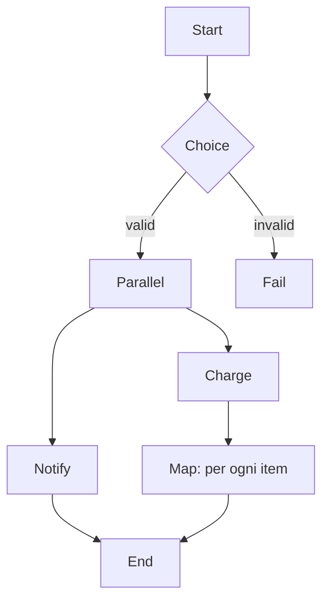

# Step Functions, MQ, AppFlow

Tre servizi molto diversi accomunati dal tema "muovere e coordinare dati tra sistemi": **Step Functions** orchestra workflow tra servizi AWS, **MQ** offre broker tradizionali per migrazioni lift-and-shift, **AppFlow** muove dati da/per SaaS senza scrivere codice.

## 1. Step Functions — workflow managed

Una macchina a stati definita in **ASL** (Amazon States Language, JSON). Ogni stato è un `Task`, `Choice`, `Parallel`, `Map`, `Wait`, `Pass`, `Succeed` o `Fail`. Step Functions chiama l'integrazione, gestisce retry/catch, persiste lo stato di esecuzione (fino a 1 anno per Standard).

| Caratteristica | Standard | Express |
|---|---|---|
| Durata max | 1 anno | 5 minuti |
| Esecuzioni/sec | 2000 startup, 4000 transition | 100k+ |
| Prezzo | $25/M transitions | $1/M invocations + GB-s |
| Audit | step-by-step in console | aggregato in CloudWatch Logs |
| Use case | long-running, audit-critical | high-volume event processing |

## 2. ASL — esempio minimale

```json
{
  "StartAt": "Validate",
  "States": {
    "Validate": {
      "Type": "Task",
      "Resource": "arn:aws:states:::lambda:invoke",
      "Parameters": { "FunctionName": "validateOrder", "Payload.$": "$" },
      "Retry": [{ "ErrorEquals": ["States.TaskFailed"], "MaxAttempts": 3, "BackoffRate": 2 }],
      "Catch": [{ "ErrorEquals": ["ValidationError"], "Next": "Reject" }],
      "Next": "Charge"
    },
    "Charge": { "Type": "Task", "Resource": "arn:aws:states:::sqs:sendMessage.waitForTaskToken", "End": true },
    "Reject": { "Type": "Fail", "Error": "Invalid" }
  }
}
```

## 3. Pattern di stato fondamentali



- **Task**: chiama un servizio (Lambda, ECS task, SNS, DynamoDB, Bedrock, …). Step Functions integra **direttamente 220+ servizi AWS** senza Lambda glue.
- **Choice**: branching su valori di input.
- **Parallel**: brache eseguite contemporaneamente, aggregazione output.
- **Map**: itera su un array. Modalità **Inline** (max 40 concorrenti) o **Distributed Map** che scala a **10.000 esecuzioni parallele** processando milioni di item da S3 o JSON inline.
- **Wait**: ritardo statico (`Seconds`) o assoluto (`Timestamp`).
- **waitForTaskToken** (`.sync` / `.waitForTaskToken`): pausa il workflow finché un sistema esterno non chiama `SendTaskSuccess`. Pattern human-approval o long-running async.

## 4. Error handling

Niente più try/catch sparso: `Retry` e `Catch` sono dichiarativi a livello di stato. Best practice:
- `States.ALL` come catch-all finale, ma con specifici prima.
- Backoff esponenziale (`BackoffRate: 2`) per non martellare il downstream.
- Stato dedicato di compensation (saga pattern) per rollback distribuito.

## 5. Workflow Studio

Editor visuale drag-and-drop dentro la console che genera ASL. Utile per iniziare e per onboarding di chi non conosce JSON. Output è sempre ASL versionabile in git.

## 6. Amazon MQ — broker tradizionali

MQ è AWS-managed **ActiveMQ Classic / Artemis** e **RabbitMQ**. Esiste per un motivo: migrazioni lift-and-shift da app on-prem che parlano già JMS, AMQP 0-9-1, MQTT, STOMP, OpenWire. Se nasci cloud, **usa SNS+SQS**: meno operazioni, prezzo lineare. MQ ha vantaggi specifici:

- **Protocolli legacy**: JMS, AMQP, MQTT, STOMP.
- **Topic durable + selector**: richiesti da app vecchie.
- **Single-broker dev** o **active/standby** (multi-AZ).

Trappola: MQ è un broker **gestito ma non serverless**. Paghi l'istanza 24/7. Per workload moderate vanno bene mq.t3.micro; in produzione mq.m5.large in active/standby.

## 7. AppFlow — integrazione SaaS no-code

Flussi bidirezionali tra **SaaS** (Salesforce, Slack, Marketo, ServiceNow, Zendesk, SAP, Google Analytics…) e **AWS** (S3, Redshift, EventBridge). Console-based: scegli source → destination → mapping campi → schedule/on-demand/event-triggered. Trasformazioni semplici (filter, mask, validate, arithmetic).

| Servizio | Quando |
|---|---|
| AppFlow | "voglio Salesforce Opportunity in S3 ogni ora, senza scrivere codice" |
| EventBridge Partner bus | "voglio reagire in tempo reale a eventi SaaS" |
| Glue / Lambda custom | controllo totale, trasformazioni complesse |

## 8. Esercizio

<details>
<summary>Pipeline: 50.000 file CSV in S3, per ognuno chiamare Lambda di validazione e poi caricare in Redshift. Quale primitiva Step Functions?</summary>

**Distributed Map** con source S3. Scansiona il bucket, lancia fino a 10.000 esecuzioni child in parallelo, ognuna chiama la Lambda di validazione e poi un Task Redshift Data API. Aggrega risultati e gestisce retry/error per item. Senza Distributed Map dovresti splittare a mano e fare orchestrazione con SQS+Lambda.
</details>

<details>
<summary>App legacy Java EE on-prem usa JMS con ActiveMQ. Migri ad AWS, cosa scegli?</summary>

Fase 1 lift-and-shift: **Amazon MQ for ActiveMQ** in active/standby multi-AZ. L'app non cambia codice (URL del broker punta all'endpoint MQ). Fase 2 (futura): refactor verso SNS+SQS quando il team è pronto. Andare diretti su SQS richiede riscrittura del codice JMS, spesso non vale per app stabili.
</details>

> **Riassunto**: Step Functions = workflow ASL con 220+ integrazioni dirette, Standard per long-running e Express per high-volume, Distributed Map per fan-out massivo; MQ per migrazioni broker legacy (JMS/AMQP/MQTT); AppFlow per integrazioni SaaS no-code.
