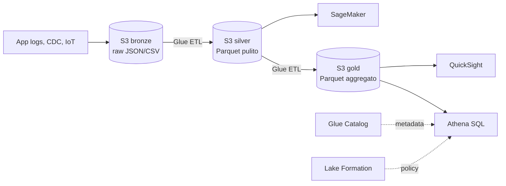

# Athena, Glue, Lake Formation — data lake

Un **data lake** è "tutti i tuoi dati grezzi in S3 + un catalogo + un motore SQL". AWS lo realizza con tre servizi che si compongono: **Glue** (catalogo + ETL), **Athena** (query), **Lake Formation** (security). Insieme sostituiscono molti data warehouse classici quando i dati sono semi-strutturati e i pattern di query irregolari.

## 1. Architettura medallion (bronze/silver/gold)



Regola: **bronze immutabile** (rollback sempre possibile), **silver normalizzato Parquet partizionato**, **gold ottimizzato per consumo** (BI, ML feature store).

## 2. Athena — SQL serverless su S3

Athena è **Trino managed** (in passato Presto). Punti chiave:

- **Pricing**: $5 per TB **scansionato** dopo compressione. Una query mal partizionata può costare €€€.
- **Partition pruning**: `WHERE dt='2026-05-21'` su tabella partizionata legge solo quella partizione.
- **Columnar formats** (Parquet/ORC): leggi solo le colonne richieste. **~100x più economico** di JSON/CSV.
- **CTAS** (`CREATE TABLE AS SELECT`): materializza risultati in S3 in formato ottimizzato.
- **Federated query**: legge anche da RDS, DynamoDB, Redshift, on-prem (con Lambda connector).
- **Athena for Spark**: notebook PySpark serverless, integrazione catalog.
- **Query Result Reuse**: cache risultati fino a 7 giorni → query identica = costo 0.

### Esempio

```sql
-- Tabella esterna su S3 Parquet partizionata per giorno
CREATE EXTERNAL TABLE orders (
  order_id string, user_id bigint, amount decimal(10,2)
)
PARTITIONED BY (dt string)
STORED AS PARQUET
LOCATION 's3://lake-silver/orders/';

MSCK REPAIR TABLE orders;  -- registra partizioni esistenti

-- Query con partition pruning: scansiona ~50 MB invece di 50 GB
SELECT user_id, SUM(amount)
FROM orders
WHERE dt BETWEEN '2026-05-01' AND '2026-05-21'
GROUP BY user_id;
```

## 3. Glue — Data Catalog + ETL

| Componente | Cosa fa |
|---|---|
| **Data Catalog** | Hive Metastore managed; condiviso da Athena, EMR, Redshift Spectrum, SageMaker |
| **Crawler** | Scansiona S3/JDBC e inferisce schema + partizioni → popola il catalog |
| **Glue ETL** | Job Spark o Python Shell managed, pay-per-DPU-second |
| **Glue Studio** | UI visual drag-and-drop che genera codice PySpark |
| **DataBrew** | Preparazione no-code (250+ trasformazioni), per analisti |
| **Glue Streaming** | Job continuativi su Kinesis/MSK source |
| **Job Bookmark** | Stato incrementale: processa solo i nuovi file dall'ultima run |

Trappola comune: i **crawler costano** se li lanci ogni 5 minuti su bucket grandi. Spesso conviene **registrare le partizioni manualmente** (`ALTER TABLE ADD PARTITION`) dal job ETL che le ha appena create.

## 4. Lake Formation — security fine-grained

Senza Lake Formation, l'access control su S3+Glue è "bucket o niente". Con LF puoi concedere:

- **Database / Table / Column level**: nascondi colonne sensibili.
- **Row-level filter**: WHERE clause iniettata automaticamente (es. ogni utente vede solo i record del proprio paese).
- **Cell-level masking**: hash o redact in lettura.
- **LF-Tags**: etichetti risorse con tag (`sensitivity=pii`) e concedi permessi per tag.
- **Cross-account data sharing**: pattern data mesh — produttore condivide un database, consumatori lo "linkano" nel proprio account.

LF si integra trasparente con Athena, Redshift Spectrum, EMR, Glue, QuickSight, SageMaker.

## 5. Costi: l'errore che paga di più

Bucket di log JSON gzip da 10 TB. Una `SELECT *` senza WHERE costa **$50**. Stessi dati in **Parquet + Snappy + partizionati per giorno**, stessa query selettiva costa **$0,05**. Differenza 1000x. Lezione: **non interrogare mai JSON/CSV con Athena per analisi ricorrenti**. Converti in Parquet con Glue una volta sola.

## 6. Open Table Formats: Iceberg, Hudi, Delta

Athena, Glue ed EMR supportano nativamente **Apache Iceberg**, **Hudi**, **Delta Lake**. Aggiungono ACID, time travel, schema evolution, upsert su S3 senza riscrivere intere partizioni. Iceberg è il default consigliato AWS dal 2024.

## 7. Pattern di adozione

1. **Logs in S3 + Glue Crawler + Athena**: già un data lake di base, costo zero a riposo.
2. **Aggiungi Glue ETL** per bronze → silver Parquet partizionato.
3. **Lake Formation** quando arrivano team multipli o dati sensibili.
4. **Iceberg** quando servono update/delete (GDPR) o pipeline CDC.

## 8. Esercizio

<details>
<summary>Hai 5 TB di log JSON in S3 e Athena costa $250/mese. Cosa fai?</summary>

Due interventi: (1) **Glue ETL** che converte i log in **Parquet Snappy partizionato per `dt`**; riduce dimensione ~5-10x e abilita partition pruning. (2) Forzare le query a includere sempre `WHERE dt=...`. Risultato tipico: da $250 a $5-15/mese. Bonus: abilita **Query Result Reuse** per dashboard ricorrenti.
</details>

<details>
<summary>Devi dare accesso a "tabella ordini" a 30 analisti, ma il campo `customer_email` deve essere nascosto per 25 di loro. Come?</summary>

**Lake Formation column-level grant**: crei due gruppi IAM (analyst, analyst-pii). Sul database concedi `SELECT` su tutte le colonne tranne `customer_email` al gruppo analyst, e `SELECT` totale a analyst-pii. Athena applica automaticamente il filtro. Senza LF dovresti creare due view distinte e gestire i grant su S3 a mano — scala male.
</details>

> **Riassunto**: Athena = SQL serverless su S3 ($5/TB scansionato), Glue = catalog + ETL Spark + crawler, Lake Formation = security fine-grained (column/row/cell). Architettura bronze/silver/gold in Parquet partizionato è il pattern di riferimento; Iceberg per ACID e CDC.
