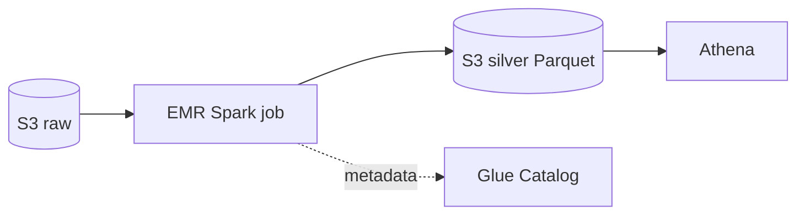

# EMR, Kinesis, MSK

Tre famiglie per dati in volume: **EMR** per batch big-data, **Kinesis** per streaming AWS-nativo, **MSK** per chi vuole Kafka standard. La scelta dipende da volume, latenza, ecosistema esistente e quanto cluster vuoi gestire.

## 1. EMR — Hadoop/Spark managed

EMR (Elastic MapReduce) installa e configura **Spark, Hive, Presto/Trino, HBase, Flink, Hudi, Iceberg** su EC2 o EKS o serverless. Tre forme:

| Forma | Quando |
|---|---|
| **EMR on EC2** | Massimo controllo, cluster long-running o transient |
| **EMR on EKS** | Tu hai già EKS, vuoi co-location con altri workload, multitenancy |
| **EMR Serverless** | Job a burst, niente cluster da gestire, pay-per-vCPU-secondo |

Architettura tipica EC2: **master** node + **core** nodes (storage HDFS + compute) + **task** nodes (solo compute, ottimi per Spot al 70-90% di sconto). EMRFS sostituisce HDFS con **S3** come storage permanente: i cluster diventano stateless e usa-e-getta (transient).



Trappola: cluster long-running idle = bruciare soldi. Per pipeline batch giornaliere, **EMR Serverless** o **transient cluster con StepFunctions** sono quasi sempre meglio.

## 2. Kinesis Data Streams

Stream di record ordinati per **partition key**, suddivisi in **shard**. Ogni shard regge ~1000 record/s o 1 MB/s ingress, 2 MB/s egress.

- **Retention**: 24h default, fino a 365 giorni a pagamento.
- **On-demand mode**: AWS gestisce gli shard automaticamente (fino a 200 MB/s in scrittura, 400 MB/s lettura).
- **Enhanced fan-out (EFO)**: consumer dedicato con 2 MB/s **per consumer per shard** (no contesa).
- **KCL** (Kinesis Client Library) per consumer Java/Python con checkpoint in DynamoDB.

```bash
aws kinesis put-record \
  --stream-name events \
  --partition-key user-42 \
  --data $(echo -n '{"v":1}' | base64)
```

## 3. Kinesis Data Firehose

**Delivery stream** completamente serverless. Buffera (per tempo o per size) e scarica a:
- S3 (con conversione Parquet/ORC opzionale via Glue schema)
- Redshift (via S3 + COPY)
- OpenSearch
- HTTP endpoint generico (Datadog, Splunk, MongoDB Atlas)

Trasformazione opzionale con **Lambda** in-flight. Pricing per GB ingested. È il modo più semplice per "log applicativi → S3 Parquet pronto per Athena".

## 4. Kinesis Video Streams

Stream video con SDK Producer per camere/dispositivi, retention configurabile, integrazione con **Rekognition Video** per analisi real-time o on-demand. Niente a che vedere con Data Streams sotto al cofano.

## 5. MSK — Managed Streaming for Kafka

**Kafka 100% open-source managed**. Compatibile con tutto l'ecosistema (Connect, Streams, Schema Registry, MirrorMaker, …).

| Servizio | Quando |
|---|---|
| **MSK Provisioned** | Tu scegli broker (es. kafka.m7g.large), storage, partition count |
| **MSK Serverless** | Pay-per-throughput, AWS gestisce capacità (fino a 200 MB/s) |
| **MSK Connect** | Kafka Connect managed per sink/source (Debezium CDC, S3 sink, ecc.) |

MSK conviene se: già usi Kafka, hai consumer/producer Kafka esistenti, vuoi multi-region MirrorMaker, hai bisogno di compaction, exactly-once transactions.

## 6. Kinesis vs Kafka: la scelta

| Aspetto | Kinesis Data Streams | MSK |
|---|---|---|
| Operatività | totalmente managed | managed ma vedi broker |
| Pricing | per shard-ora + PUT payload | per broker-ora + storage |
| Ecosistema | AWS-centrico | enorme (Kafka Connect, Streams, ksqlDB) |
| Multi-region | manuale o cross-region replica | MirrorMaker 2 |
| Latenza | ~70-200 ms end-to-end | ~5-50 ms |
| Compaction | no | sì |
| Lock-in | AWS | portabile |

Regola rapida: greenfield AWS-only → Kinesis. Esistente Kafka o ecosistema third-party → MSK.

## 7. Pattern di costo

- Kinesis Data Streams on-demand è comodo ma più caro a regime: fissa shard quando il throughput è prevedibile.
- Firehose è il modo più economico per "stream → S3" se non ti serve replay con consumer multipli.
- MSK Serverless ha un costo base non-zero (~$0.75/h per cluster): no per piccoli workload.
- EMR su Spot per task nodes: risparmio 70-90% sui job batch.

## 8. Esercizio

<details>
<summary>Devi loggare 50.000 eventi clickstream/secondo da una web app a S3 in Parquet. Cosa scegli?</summary>

**Kinesis Data Firehose** con conversione Parquet abilitata (Glue schema). Buffering 128 MB / 5 min, partizionamento dinamico per giorno (`!{partitionKeyFromQuery:dt}`). Zero cluster da gestire, pay-per-GB. Aggiungi Lambda transform se serve normalizzare. Athena query direttamente l'output. Kinesis Data Streams pure va bene ma richiede consumer custom; MSK è overkill.
</details>

<details>
<summary>Job Spark pesante che gira 1h al giorno. EMR EC2, EKS o Serverless?</summary>

**EMR Serverless**. Niente cluster da spegnere/avviare, niente Spot capacity da gestire, paghi solo la vCPU-secondo effettiva. Per cluster long-running 24/7 con > 4-6 ore di lavoro al giorno EC2 con Spot diventa competitivo, ma sotto quella soglia Serverless vince per ops + costo.
</details>

> **Riassunto**: EMR = Hadoop/Spark managed (EC2, EKS, Serverless), usa Spot su task nodes; Kinesis = streaming AWS-nativo (Data Streams, Firehose serverless to S3/Redshift, Video); MSK = Kafka managed per chi ha già l'ecosistema. Greenfield → Kinesis, Kafka esistente → MSK.
