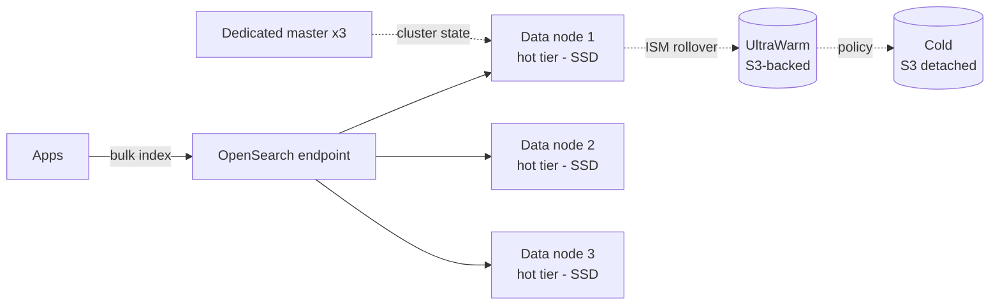

# OpenSearch e QuickSight

Due servizi complementari della famiglia Analytics: **OpenSearch** è il motore di search e log analytics (fork AWS di Elasticsearch), **QuickSight** è la piattaforma di Business Intelligence managed. Insieme coprono "trovare ago in pagliaio" e "presentare cruscotti".

## 1. OpenSearch Service — managed search

Nato come fork open-source di Elasticsearch 7.10 dopo il cambio di licenza Elastic. AWS gestisce installazione, patching, snapshot, scaling.

Due opzioni di deploy:

| Modello | Quando |
|---|---|
| **Managed cluster** | controllo totale (instance type, EBS, dedicated master), workload prevedibile |
| **OpenSearch Serverless** | pay-per-OCU (OpenSearch Compute Unit), workload variabile, niente sizing |

### Architettura cluster

Best practice: **3 dedicated master node** in produzione (evita split-brain), nodi data dispari in **3 AZ**, replica almeno 1.

## 2. Tiered storage

- **Hot tier**: SSD locale, query veloci, dati recenti.
- **UltraWarm**: indici read-only su S3 + cache locale, ~80% in meno di costo, latenza 10x.
- **Cold storage**: dati molto vecchi, montati on-demand, costo minimo.
- **Index State Management (ISM)**: policy che fa **rollover** automatico (es. nuovo indice ogni 50 GB) e sposta dopo N giorni in UltraWarm e poi Cold.

Trappola classica: indici unici giganti (`logs-2026`) → rebalance lentissimo. Sempre **time-based index pattern** (`logs-2026.05.21`) con rollover.

## 3. Use case principali

1. **Log analytics**: CloudWatch Logs / Firehose / Logstash → OpenSearch → Dashboards (sostituto ELK).
2. **Full-text search applicativo**: catalogo prodotti, ricerca interna, knowledge base.
3. **Vector search per RAG**: dal 2023 OpenSearch supporta **k-NN engine** (HNSW, IVF). Indicizzi embedding di documenti e cerchi per similarità coseno. Building block per RAG con Bedrock.
4. **SIEM / security analytics** con il plugin Security Analytics.

### Sicurezza

- **Fine-grained access control** (FGAC): RBAC + filtri document/field level.
- **Cognito** o **SAML** per OpenSearch Dashboards (login utenti).
- Cluster sempre in VPC privato.

## 4. QuickSight — BI managed

BI cloud-native: dashboard interattive, paginated reports, embedded analytics, **machine learning insight** automatici.

| Caratteristica | Dettaglio |
|---|---|
| **Datasource** | S3, Athena, Redshift, RDS, Aurora, Snowflake, Salesforce, file CSV/Excel, SaaS via JDBC |
| **SPICE** | In-memory columnar engine (10 GB free per user) per query sub-secondo |
| **Direct Query** | Esegue ogni volta sul source (per dati real-time) |
| **Q** | Natural language: "what were sales last quarter by region?" → grafico |
| **Generative BI con Q** | Genera storie, executive summary, esegue cosa-se |
| **Embedded** | Iframe sicuro o JS SDK in app tue, RLS dinamico per tenant |
| **Paginated reports** | Pixel-perfect PDF/Excel pianificati (ex Bursting) |

## 5. SPICE: il segreto del prezzo

**SPICE** (Super-fast, Parallel, In-memory Calculation Engine) pre-carica i dati in RAM colonnare compressa. Una dashboard su 100 M righe risponde in < 1 s **e non interroga la fonte ogni volta**. Fondamentale per:
- limitare costo Athena (1 scan al refresh SPICE, non a ogni view)
- proteggere il DB transazionale (no query interattive on top)
- offline-capable (la fonte può essere giù, la dashboard funziona)

Refresh SPICE: schedulato o incrementale (solo righe nuove). 

## 6. Pricing modelli

| Tipo | Prezzo |
|---|---|
| **Author Pro / Standard** | $24-50/user/mese, crea dashboard |
| **Reader** | $3/user/mese o **$0.30/session** (capped a $5/user/mese) |
| **Embedded** | per session API |
| **Q add-on** | extra per author/reader |

Session pricing è killer per uso saltuario (es. 200 manager che entrano 1x al mese).

## 7. Quando scegliere cosa

- **OpenSearch**: cerca testo, log, vettori. Non è un BI tool.
- **QuickSight**: dashboard e report. Non è un motore di search.
- **Athena + QuickSight** è la combo classica "data lake → BI".
- **OpenSearch + QuickSight**: QuickSight si collega come datasource per visualizzare aggregati di log.

## 8. Esercizio

Logs CloudWatch da 200 microservizi, 500 GB/giorno, retention 90 giorni di ricerca veloce + 1 anno freddo. Architettura OpenSearch?

**Firehose → OpenSearch Managed** (oppure Serverless se carico variabile). Cluster: 3 dedicated master `m6g.large`, 6 data node `r6g.xlarge` in 3 AZ, replica 1. **ISM policy**: rollover ogni 50 GB o 1 giorno, sposta in **UltraWarm** dopo 30 giorni, **Cold** dopo 90 giorni, **delete** a 365 giorni. Time-based index `logs-YYYY.MM.DD`. Risparmio storage ~70% rispetto a tutto su hot.

200 manager guardano dashboard una volta al mese. Author Pro per loro?

No. **Reader con session pricing** ($0.30/session, capped $5/mese/utente). 200 × $5 = $1000/mese vs 200 × $24 = $4800/mese. Author solo per chi crea/modifica dashboard. Bonus: embedded session se la dashboard vive dentro un portale interno → ancora più economico per uso anonimo aggregato.

> **Riassunto**: OpenSearch = search/log/vector managed con tiered storage hot→UltraWarm→Cold e ISM; QuickSight = BI con SPICE in-memory, Q natural language, embedded e session pricing. Combinazione tipica: Athena → QuickSight per BI, Firehose → OpenSearch per log analytics e RAG.
