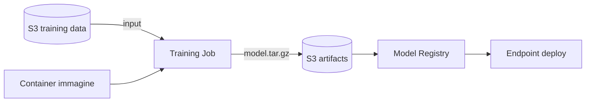

# SageMaker — overview

SageMaker è la piattaforma ML "tutto in uno" di AWS: dal notebook al modello in produzione, passando per training distribuito, feature store, monitoring, pipeline MLOps. È enorme: in questa sezione vediamo i pezzi essenziali e quando usarli.

## 1. SageMaker Studio

IDE web basato su **JupyterLab** con:
- spazio collaborativo per data scientist
- accesso a notebook su istanze elastiche (ml.t3.medium → ml.p5.48xlarge)
- terminal, debugger, profiler, code editor (Code Editor IDE), RStudio
- integrazione git
- **Studio Lab**: versione gratuita personale con CPU/GPU, account separato AWS

Costo: paghi solo l'istanza notebook quando è running.

## 2. Training



Tre approcci:

| Approccio | Quando |
|---|---|
| **Built-in algorithms** | XGBoost, Linear Learner, Object Detection, Seq2Seq, k-NN — pronti |
| **Script mode** (framework container) | tuo codice PyTorch / TF / HuggingFace dentro container AWS-managed |
| **BYO container** | container ECR custom con `train` come entrypoint |

Funzioni chiave:
- **Managed Spot Training**: risparmio fino al **90%** sui job interrompibili (checkpointing su S3).
- **Distributed training**: **data parallel** (SMDDP) e **model parallel** (SMP) per modelli che non stanno in una GPU.
- **SageMaker HyperPod**: cluster persistenti GPU per training di foundation model giganti (settimane), con resilienza automatica.
- **Warm pool**: tieni l'istanza calda per N minuti dopo il job per iterazioni rapide.

```python
import sagemaker
from sagemaker.pytorch import PyTorch

est = PyTorch(
    entry_point="train.py",
    role=role,
    instance_type="ml.p4d.24xlarge",
    instance_count=4,
    framework_version="2.3",
    distribution={"torch_distributed": {"enabled": True}},
    use_spot_instances=True, max_wait=7200, max_run=3600,
    checkpoint_s3_uri="s3://my-bucket/ckpt/"
)
est.fit({"train": "s3://my-bucket/train/"})
```

## 3. Inference: quattro opzioni

| Tipo | Latenza | Costo | Use case |
|---|---|---|---|
| **Real-time endpoint** | < 100 ms | istanza 24/7 | API sincrona, traffico costante |
| **Serverless inference** | cold start 1-5 s, poi < 100 ms | pay-per-request | traffico variabile / intermittente |
| **Asynchronous inference** | secondi-minuti | istanza scala a 0 quando vuoto | payload grandi (1 GB), processing lungo |
| **Batch transform** | offline | job temporaneo | predict massivo su dataset (no endpoint) |

Plus:
- **Multi-model endpoint**: N modelli sulla stessa istanza, caricati on-demand.
- **Multi-container endpoint**: pipeline di container in sequenza/parallelo.
- **Inference Recommender**: benchmarka istanze per latenza/cost.
- **Shadow testing**: invia % traffico a un nuovo modello senza esporlo agli utenti.

## 4. MLOps: Pipelines, Registry, Monitor

- **SageMaker Pipelines**: DAG di step (preprocess, train, eval, register, deploy) versionato, integrato con CI/CD. Sostituisce Step Functions per workflow ML.
- **Model Registry**: catalogo modelli con versioning, approval workflow, lineage.
- **Model Monitor**: rileva **data drift**, **model drift**, **bias drift**, **feature attribution drift** in produzione. Schedula baseline → confronto periodico.
- **Clarify**: bias detection pre-training e post-training, explainability (SHAP).

## 5. Feature Store

Repository centralizzato di feature ML, **online** (DynamoDB, low-latency) + **offline** (S3 Parquet, storia). Risolve il classico "training/serving skew": il codice di estrazione feature è uno solo, sia per training (batch) che per inference (real-time).

## 6. Ground Truth e AutoML

- **Ground Truth**: labeling managed (Mechanical Turk, vendor o team interno). Active learning per ridurre il labeling necessario.
- **Autopilot**: AutoML tabulare (regression/classification/time series). Genera notebook ispezionabili.
- **Canvas**: AutoML **no-code** per analisti business, con generative AI per modelli ready-made.
- **JumpStart**: catalogo di foundation model (Llama, Mistral, Stable Diffusion, ecc.) e soluzioni one-click. Deploy in 2 click.

## 7. Costi & gotcha

- Notebook lasciato acceso 24/7 = costo silenzioso. Configurare **idle shutdown** in Studio.
- Endpoint real-time = istanza che paghi anche se zero richieste. Per traffico irregolare passa a **Serverless** o **Async**.
- Training su istanze p4d/p5 senza Spot = bruciare cassa.
- Multi-model endpoint conviene quando hai centinaia di modelli simili con traffico sparso.
- Per RAG e LLM custom valuta **Bedrock** prima (sezione 33): SageMaker custom solo se serve fine-tuning profondo o modelli non sul catalogo.

## 8. Esercizio

<details>
<summary>Devi servire 50 modelli XGBoost (uno per tenant), traffico totale 100 req/min sparso. Architettura SageMaker?</summary>

**Multi-model endpoint** su singola istanza ml.m5.large (o due in multi-AZ). I 50 modelli stanno su S3, vengono caricati on-demand in cache LRU. Costo: 1-2 istanze invece di 50. Alternativa **Serverless inference** se traffico molto sporadico. Real-time endpoint dedicato per ogni tenant = anti-pattern: 50 istanze 24/7 = €€€.
</details>

<details>
<summary>Training di un modello custom da 10B parametri. Cluster ottimale?</summary>

**SageMaker HyperPod** con 16-64 ml.p5.48xlarge (8x H100), distributed training via **SMP** (model parallel) + **SMDDP** (data parallel). FSx for Lustre come storage condiviso ad alta banda per i checkpoint. Spot non adatto: i job sono lunghi e l'interruzione fa perdere ore. HyperPod gestisce node failure recovery automatico.
</details>

> **Riassunto**: SageMaker = piattaforma ML end-to-end. Studio per dev, Training con Spot e distributed (HyperPod per foundation model), Inference in 4 sapori (real-time, serverless, async, batch), Pipelines + Registry + Monitor per MLOps, Feature Store contro training/serving skew, AutoML (Autopilot, Canvas, JumpStart). Per LLM e RAG valuta Bedrock prima di andare custom.
