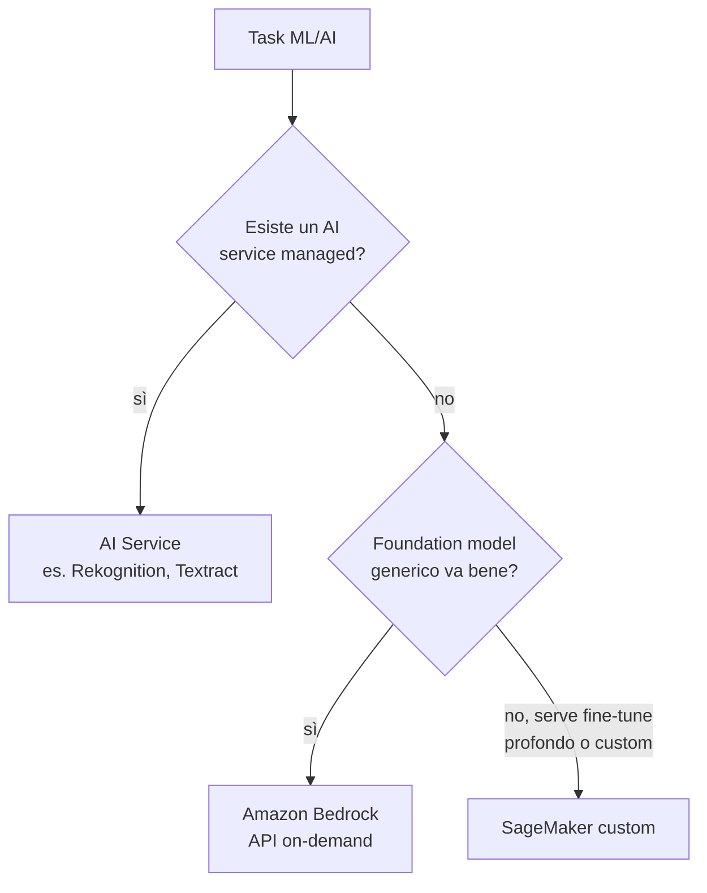

# Bedrock e AI services

Negli ultimi anni AWS ha aggiunto due livelli sopra SageMaker: **Bedrock** (foundation model GenAI as-a-service) e una famiglia di **AI service managed** (Rekognition, Comprehend, Polly…) che risolvono task specifici senza dover addestrare nulla. Capire quando usare uno, l'altro o SageMaker è la decisione architetturale chiave per ML in AWS.

## 1. La piramide della decisione



Regola: **alza il livello di astrazione il più possibile**. Custom training su SageMaker è l'ultima opzione, non la prima.

## 2. Amazon Bedrock — foundation model on demand

Bedrock espone modelli di diversi fornitori via **una API unica**, senza gestire infrastruttura:

| Provider | Modelli (esempi) | Forte in |
|---|---|---|
| Anthropic | Claude (Opus, Sonnet, Haiku) | reasoning, agent, lungo contesto |
| Meta | Llama 3.x | open-weight, multilingue |
| Mistral | Mistral Large, Mixtral | efficienza, multilingua EU |
| Cohere | Command, Embed | RAG, embedding multilingua |
| Amazon | Titan, **Nova** (Pro, Lite, Micro, Canvas, Reel) | text, image, video gen |
| Stability | Stable Diffusion XL | immagini |
| AI21 | Jamba | long context |

### Modalità d'uso

- **On-demand** (pay-per-token): default, niente capacity.
- **Provisioned throughput**: capacity riservata per latenza/QPS garantiti.
- **Batch inference**: 50% di sconto, async su dataset S3.
- **Cross-region inference**: routing automatico tra regioni per resilienza.

```python
import boto3, json
br = boto3.client("bedrock-runtime", region_name="eu-west-1")
resp = br.converse(
    modelId="anthropic.claude-sonnet-4-7-v1:0",
    messages=[{"role": "user", "content": [{"text": "Riassumi: ..."}]}],
    inferenceConfig={"maxTokens": 1024, "temperature": 0.2}
)
print(resp["output"]["message"]["content"][0]["text"])
```

## 3. Feature Bedrock che cambiano il design

- **Knowledge Bases**: RAG managed. Punti a bucket S3 / Confluence / SharePoint / web / Salesforce, Bedrock chunka, embedda (vectore store OpenSearch Serverless / Aurora pgvector / Pinecone), serve `RetrieveAndGenerate`. Eviti di scrivere pipeline RAG a mano.
- **Agents**: orchestrazione tool-use, action group con OpenAPI/Lambda, integrazione Knowledge Base, memory di sessione. Sostituisce framework tipo LangChain per molti casi.
- **Guardrails**: filtri input/output (PII, topic deny, harmful content, **contextual grounding** per ridurre allucinazioni RAG).
- **Bedrock Studio**: ambiente low-code per prototipare agent e chatbot.
- **Model Customization**: fine-tuning (LoRA) e **continued pre-training** su tuoi dati.
- **Model Distillation**: usa un modello grande come teacher per addestrarne uno piccolo task-specific (90% performance, costo 10x meno).
- **Intelligent Prompt Routing**: instrada ogni richiesta al modello "giusto" (cheap vs powerful) in base alla difficoltà stimata.
- **Bedrock Marketplace**: catalogo modelli extra (HuggingFace, vendor) deploy in pochi click.

## 4. AI services managed — task specifici

| Servizio | Cosa fa |
|---|---|
| **Rekognition** | image/video: face, label, moderation, celebrity, custom labels |
| **Comprehend** | NLP: sentiment, entities, key phrases, language, topic modeling, **Medical** variant |
| **Translate** | traduzione 75+ lingue, custom terminology |
| **Polly** | TTS neural / generative, 100+ voci, SSML |
| **Transcribe** | STT real-time/batch, speaker diarization, **Medical**/**Call Analytics** |
| **Textract** | OCR + estrazione form/tabelle/firme/query (molto più avanti di un OCR) |
| **Lex** | chatbot conversazionali (stesso engine di Alexa) |
| **Personalize** | recommender system, real-time |
| **Forecast** | time series forecasting AutoML |
| **Fraud Detector** | anti-frode online ML-based |
| **Kendra** | enterprise search semantica con connectori (alternativa Knowledge Base) |
| **Lookout for Equipment/Vision/Metrics** | anomaly detection industriale |
| **HealthLake / Comprehend Medical** | dati clinici FHIR + NLP medico |

E poi i **Q**:
- **Amazon Q Developer**: assistente AI in IDE (autocomplete, chat, agent, security scan).
- **Amazon Q Business**: chatbot enterprise sopra i tuoi dati aziendali, con SSO, RBAC, plugin.

## 5. Quando Bedrock, quando AI service, quando SageMaker

| Necessità | Soluzione |
|---|---|
| OCR fatture | **Textract** (no LLM serve) |
| Trascrizione meeting con speaker | **Transcribe** |
| Chatbot RAG su Confluence | **Bedrock Knowledge Bases** o **Q Business** |
| Agent che esegue tool sui tuoi sistemi | **Bedrock Agents** |
| Recommender e-commerce | **Personalize** |
| Modello XGBoost custom su tabelle proprietarie | **SageMaker** |
| Foundation model proprietary fine-tune profondo | **SageMaker** (o Bedrock customization se modello supportato) |
| Detection difetti su foto produzione (poche label) | **Rekognition Custom Labels** o **Lookout for Vision** |

## 6. Pricing pattern

- AI services: per request/character/minute, niente fisso.
- Bedrock on-demand: per **1k token input/output** (variabile per modello).
- Bedrock provisioned: $ per model-unit-hour, conviene da ~5-10 RPS stabili.
- Knowledge Bases: storage vector store + ingestion + retrieve fee.
- SageMaker: ore istanza GPU/CPU.

## 7. Gotcha tipici

- Allucinazioni in RAG: attivare **Guardrails contextual grounding** o re-rank con citation enforce.
- Costo agent fuori controllo: ogni step di tool-use è una nuova call al modello. Limitare `maxIterations`.
- Latency variabile su on-demand quando la regione è satura → **cross-region inference** o provisioned throughput.
- Non confondere **Q Developer** (gratis fino a un certo uso, IDE-only) con **Q Business** (a pagamento, enterprise app).
- Knowledge Bases con bucket pieni di PDF scansionati: prima passa per **Textract**, altrimenti chunk vuoti.

## 8. Esercizio

<details>
<summary>Devi costruire un chatbot interno che risponda su 50.000 documenti aziendali (PDF, Word, Confluence). Stack?</summary>

Opzione 1 (rapida): **Amazon Q Business** con connector Confluence + S3 (per PDF/Word). SSO via IdC, RBAC mappato sui permessi sorgente, plugin per ticket. Zero codice. Opzione 2 (più controllo): **Bedrock Knowledge Bases** (vector store OpenSearch Serverless o Aurora pgvector) + Bedrock Agents per orchestrazione + Guardrails. Frontend custom. Per PDF scansionati passare prima da **Textract**. SageMaker custom = overkill.
</details>

<details>
<summary>App mobile deve trascrivere note vocali (italiano, accenti regionali) e estrarre date/azioni. Soluzione?</summary>

**Transcribe** (italiano + custom vocabulary per termini di dominio) → **Bedrock Claude Sonnet** con prompt strutturato che estrae date, persone, action item in JSON. Output validato con **Guardrails** (PII redaction, niente contenuti sensibili). Per app real-time usare Transcribe streaming. Costo dominato da Transcribe per minuto.
</details>

> **Riassunto**: piramide AWS AI = AI services managed (specifici) → Bedrock (foundation model + KB + Agents + Guardrails) → SageMaker custom. Bedrock unifica Claude/Llama/Mistral/Titan/Nova via API singola; Knowledge Bases per RAG, Agents per tool-use, Guardrails per sicurezza. Q Developer aiuta il dev, Q Business porta GenAI sui dati aziendali. Sali di astrazione prima di andare custom.
