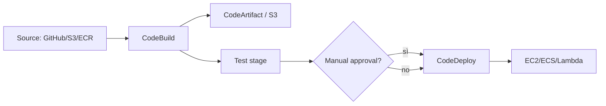
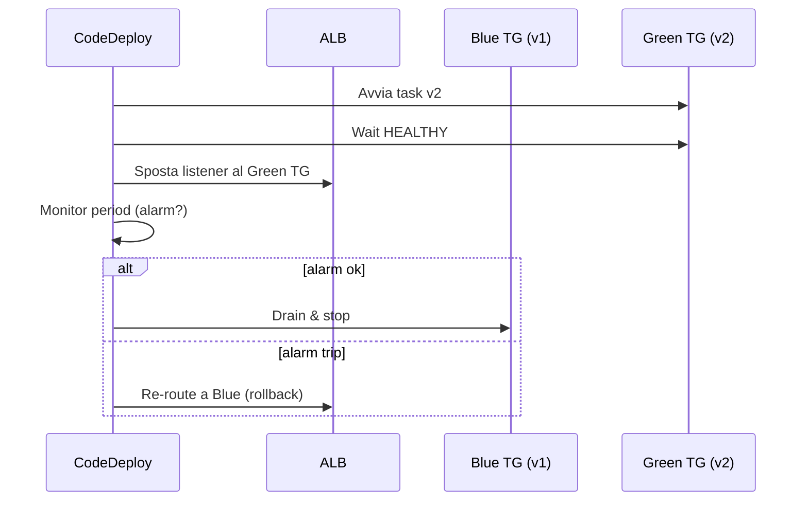

# CI/CD su AWS

Una pipeline CI/CD trasforma "push su main" in "in produzione, in sicurezza, con rollback automatico" senza intervento umano. AWS offre una famiglia di servizi "Code*" che si compongono, ma il mondo reale 2026 è bifronte: chi vive dentro AWS usa CodePipeline + CodeBuild, chi vive su GitHub usa Actions con OIDC. Vediamo entrambi.

## 1. La famiglia Code* (panoramica)



| Servizio | Ruolo |
|---|---|
| **CodePipeline** | Orchestratore (stage source/build/test/deploy) |
| **CodeBuild** | Worker compute managed (Linux/Windows, x86/ARM) |
| **CodeDeploy** | Deploy automatizzato su EC2/ECS/Lambda con hook |
| **CodeArtifact** | Repo privato npm/pip/Maven/NuGet/Generic |
| **CodeCommit** | Git managed — **deprecato lug 2024**, no nuovi account |
| **CodeCatalyst** | Esperienza end-to-end "all-in-one" (più recente) |

## 2. CodePipeline — l'orchestratore

Pipeline = sequenza di **stage**; ogni stage = sequenza di **action**. Trigger su commit (webhook GitHub/Bitbucket), su nuovo oggetto S3, schedule, o manuale.

Action types: Source, Build, Test, Deploy, Approval, Invoke (Lambda). **Manual Approval** = pausa per richiedere `:thumbsup:` di un umano (utile pre-prod), notifica via SNS.

Variante "V2" pipeline: parallel actions, variabili tra stage, esecuzioni concorrenti per branch.

## 3. CodeBuild — il worker

Definito da un `buildspec.yml` nel repo. Esegue dentro un container managed (Amazon Linux, Ubuntu, Windows) o **custom image** (tua da ECR).

```yaml
version: 0.2
phases:
  install:
    runtime-versions: { nodejs: 20 }
    commands: [ npm ci ]
  pre_build:
    commands:
      - aws ecr get-login-password | docker login --username AWS --password-stdin $ECR
  build:
    commands:
      - npm test
      - docker build -t $ECR/app:$CODEBUILD_RESOLVED_SOURCE_VERSION .
      - docker push $ECR/app:$CODEBUILD_RESOLVED_SOURCE_VERSION
artifacts:
  files: [ appspec.yml, taskdef.json ]
cache:
  paths: [ 'node_modules/**/*' ]
```

Feature utili: **batch build** (matrix tipo CI tradizionale), **local cache** (S3 o LOCAL Docker layer), **reports** (JUnit, code coverage), **VPC mode** (build dentro VPC per accedere a RDS interni).

## 4. CodeDeploy — strategie di rilascio

Tre target supportati: EC2/on-prem (con agent), Lambda, ECS.

| Strategia | Dove | Comportamento |
|---|---|---|
| **In-place** | EC2 | Aggiorna gli stessi server (rolling) |
| **Blue/Green** | EC2/ECS/Lambda | Crea ambiente nuovo, sposta traffico, distrugge vecchio |
| **Canary** | Lambda | 10% per 10 min, poi 100% (preset `Canary10Percent10Minutes`) |
| **Linear** | Lambda | Es. 10% ogni 10 min |
| **All-at-once** | Lambda | Switch totale (per dev) |

`appspec.yml` definisce **hook** (`BeforeAllowTraffic`, `AfterAllowTraffic`, `BeforeInstall`...): puoi attaccare una Lambda di smoke test. Rollback **automatico** se CloudWatch alarm scatta entro il monitor period.

## 5. ECS blue/green concretamente



Serve un secondo target group (idle quando blue è attivo). Costo: doppia compute per il monitor period.

## 6. CodeArtifact e CodeCatalyst

**CodeArtifact**: repo privato per dipendenze (`npm`, `pip`, `mvn`, `nuget`, `generic`). Vantaggi: cache upstream (pubblica npmjs), policy IAM, no chiavi PAT. Esempio: `aws codeartifact login --tool npm --domain myorg --repository internal`.

**CodeCatalyst**: piattaforma unificata 2023+ con sorgenti, workflow CI, Dev Environment cloud (Cloud9-like), issue tracker. Pensata come "GitHub di AWS" — meno adottata di Actions ma utile in shop AWS-only.

## 7. GitHub Actions + OIDC (l'alternativa popolare)

La maggior parte dei nuovi progetti usa **GitHub Actions** e si autentica su AWS via **OIDC** (no chiavi long-term in repo):

```yaml
permissions:
  id-token: write
  contents: read
jobs:
  deploy:
    runs-on: ubuntu-latest
    steps:
      - uses: aws-actions/configure-aws-credentials@v4
        with:
          role-to-assume: arn:aws:iam::1234:role/gh-deploy
          aws-region: eu-west-1
      - run: aws s3 sync ./dist s3://my-app/
```

Il `role/gh-deploy` ha un trust policy che accetta solo il provider OIDC GitHub + condizione su `repo:myorg/myrepo:ref:refs/heads/main`. Zero secrets, audit completo. Stessa logica per GitLab, Bitbucket, Buildkite, Circle.

## 8. Esercizio

<details>
<summary>Devi deployare un'API critica su ECS Fargate con rollback automatico se p99 sale. Come imposti la pipeline?</summary>

Setup:
1. **Source**: GitHub via webhook → CodePipeline (o Actions).
2. **Build** (CodeBuild): test, build immagine, push ECR con tag `git-sha`.
3. **Deploy** (CodeDeploy Blue/Green su ECS): traffic shift `Canary10Percent5Minutes`.
4. **CloudWatch Alarm** su `TargetResponseTime` p99 e `5XXError` collegato al Green TG.
5. CodeDeploy "Rollback on alarm" → torna automaticamente al Blue se alarm scatta nel monitor period.
6. SNS topic per notifiche Slack/PagerDuty su rollback.

Costo extra: doppia capacità per ~10-30 min. Vale ogni centesimo.
</details>

<details>
<summary>Hai chiavi AWS long-term in GitHub Secrets per i deploy. Quali rischi e come risolvi?</summary>

**Rischi**: chiavi che non scadono mai, leak via log/PR/fork, nessun audit pulito di chi le usa, rotation manuale dolorosa. Un repo pubblicato per errore espone l'account.

**Soluzione**: **OIDC federation**. Crei un OIDC Identity Provider in IAM puntando a `token.actions.githubusercontent.com`. Crei un ruolo con trust policy che richiede `sub: repo:org/repo:ref:refs/heads/main` (condizione stretta). In Actions, `aws-actions/configure-aws-credentials@v4` scambia il token GitHub per credenziali STS temporanee (1 ora). Zero secrets in repo, audit perfetto in CloudTrail.
</details>

> **Riassunto**: CodePipeline orchestra stage source/build/test/deploy; CodeBuild esegue buildspec; CodeDeploy fa blue/green ECS/EC2 e canary Lambda con rollback su alarm; CodeArtifact = repo privato pacchetti; CodeCommit deprecato; alternativa moderna = GitHub Actions con OIDC, zero chiavi long-term.
