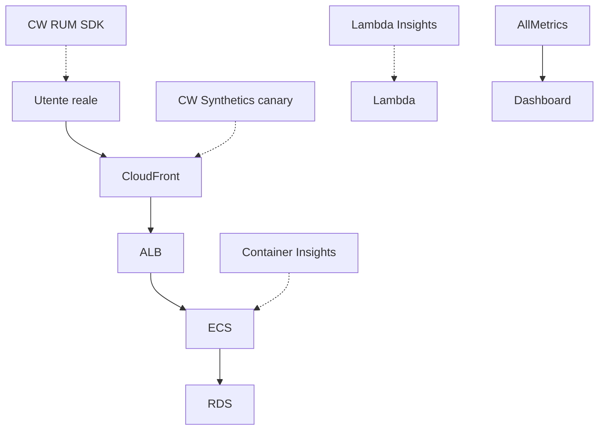

# Observability su AWS

"Observability" non è "ho un grafico carino"; è la capacità di rispondere a domande nuove sul sistema senza ridistribuire codice. Le tre gambe classiche sono **metriche, log, trace**, più audit (CloudTrail) e governance configurazionale (Config). AWS ti dà tutto in casa — il problema vero è costo (Logs retention) e segnale/rumore (alarm troppo sensibili).

## 1. CloudWatch Metrics

Modello: **namespace** (es. `AWS/EC2`, `MyApp/Orders`) → **metric** (es. `CPUUtilization`) → **dimension** (es. `InstanceId=i-1`). Risoluzione standard 1 min, **high-resolution** 1 sec ($$$). Pubblicare metriche custom:

```bash
aws cloudwatch put-metric-data \
  --namespace MyApp/Orders \
  --metric-name OrdersCreated \
  --dimensions Env=prod,Region=eu-west-1 \
  --value 1 --unit Count
```

**Embedded Metric Format (EMF)**: emetti un JSON nei log Lambda con un payload speciale, CloudWatch lo estrae come metrica senza chiamare l'API. Più cheap, niente latenza extra. Ottimo per Lambda.

## 2. CloudWatch Logs

Modello: **log group** (logico, es. `/aws/lambda/myFn`) → **log stream** (uno per processo/container/Lambda invocation). Retention default = **MAI** (infinita, paghi storage forever). Impostala sempre.

| Retention | Quando |
|---|---|
| 1-7 giorni | dev, debug |
| 30 giorni | prod app normale |
| 90 giorni | sicurezza/audit base |
| 1 anno+ | compliance (PCI 1 anno minimo) |

**Subscription filter** → invia log a Lambda, Firehose, Kinesis (es. shippare in OpenSearch o S3). **Logs Insights** query:

```
fields @timestamp, @message
| filter @message like /ERROR/
| stats count() by bin(5m)
| sort @timestamp desc
| limit 100
```

## 3. CloudWatch Alarms

Stati: `OK | ALARM | INSUFFICIENT_DATA`. Si attiva su statistica (Avg/Sum/p99) di una metrica su un periodo.

- **Composite Alarm**: AND/OR di più alarm → riduce paging rumoroso ("ALB 5xx alto **E** RDS CPU alta", non OR).
- **Anomaly Detection**: modello ML su pattern stagionali ("è anomalo per il lunedì 9:00?").
- **Metric Math**: `error_rate = m1/m2 * 100` direttamente.

Actions: SNS (alerting umano), Auto Scaling, EC2 reboot/recover, Systems Manager Incident Manager.

## 4. Dashboard, Synthetics, RUM, Insights



| Strumento | Misura |
|---|---|
| **Dashboard** | Aggregatore visuale custom |
| **Synthetics** | Canary Puppeteer/Selenium da edge AWS verso URL/API |
| **RUM** (Real User Monitoring) | JS SDK nel browser → metriche reali utenti (Web Vitals) |
| **Container Insights** | Performance ECS/EKS (CPU/MEM per task, pod) |
| **Lambda Insights** | Memory init, init duration, network |

## 5. AWS X-Ray e ADOT

Tracing distribuito: ogni richiesta riceve un **trace ID** propagato negli header (`X-Amzn-Trace-Id`); ogni componente emette **segmenti** (e subsegmenti per chiamate downstream). Risultato: **service map** visuale con latenza per nodo + drill su singola trace.

```python
from aws_xray_sdk.core import xray_recorder, patch_all
patch_all()  # auto-instrument boto3, requests, ...

@xray_recorder.capture('process_order')
def process_order(order):
    ...
```

**Sampling rule**: di default 1 req/sec + 5% (per non strapagare). Personalizzabile per URL/servizio.

**ADOT (AWS Distro for OpenTelemetry)** è la direzione strategica: collector OTel standard che esporta in X-Ray *e* CloudWatch Metrics *e* altri backend (Jaeger, Tempo). Se sei multi-vendor o vuoi standard aperto, ADOT è la scelta.

## 6. CloudTrail — audit di chi-fa-cosa

Registra ogni chiamata API verso AWS. Tipi di evento:

- **Management events** (default ON gratis 90 giorni): `RunInstances`, `CreateBucket`, `AssumeRole`.
- **Data events** (OFF default, costo extra): `GetObject` S3, `Invoke` Lambda, `Query` DynamoDB.
- **Insights events**: anomalie volume (es. boom di `DeleteObject`).

Best practice: **Organization Trail** (un trail dell'org root copre tutti gli account child, log immutabili in bucket S3 dedicato con Object Lock). **CloudTrail Lake** = data lake SQL-queryable per investigation.

## 7. AWS Config

Snapshotta configurazione di ogni risorsa nel tempo + valuta **rule** (es. "tutti i bucket S3 devono avere block public access"). Tipi rule: **managed AWS** (200+ pronte), **custom Lambda**, **custom Guard** (linguaggio dichiarativo).

**Conformance Pack** = bundle rule per uno standard (CIS, PCI, HIPAA). **Aggregator** = vista cross-account/region. **Advanced Query** SQL-like: `SELECT resourceId WHERE configuration.encrypted = false`.

Costo: $0.003 per item per region — su account grandi può lievitare.

## 8. Systems Manager (SSM) — operations swiss-army knife

| Modulo | Cosa fa |
|---|---|
| **Parameter Store** | Config key-value (String, StringList, SecureString con KMS) |
| **Session Manager** | Shell su EC2 senza SSH (vedi sez. 13) |
| **Run Command** | Esegui comando su flotte di EC2 ("yum update -y" su 500 host) |
| **Patch Manager** | Patching SO secondo schedule + baseline |
| **State Manager** | "Mantieni questi 500 host in questo stato" (idempotente) |
| **Automation** | Runbook YAML (es. "snapshot + reboot RDS") |
| **Inventory** | Inventario SW/HW installato |
| **Incident Manager** | On-call rotation + runbook + chat collab |

## 9. Esercizio

<details>
<summary>La fattura CloudWatch è esplosa a $5k/mese. Per dove iniziare?</summary>

Tre sospetti tipici:
1. **Logs ingestion + storage**: log group senza retention. Vai a **CW Logs → Log Groups → Storage**, ordina per byte. Imposta retention 7/30 gg sui top.
2. **Custom metric ad alta cardinalità**: emetti metriche con `userId` come dimension → milioni di metriche uniche. Cambia design (dimensione = tier/region, non userId).
3. **Synthetics canary** troppo frequenti (ogni 1 min) su tutte le region. Scala a 5 min, riduci geo.

Quick win: abilita **Log Group retention** policy via Config rule che blocca creazione log group senza retention.
</details>

<details>
<summary>Devi capire perché un API è lenta solo per il 2% delle richieste. Quale tool?</summary>

**X-Ray (o ADOT)**: la service map mostra latenza per nodo, ma per debug del long-tail attivi **sampling al 100% temporaneo** per la rotta in questione, poi cerchi trace con `responsetime > 2s`. Spesso scopri che una chiamata downstream (es. RDS query slow su un caso edge, o cold start Lambda dentro VPC) genera il p99. CloudWatch metrics aggregate ti dicono *che* esiste; X-Ray ti dice *dove* e *perché*.
</details>

> **Riassunto**: CloudWatch (Metrics/Logs/Alarms/Dashboards/Synthetics/RUM) per metriche e log con EMF e Insights query; X-Ray/ADOT per tracing distribuito e service map; CloudTrail per audit API (Org Trail + Lake); Config per posture configurazione e compliance pack; SSM come coltellino svizzero ops (Param Store, Session, Run Command, Patch, Incident Manager); attenzione a Logs retention e cardinalità metriche custom.
