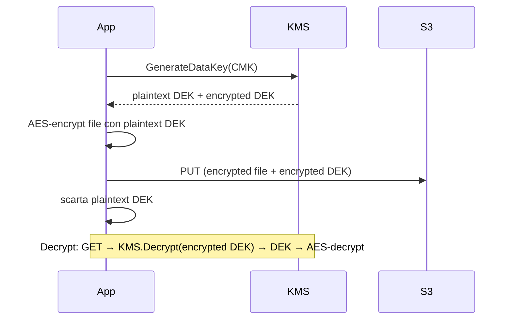

# Crittografia su AWS

In un audit, la differenza tra "abbiamo le chiavi crittografiche sicure" e "abbiamo le chiavi crittografiche **dimostrabilmente** sicure" è la differenza tra dormire la notte e non passare la due-diligence. AWS offre KMS per le chiavi, CloudHSM per i casi paranoici, Secrets Manager / Parameter Store per i segreti, ACM per i certificati TLS. Vediamoli con i gotcha veri.

## 1. KMS — il cuore

KMS gestisce **CMK** (Customer Master Key, ora chiamate "KMS keys"). Le chiavi non escono mai dall'HSM AWS in chiaro. Tipi:

| Tipo | Chi gestisce | Costo | Quando |
|---|---|---|---|
| **AWS owned** | AWS, condivisa | gratis | default S3/DynamoDB se non specifichi |
| **AWS managed** (`aws/<service>`) | AWS, per tuo account | gratis | servizio managed con default sano |
| **Customer managed** (CMK) | tu | $1/mese + $0.03/10k req | quando vuoi key policy / rotation / audit |

CMK supportano: rotation automatica annuale (un click), key policy + grant, multi-region replica, BYOK (import del tuo key material). Algoritmi: simmetrici AES-256 GCM (default) o asimmetrici RSA 2048/3072/4096 ed ECC (firma, encrypt asimmetrico).

## 2. Envelope encryption

Cifrare un file grande direttamente con KMS non si fa (limite 4 KB). Si usa **envelope**:



I servizi managed (S3 SSE-KMS, EBS, RDS, ecc.) fanno questo per te. Costo: 1 chiamata KMS per data key, non per byte → cheap.

## 3. Key policy, grant, condizioni

Una CMK ha **key policy** obbligatoria (chi può usarla/amministrarla). A differenza di altre risorse, anche l'admin dell'account *deve* essere in key policy esplicitamente, altrimenti la chiave è "orfana" e si perde l'accesso (bug noto: revoca dell'admin per errore).

```json
{
  "Sid": "AllowAppDecrypt",
  "Effect": "Allow",
  "Principal": {"AWS": "arn:aws:iam::123:role/app"},
  "Action": ["kms:Decrypt", "kms:GenerateDataKey"],
  "Resource": "*",
  "Condition": {
    "StringEquals": {"kms:EncryptionContext:tenant": "acme"}
  }
}
```

**Encryption context**: coppie chiave-valore che diventano parte dell'autenticazione AAD. Se cifri con context `{tenant: acme}`, devi decifrare con lo *stesso* context. Utile per multi-tenancy: previene che il tenant A decripti dati del tenant B anche se ottiene accesso alla CMK.

**Grant** = autorizzazione temporanea programmaticamente concessa (usata da AWS services internamente, es. EBS che decritta volumi per conto tuo).

## 4. Multi-region key e cross-account

**Multi-region key**: chiavi con stesso key material in più region, stesso key ID. Utili per DR (replica DynamoDB Global Tables, S3 CRR a region differente). Costa per *ogni* region come una chiave a sé (no sconto).

**Cross-account**: combinazione di key policy (grant a un IAM role di un altro account) + IAM policy nell'account consumer. È un AND.

## 5. CloudHSM — quando KMS non basta

CloudHSM = HSM dedicato (un appliance hardware) certificato **FIPS 140-2 Level 3** (KMS è L2/L3 a seconda del servizio, dichiarato L3 dal 2023). Usi:

- Regolamento che richiede HSM single-tenant (alcuni banking/PSD2).
- Custom crypto SDK (PKCS#11, JCE, OpenSSL engine).
- Chiavi per CA private interne con piena custodia.

Costo: ~$1.45/ora per HSM → $1k/mese per HA cluster a 2 nodi. Per il 95% dei casi, KMS basta e avanza.

## 6. Secrets Manager vs Parameter Store

Entrambi memorizzano segreti, ma diversi.

| Feature | Secrets Manager | Parameter Store (SecureString) |
|---|---|---|
| Prezzo | $0.40/secret/mese + $0.05/10k API | gratis (Standard) / $0.05/param (Advanced) |
| Rotation automatica via Lambda | sì, built-in per RDS/Redshift/DocDB | no (devi fare tu) |
| Versioning | sì, con `AWSCURRENT`/`AWSPREVIOUS` label | sì, history per parametro |
| Cross-region replication | sì, nativa | no (devi replicare) |
| Max size | 64 KB | 4 KB (Std) / 8 KB (Adv) |
| JSON multi-key | sì, naturale | sì ma manuale |

Regola: **password DB → Secrets Manager** (rotation built-in vale i $0.40). **API key statiche, config app → Parameter Store** SecureString. Mai mettere segreti in env var di Lambda in chiaro (sono visibili in CloudTrail e CFN).

## 7. ACM — certificati TLS

**AWS Certificate Manager** emette certificati TLS pubblici **gratis** per uso con servizi AWS (CloudFront, ALB, NLB, API GW). Validazione DNS (CNAME record in Route 53 — un click se Hosted Zone è in stesso account) o email.

```bash
aws acm request-certificate \
  --domain-name api.example.com \
  --subject-alternative-names "*.api.example.com" \
  --validation-method DNS
```

Rinnovo automatico se il certificato è "in use" su un servizio AWS e il DNS è ancora valido. Non puoi esportare il private key (è il prezzo del gratis): se ti serve su EC2 in modo custom, usa Let's Encrypt o ACM Private CA.

**ACM Private CA** (a pagamento, ~$400/mese + $0.75/cert dopo i primi 1000): per emettere certificati interni (es. mTLS tra microservizi, IoT device, certificati Kubernetes). Costoso ma evita di gestire la tua PKI da zero.

## 8. Esercizio

<details>
<summary>Hai password DB hardcoded in env var Lambda. Come migri a soluzione corretta?</summary>

Setup:
1. Crea segreto in Secrets Manager (`prod/myapp/db`) con JSON `{"username": "...", "password": "...", "host": "...", "port": 5432}`.
2. Abilita **rotation automatica** con la Lambda built-in per RDS (ogni 30 giorni, ruota anche l'utente DB).
3. IAM role della Lambda: `secretsmanager:GetSecretValue` solo su quel secret ARN.
4. Nel codice Lambda, fetch + cache locale per la durata del container (5-15 min) — riduci chiamate API.
5. Rimuovi env var, rimuovi password da CFN/CDK (sostituisci con `{{resolve:secretsmanager:prod/myapp/db:SecretString:password}}`).
6. Forza ruota della password vecchia (era nei CloudTrail/git history → compromessa).
</details>

<details>
<summary>Vuoi che il tenant A non possa mai leggere oggetti S3 cifrati del tenant B, anche se per errore le sue IAM permission diventano troppo larghe. Come?</summary>

Usa **encryption context** in KMS come secondo livello di difesa. Quando tenant A scrive: cifra con `EncryptionContext: {tenant: A}`. La key policy KMS richiede `kms:EncryptionContext:tenant` = principal-tag o sub-arn del tenant. Anche se il ruolo del tenant A ottiene `s3:GetObject` su un oggetto del tenant B, KMS rifiuterà `Decrypt` perché il context non combacia.

Combinato con bucket policy `aws:RequestTag/tenant`, hai due livelli indipendenti — uno bug IAM non basta a perdere dati.
</details>

> **Riassunto**: KMS con CMK customer-managed per controllo + audit (envelope encryption, encryption context, multi-region); CloudHSM solo per FIPS 140-2 L3 dedicato; Secrets Manager per credenziali DB con rotation automatica ($0.40), Parameter Store per config app (gratis); ACM TLS pubblico gratis per servizi AWS, Private CA a pagamento per mTLS interno.
