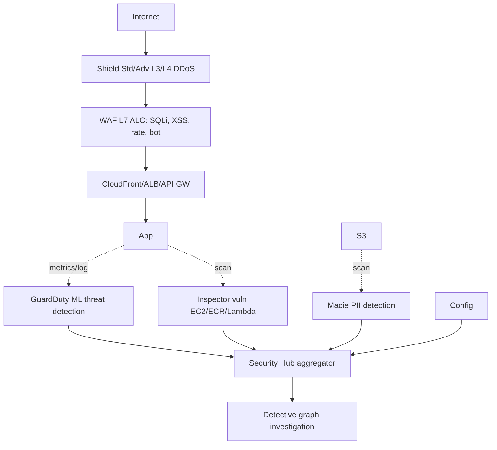

# Threat detection su AWS

La sicurezza in cloud non è "un firewall e via": è una pila di servizi specializzati, ognuno per uno strato del modello "defense in depth". Il rischio non è tanto comprarli tutti — è gestire l'enorme volume di finding che producono. Il finale del capitolo è proprio l'aggregatore (Security Hub) che li fonde.

## 1. La pila completa



## 2. WAF — L7 application firewall

WAF (Web Application Firewall) filtra richieste HTTP/HTTPS prima che arrivino all'app. Si attacca a **CloudFront, ALB, API Gateway (REST), AppSync, App Runner, Cognito User Pool**.

Componenti:
- **Web ACL**: l'oggetto principale con un set ordinato di regole.
- **Rule**: condizione (es. "country = RU" o "URI contiene `../`") + azione (Allow/Block/Count/CAPTCHA/Challenge).
- **Rule group**: bundle riutilizzabile.

Sorgenti di rule:
- **AWS Managed Rules**: gratis-ish, "Core Rule Set", "Known Bad Inputs", "SQL Database", "Linux", ecc.
- **Marketplace**: F5, Imperva, Fortinet.
- **Custom**: scritte da te (es. blocca tutti i POST > 1 MB su `/upload`).

Feature: **Rate-based rule** (rate limit per IP), **Bot Control** (managed, riconosce crawler vs bot malevoli), **CAPTCHA / Challenge** (sfida JS o reCAPTCHA-like).

## 3. Shield — DDoS protection

| | Standard | Advanced |
|---|---|---|
| Costo | gratis (sempre on) | $3000/mese + traffic |
| Cosa protegge | L3/L4 (SYN flood, UDP refl, ecc.) | L3/L4 + L7 |
| Cost protection | no | sì (refund di scaling durante DDoS) |
| SRT | no | Shield Response Team |
| Health-based detection | no | sì |

Shield Advanced ha senso per workload critici (banking, news, gaming live) — è anche la condizione per avere il team SRT in chiamata. Per il resto, Shield Standard + WAF Bot Control coprono il 95%.

## 4. GuardDuty — threat detection continua

Servizio "always on" che analizza con ML:
- **CloudTrail management/data events** (anomalie API)
- **VPC Flow Logs** (connessioni a IP noti malevoli, port scan)
- **DNS query logs Route 53 resolver** (DNS tunneling, comunicazione a C2)
- **EKS audit logs** (escalation pod)
- **EBS volumes** (Malware Protection scansiona on-demand)
- **S3 Protection** (anomalie GetObject/PutObject)
- **RDS login monitoring** (brute force RDS Aurora MySQL/Postgres)
- **Lambda Protection** (network behavior delle Lambda)

Output: **finding** con severity (Low/Medium/High) → EventBridge → automazione (es. Lambda che isola istanza compromessa).

Costo: complesso (per evento + GB analizzato) — abilitare in dev può sorprendere. Aggiunge tipicamente 1-3% della bolletta in account medi.

## 5. Inspector — vulnerability assessment

Scan continuo per **CVE** e **network reachability** su:
- **EC2** (agente SSM): vulnerability nei pacchetti OS.
- **ECR container images**: scansione layer.
- **Lambda function**: dipendenze del package (boto3, npm).

Output: finding con CVSS score, CVE ID, raccomandazione (es. "upgrade openssl a 3.0.13"). Integrazione con Jira via EventBridge o Security Hub.

Differenza con GuardDuty: Inspector = "**come potrei essere attaccato**" (preventivo), GuardDuty = "**sto venendo attaccato adesso**" (detection).

## 6. Macie, Detective, Firewall Manager

| Servizio | Cosa fa |
|---|---|
| **Macie** | Trova PII (CF, SSN, codice fiscale, IBAN) nei bucket S3 via ML + regex |
| **Detective** | Costruisce grafo da CloudTrail/VPC/GuardDuty → investigation visuale "chi ha fatto cosa quando" |
| **Firewall Manager** | Gestione centralizzata WAF / Shield / SG / Route 53 DNS firewall su tutta l'org |
| **IAM Access Analyzer** | Trova: 1) accessi esterni inattesi 2) policy unused 3) validation 4) custom checks |
| **Audit Manager** | Raccoglie evidence automaticamente per audit (SOC2, PCI, HIPAA, GDPR) |

Macie costa a GB scansionati → conviene attivarlo su bucket "sensibili" (dump DB, log app), non su data lake intero a tappeto.

## 7. Security Hub — l'aggregatore

Il "single pane of glass" che raccoglie finding da GuardDuty, Inspector, Macie, IAM Access Analyzer, Config, partner di terze parti (Wiz, CrowdStrike, ecc.) e li valuta contro standard:

- **AWS Foundational Security Best Practices (FSBP)**
- **CIS AWS Benchmark v3.0**
- **PCI DSS 3.2.1**
- **NIST 800-53**

Cross-account/region aggregator. **Automated Security Response (SOAR)**: pre-built playbook che remediano automaticamente (es. rimuovi accesso pubblico bucket, disabilita IAM user con chiavi compromesse).

```json
{
  "SchemaVersion": "2018-10-08",
  "ProductArn": "arn:aws:securityhub:eu-west-1::product/aws/inspector",
  "Severity": {"Label": "HIGH"},
  "Title": "Vulnerability CVE-2024-XXXX in openssl",
  "Resources": [{"Type": "AwsEc2Instance", "Id": "arn:..."}]
}
```

## 8. Anti-pattern comuni

- **WAF in `Count` mode "temporaneo"** che resta tale per mesi → finding ma zero protezione.
- **GuardDuty abilitato solo in 1 region**: gli attacker scelgono region inattive.
- **Inspector senza pipeline che blocca PR**: trovi le CVE ma non le fixi.
- **Macie attivo su tutto S3** → bolletta gigante. Targeta bucket sensibili.
- **Security Hub con 10k finding di severity Low** → nessuno guarda più. Filtra, sopprimi quelle accettate, automatizza le critiche.

## 9. Esercizio

<details>
<summary>Un sito e-commerce subisce ondata di "credential stuffing" sul /login (bot che prova coppie email/pwd). Come ti difendi?</summary>

Layered:
1. **WAF Rate-based rule**: max 100 POST `/login` per IP per 5 min → Block.
2. **WAF Bot Control** managed rule: riconosce 90% dei bot da signature.
3. **WAF CAPTCHA action** su `/login`: bot devono risolvere captcha invisibile (challenge JS prima).
4. Cognito User Pool con **Advanced Security** (risk-based auth: chiede MFA se geolocation/device anomalo).
5. GuardDuty su `IAMUser/AnomalousBehavior` per cogliere account compromessi a valle.
6. Alarm CloudWatch su `BlockedRequests` WAF + ratio failed login → notifica.

Costo extra: WAF ~$5/mese + $0.60/M req + $10 Bot Control. Risparmio: tempo CS + chargeback frodi.
</details>

<details>
<summary>Il pentester ha caricato 10k oggetti S3 con dati finti contenenti pattern di carte di credito. Vuoi trovarli senza scansionare tutto il bucket gigante. Quale tool e come limiti il costo?</summary>

**Amazon Macie** con job di tipo **"Scheduled / One-time"** + filtri:
- Limita per **bucket** (solo il bucket di test, non l'intero account).
- Limita per **prefisso** S3 (es. `s3://bucket/test/`).
- Limita per **object size** (skip oggetti > 100 MB se sai che le carte sono in CSV piccoli).
- Sampling al 10% se vuoi solo discovery a campione.

Macie usa Managed Data Identifier per CREDIT_CARD_NUMBER (riconosce schema Luhn) — finding in Security Hub. Costo proporzionale a GB scansionati, non oggetti.
</details>

> **Riassunto**: WAF L7 (managed rules + bot control + rate limit + CAPTCHA), Shield Std gratis + Advanced ($3k) per DDoS L3/4/7; GuardDuty per threat detection ML su CloudTrail/VPC/DNS/EKS/S3/RDS/Lambda; Inspector per vuln EC2/ECR/Lambda; Macie per PII S3; Detective per investigation graph; Security Hub aggregatore con FSBP/CIS/PCI; sempre automatizzare remediation o annegherai nei finding.
