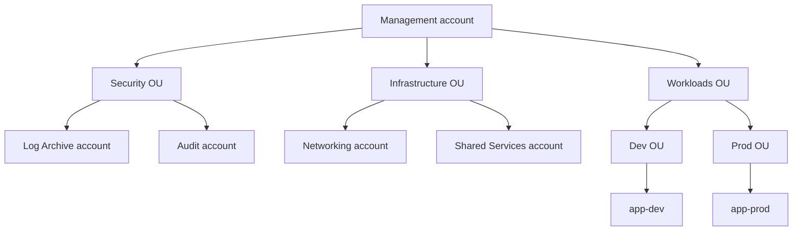

# Governance multi-account

A 5 account te la cavi a mano. A 50, senza governance, hai 50 versioni della stessa policy, 50 ruoli admin, 50 budget separati e nessuno che capisce dove va a finire la bolletta. Control Tower + Organizations + Identity Center sono la "fabbrica account" che AWS ti regala — ricapitoliamo brevemente e poi entriamo nella parte governance vera (guardrail, SSO, tag policy).

## 1. Organizations — recap

Già visto in sez. 8: **management account** (root) + **OU** ad albero + **member account**. Strumenti chiave:

- **SCP** (Service Control Policy): guardrail negativi che limitano ciò che IAM può fare in un account. SCP non *concede* mai permessi, può solo *negare*.
- **Consolidated billing**: una sola fattura, sconti di volume condivisi.
- **Trusted access**: abilita servizi (Config, Security Hub, GuardDuty, Backup) a operare cross-account.



## 2. Control Tower — landing zone come servizio

Control Tower automatizza la creazione della **landing zone**: setup org "best-practice" con account dedicati (Log Archive, Audit), OU baseline, SSO, CloudTrail org trail, Config aggregator, guardrail iniziali.

**Account Factory** = self-service per vendere nuovi account: l'utente compila un form ("nome account, email, OU, baseline"), Control Tower crea l'account, applica SCP, configura SSO, etc. Versione "by code": **Account Factory for Terraform (AFT)**.

**Guardrail** (oggi chiamati "Controls"):

| Tipo | Esempio | Implementazione |
|---|---|---|
| **Preventive** | "non si possono creare risorse fuori da eu-west-1" | SCP |
| **Detective** | "tutti i bucket S3 devono avere versioning" | Config rule |
| **Proactive** | "blocca al deploy IaC un EC2 senza tag CostCenter" | CloudFormation hook |

Per ogni guardrail, tipo: **Mandatory** (sempre on, non disattivabile), **Strongly recommended**, **Elective**.

## 3. AWS Identity Center (ex AWS SSO)

Il modo *corretto* di gestire utenti umani 2026: **un solo login** federato verso tutti gli account. Sostituisce gli IAM user (che dovrebbero esistere solo per scenari legacy/break-glass).

Componenti:
- **Identity source**: built-in directory, oppure Microsoft Entra ID (ex Azure AD), Okta, Google Workspace via **SAML 2.0** + **SCIM** per provisioning.
- **Permission Set**: una IAM policy + relative session duration che diventerà un IAM role nell'account target.
- **Assignment**: `(gruppo identity source) × (permission set) × (account)`.

L'utente fa SSO → vede la lista account/ruoli che può assumere → clicca → ottiene credenziali STS temporanee. CLI: `aws sso login --profile dev-admin`.

## 4. ABAC con session tag

ABAC = Attribute-Based Access Control. Idea: invece di "Bob può accedere a bucket-finance", "chi ha tag Department=Finance accede a risorse con tag Department=Finance".

In Identity Center: mappa attributi della directory esterna (es. `department` in Entra) a session tag AWS:

```json
{
  "Version": "2012-10-17",
  "Statement": [{
    "Effect": "Allow",
    "Action": "s3:GetObject",
    "Resource": "arn:aws:s3:::reports/*",
    "Condition": {
      "StringEquals": {
        "s3:ExistingObjectTag/Department": "${aws:PrincipalTag/Department}"
      }
    }
  }]
}
```

Beneficio: zero policy nuove quando assumi un dipendente nuovo, basta metterlo nel gruppo Entra giusto.

## 5. Resource Access Manager (RAM)

Condividi risorse tra account dell'org **senza** dover gestire IAM cross-account complicato:

- **VPC subnet** (un account "Networking" possiede VPC, altri account ci lanciano EC2/RDS direttamente).
- **Transit Gateway**.
- **Route 53 Resolver rules**.
- **License Manager configuration**.
- **CodeArtifact repository**.

Risparmio: 1 VPC condivisa invece di 50 VPC + 50 peering.

## 6. Service Catalog — vending di stack

Pubblichi "prodotti" CloudFormation curati (es. "VPC standard", "RDS Postgres con backup") e gli utenti finali in altri account li lanciano da una console self-service. Ottimo per democratizzare l'infrastruttura senza dare permessi raw a tutti.

**TagOptions** forza tag obbligatori (CostCenter, Owner). **Constraint**: launch role (eleva permessi solo nel lancio), notification, template.

## 7. StackSets, Health, Account Management

- **CloudFormation StackSets** con **delegated administrator**: deleghi a un account membro (non al management) di lanciare stack su tutta l'org. Auto-deploy quando un nuovo account viene aggiunto a un'OU.
- **AWS Health Dashboard organization view**: aggregato eventi (manutenzioni, deprecations) di tutti gli account.
- **Account Management**: chiusura account programmatic (API `CloseAccount`), alternate contacts (billing, security, ops separati dal root account email).

## 8. Tag, Backup, AI opt-out policies

Tre policy "organization-wide" oltre SCP:

| Policy | Cosa fa |
|---|---|
| **Tag Policy** | Definisce tag obbligatori + valori validi (es. `Env in [dev,stage,prod]`) |
| **Backup Policy** | Definisce piano backup AWS Backup applicato a tutti gli account |
| **AI services opt-out** | Esclude i tuoi dati da training modelli AWS (Bedrock, Rekognition, Transcribe) |

Tag policy NON forza (lo fa Config rule o IaC); segnala compliance/violation. Per forza vera, SCP che richiede tag.

## 9. Esercizio

<details>
<summary>Stai partendo: 0 account, vuoi setup multi-account "fatto bene" per 1 anno. Da dove inizi?</summary>

Approccio "by-the-book" AWS:
1. **Apri account management** con email dedicata (non personale, gruppo `aws-root@`).
2. Abilita **Control Tower** in region principale (es. eu-west-1) → crea OU baseline (Security, Sandbox, Workloads), account Log Archive + Audit, org trail.
3. Configura **Identity Center** con la tua directory (Entra/Okta), crea permission set (AdminAccess, PowerUser, ReadOnly, BillingViewer).
4. Crea **Account Factory** baseline per produrre nuovi account workload.
5. **Guardrail mandatory** + un set di elective (es. "no public RDS", "MFA mandatory", "Log group retention richiesta").
6. **GuardDuty + Security Hub + Config** delegated admin sull'Audit account, abilitati su tutta l'org.
7. **Budget alerting** su ogni account, anche dev.

Tempo totale: 1-2 settimane. Risparmi 6 mesi di refactor un anno dopo.
</details>

<details>
<summary>Hai 80 dipendenti su Okta. Vuoi che tutti gli ingegneri abbiano accesso "PowerUser" a 10 account dev, e solo i tech lead a prod. Come modelli?</summary>

In Okta crea due gruppi: `aws-eng` (tutti gli ingegneri) e `aws-tech-leads` (subset). Sincronizza via **SCIM** verso Identity Center (auto-provisioning, niente sync manuale).

In Identity Center:
- Permission set `PowerUserAccess` (managed) + `ReadOnlyAccess`.
- Permission set custom `ProdAdmin` con session duration 1h (forzata corta per ridurre blast radius).
- Assignment: gruppo `aws-eng` × `PowerUserAccess` × {tutti gli account dev}.
- Assignment: gruppo `aws-tech-leads` × `ProdAdmin` × {account prod} **+ MFA condition** + approval via IAM Identity Center session policy che richiede ticket Jira.

Quando un ingegnere lascia Okta, perde *automaticamente* tutto il giorno stesso. Quando uno entra, accesso immediato senza ticket.
</details>

> **Riassunto**: Control Tower per landing zone con account baseline (Log, Audit) e guardrail mandatory/elective/proactive; Identity Center per SSO federato (Entra/Okta) con permission set e ABAC via session tag; RAM per share VPC/TGW/Route 53; Service Catalog per self-service IaC; StackSets delegated admin per deploy cross-account; Tag/Backup/AI opt-out policy come policy org-wide.
