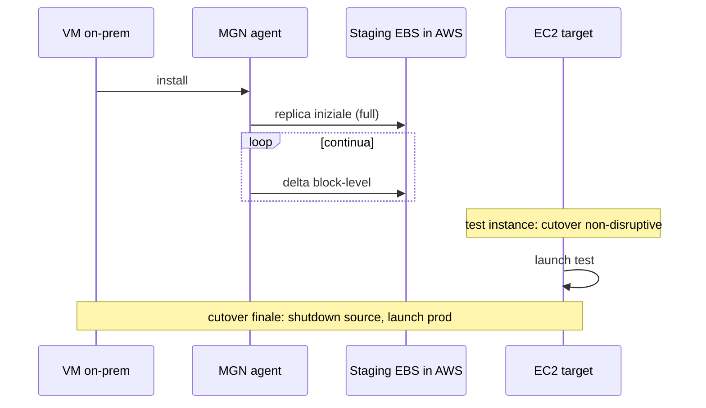

# Migration verso AWS

Una migrazione fatta male brucia 18 mesi e la fiducia del board nel cloud. Una fatta bene libera infrastruttura, riduce costi e abilita servizi managed. La domanda non è "come muovo le VM" — è "**cosa** muovo, **come** lo modernizzo, **in che ordine** lo faccio". Il framework AWS si chiama "6 R's", e gli strumenti coprono ogni R.

## 1. Le 6 R's

| R | Cosa | Esempio |
|---|---|---|
| **Rehost** | "Lift and shift" — sposta VM uguale uguale | VMware → MGN su EC2 |
| **Replatform** | "Lift, tinker and shift" — piccoli miglioramenti | MySQL on-prem → RDS MySQL |
| **Repurchase** | Sostituisci con SaaS | Exchange → Microsoft 365 |
| **Refactor / Re-architect** | Riscrivi cloud-native | monolite → microservizi serverless |
| **Retire** | Spegni, non serviva | il 10-20% delle VM scoperti durante discovery |
| **Retain** | Lascia on-prem (per ora) | mainframe legacy, dipendenze non-cloud |

Tipica wave: prima Discovery, poi Retire dei dimenticati, poi Rehost massivo per uscire dal datacenter, poi Replatform/Refactor in fase 2.

## 2. Application Discovery + Migration Hub

**AWS Application Discovery Service**: scopre cosa hai on-prem.
- **Agent-based** (Linux/Windows): metriche perf, processi, dipendenze di rete (chi parla con chi).
- **Agentless** (OVA VMware): inventory + perf base senza installare nulla.

**Migration Hub**: console centrale che traccia lo stato di tutte le migrazioni in corso (MGN/DMS/etc.) per app/wave/account. Aggrega progresso, costo stimato, blockers. **Migration Hub Refactor Spaces** aiuta lo strangler pattern (incrementalmente affianchi cloud-native al legacy).

## 3. AWS Application Migration Service (MGN)

Successore di CloudEndure Migration. **Replicazione continua block-level** dalla VM source verso una "staging" EBS in AWS, poi cutover al momento giusto.



Cutover window minuto/decine di minuti vs giorni di un dump-restore. Funziona da: VMware, Hyper-V, fisico, Azure, GCP. Anche **Server Migration** per workload retired (snapshot one-shot).

## 4. Database Migration Service (DMS) e SCT

**DMS** sposta dati DB con minimo downtime:
- **Omogeneo** (Oracle → Oracle, MySQL → MySQL): nativo, semplice.
- **Eterogeneo** (Oracle → Aurora PostgreSQL, SQL Server → Aurora MySQL): combinato con **Schema Conversion Tool (SCT)** per convertire DDL, procedure, trigger.

Modalità:
- **Full load** (one-shot snapshot).
- **CDC** (Change Data Capture: legge il transaction log della source e applica in continuo al target).
- **Full + CDC**: full iniziale + CDC ongoing → cutover quando lag = 0.

```bash
aws dms create-replication-task \
  --replication-task-identifier orcl-to-aurora \
  --source-endpoint-arn arn:... --target-endpoint-arn arn:... \
  --migration-type full-load-and-cdc \
  --table-mappings file://tables.json
```

DMS Serverless dal 2023: auto-scaling del replication compute, no più sizing manuale dell'instance.

## 5. DataSync e Transfer Family

**DataSync**: sync file ad alta velocità tra on-prem NFS/SMB/HDFS/Object e S3/EFS/FSx (o tra storage AWS). Encryption in transit, integrity check, incremental. Tipico per migrare petabyte di NAS.

**AWS Transfer Family**: server **SFTP/FTPS/FTP/AS2** managed che scrivono direttamente in S3 o EFS. Per quando i tuoi partner B2B "vogliono solo un SFTP" e tu non vuoi gestire un EC2 con OpenSSH.

## 6. Snow family — trasferimento offline

Quando la banda WAN non basta. AWS spedisce un'appliance fisica:

| Device | Capacità | Quando |
|---|---|---|
| **Snowcone** | 8-14 TB usable, portatile (~2 kg) | edge IoT, piccoli trasferimenti, ambienti austeri |
| **Snowball Edge Storage Optimized** | 80 TB usable | trasferimenti medi |
| **Snowball Edge Compute Optimized** | 42 TB + GPU + EC2 compatible | edge computing + transfer |
| **Snowmobile** | 100 PB su camion (40-ft container) | data center entero — discontinuato 2024, sostituito da multi-Snowball |

Calcolo banda: 100 TB su link 1 Gbps = 10+ giorni continui. Snowball arriva in 1 settimana, copia in 1-2 gg, rispediscilo. Cifratura hardware AES-256 con KMS.

## 7. Storage Gateway (recap hybrid)

Già visto: 3 modalità — **File Gateway** (NFS/SMB → S3), **Volume Gateway** (iSCSI cached/stored), **Tape Gateway** (VTL → S3/Glacier). Utile durante migrazioni "ibride" lunghe quando non puoi cutover subito.

## 8. Wave planning

Strategie per ordinare cosa muovere quando:

- **Big bang**: tutto in un weekend (rischioso, raro post-2010).
- **Phased per app**: una app per wave (2-4 settimane), test, poi prossima.
- **Phased per dependency graph**: scoperto dal Discovery, prima app foglia, poi salita verso shared services.
- **Strangler**: nuovo cloud-native affianca legacy, traffico migrato pezzo a pezzo via API GW / DNS.

Anti-pattern: migrare il DB **per primo** lasciando l'app on-prem → latenza WAN devastante. Migra app + DB insieme nella stessa wave, o usa DMS CDC per minimizzare cutover.

## 9. Esercizio

<details>
<summary>200 VM VMware on-prem, 30 DB SQL Server, vuoi essere off-datacenter in 12 mesi. Quale ordine e quali tool?</summary>

Mesi 1-2: **Discovery Service agentless** per inventory + dependency map. Identifica 30-40 VM dimenticate → **Retire**.

Mesi 3-4: **MGN** per rehost di 100 VM "vanilla" (web, app server). Replicazione continua, cutover settimanale wave-by-wave. Test instance per validare prima del cutover.

Mesi 5-8: DB migration. Per SQL Server con licenza esistente: rehost con MGN su EC2 (BYOL Microsoft). Per i 5-10 candidati a Replatform: **DMS + SCT** verso Aurora PostgreSQL (richiede refactor query) o RDS SQL Server (no app change). CDC per cutover finale con lag minimo.

Mesi 9-11: app rimanenti complesse + 1-2 candidate a Refactor (es. file storage → S3).

Mese 12: cutover finale, decommission datacenter, festeggia.

Tutto tracciato in **Migration Hub** con dashboard executive.
</details>

<details>
<summary>Devi trasferire 500 TB di archivi medicali dal NAS on-prem a S3 Glacier Deep Archive. Banda WAN 200 Mbps. Quanto ci metti via DataSync e con Snowball?</summary>

**DataSync via WAN**: 500 TB × 8 bit/byte ÷ 200 Mbps = ~230 giorni teorici di throughput continuo (assumendo full link usage, irrealistico). In pratica ~6-9 mesi, saturando la WAN aziendale → impatto produttività.

**Snowball Edge Storage** (80 TB cad): 7 unità ordinate, arrivano 1 settimana, copia in parallelo dal NAS ~3-5 giorni, rispedisci, AWS importa in S3 in ~1 settimana per unità. **Totale ~4-6 settimane**, banda WAN libera, costo ~$300/device + shipping.

Trade-off: latenza fisica vs latenza di rete. Per 500 TB la spedizione fisica vince netto.
</details>

> **Riassunto**: framework 6 R's (Rehost/Replatform/Repurchase/Refactor/Retire/Retain); Application Discovery + Migration Hub per inventario e tracking; MGN per lift-and-shift continuo block-level; DMS + SCT per DB omogenei/eterogenei con CDC; DataSync per file, Transfer Family per SFTP managed; Snow family per offline >50 TB; wave planning phased per dependency, evita big-bang e migrazione DB-prima-app.
