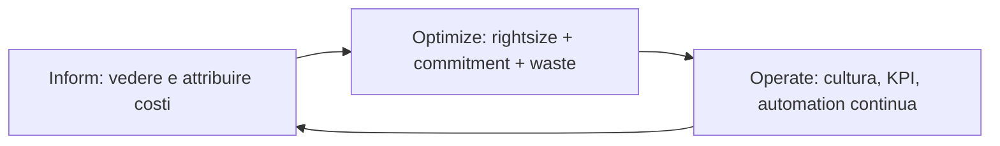

# Cost optimization e FinOps

"La bolletta cresce più dei ricavi" è la frase con cui inizia ogni progetto FinOps. La buona notizia: in media il 25-35% della spesa AWS è ottimizzabile senza toccare le feature dell'applicazione. La cattiva: nessuno la ottimizza da solo — serve un processo (FinOps), non solo un tool. Vediamo entrambi.

## 1. FinOps in 3 fasi



| Fase | Domande | Strumenti |
|---|---|---|
| **Inform** | Quanto spendiamo? Dove? Chi? | Cost Explorer, CUR, Tag, Budget |
| **Optimize** | Possiamo spendere meno? | Compute Optimizer, RI/SP, Spot, Trusted Advisor |
| **Operate** | Come restiamo ottimizzati? | Anomaly Detection, automation, KPI mensili |

## 2. Inform — Cost Explorer, CUR, Budget

**Cost Explorer**: UI per esplorare costi per servizio/region/tag/account/usage type, con forecast 12 mesi. Granularità giornaliera, retention 13 mesi (38 con history).

**Cost and Usage Report (CUR)**: il dataset granulare a livello linea-per-uso, esportato in S3 in formato Parquet. Query con **Athena** o caricato in QuickSight per dashboard custom.

```sql
SELECT line_item_product_code,
       SUM(line_item_blended_cost) AS cost
FROM cur_table
WHERE year='2026' AND month='5'
  AND line_item_user_type='Usage'
GROUP BY 1
ORDER BY 2 DESC
LIMIT 20;
```

**Budget**: alerting su soglie ($ o %), e **Budget Actions** che possono *bloccare IAM* o stoppare EC2 quando si supera (es. dev account che non può superare $500).

**Cost Anomaly Detection**: ML che nota spike inattesi per servizio/tag → notifica via SNS.

## 3. Optimize 1 — Rightsizing

**Compute Optimizer** analizza utilizzo (CPU/RAM/network/IOPS) e raccomanda:
- **EC2**: downsize (m5.xlarge → m5.large) o upgrade gen (m5 → m7g Graviton).
- **ASG**: bilanciamento famiglie.
- **EBS**: gp2 → gp3 (più cheap a IOPS uguali).
- **Lambda**: memoria ottimale (più RAM = più CPU = a volte più cheap perché finisce prima).
- **RDS/Aurora**: instance class.

Quick win storico: **gp2 → gp3** è ~20% di sconto a parità di prestazioni, 1 comando o `aws ec2 modify-volume`.

## 4. Optimize 2 — Reserved Instances e Savings Plans

Per workload "sempre on" prepaghi 1 o 3 anni, sconto 30-72%.

| Strumento | Cosa copre | Flessibilità |
|---|---|---|
| **EC2 Reserved Instance (standard)** | EC2 di specifica famiglia/region | bassa (puoi solo cambiare AZ/size in famiglia) |
| **EC2 Reserved Instance (convertible)** | EC2 cambiabile | media, sconto minore |
| **RDS/ElastiCache/Redshift/OpenSearch RI** | quel servizio | bassa |
| **Compute Savings Plan** | EC2 + Fargate + Lambda, qualsiasi region/famiglia | **alta** |
| **EC2 Instance Savings Plan** | EC2 famiglia + region | media, sconto maggiore |
| **SageMaker Savings Plan** | SageMaker | bassa |

Commitment in **$/ora** (es. "spendo $3.20/h per 3 anni"); copertura applicata automaticamente alle istanze running. **Recommendations** in Cost Explorer (lookback 7/30/60 giorni). Pagamento: All Upfront (massimo sconto) / Partial Upfront / No Upfront.

Regola pratica: copri 70-80% del baseline con SP, lascia il picco/dev a on-demand.

## 5. Optimize 3 — Spot

Già visto in sez. 14: -90% on-demand, può essere recuperato con 2-min notice. Per workload tolleranti (batch, CI, training ML, stateless web dietro ASG): **Spot Fleet** con allocation strategy **capacity-optimized** = minor probabilità di interruzione.

## 6. Optimize 4 — Eliminazione waste

Le voci più frequenti che ho visto azzerare in audit:

| Sprecone | Costo tipico | Fix |
|---|---|---|
| **NAT Gateway** per S3/DynamoDB traffic | $0.045/GB processed + $32/mese | **Gateway VPC Endpoint** (gratis!) |
| **NAT Gateway** per altri AWS API | $0.045/GB | **Interface Endpoint** ($7.50/mese vs traffico) |
| **EBS snapshot orfani** | $0.05/GB-mese | Lifecycle policy + cleanup script |
| **EBS volume detached** | $0.08/GB-mese gp3 | tag + alert + automatic delete dopo 7 gg |
| **Elastic IP non associati** | $3.6/mese cad | release |
| **CloudWatch Logs retention infinita** | $0.03/GB-mese | imposta retention 30/90 gg |
| **Idle RDS / ELB / ECS task** | tipico $50-500/mese cad | Trusted Advisor + spegnimento |
| **S3 versioning senza lifecycle** | duplicati eterni | lifecycle "noncurrent → IA → expire 90 gg" |
| **Dev/staging on 24/7** | 168h/settimana | **AWS Instance Scheduler** off 19:00-7:00 + weekend = -70% |

## 7. Storage tier optimization

- **S3 Intelligent-Tiering**: AWS sposta automaticamente oggetti tra tier (Frequent → Infrequent → Archive Instant → Archive → Deep Archive) basato su access pattern. $0.0025/1k oggetti monitor fee, ma vince per dati eterogenei.
- **S3 Storage Lens**: dashboard org-wide su 28+ metriche storage, raccomandazioni.
- **Aurora I/O Optimized**: per workload I/O-heavy paghi più per compute ma 0 per I/O — break-even ~25% IO/totale.
- **RDS Reserved Instance** + **Multi-AZ** valutato seriamente: Multi-AZ raddoppia il costo, va su prod vero, non su dev.

## 8. Tag, allocation, showback/chargeback

Senza tag, ogni discussione di costo si arena al "non sappiamo chi". Strategia:

1. **Tag obbligatori** definiti in **Tag Policy** + enforce in IaC (CDK Aspects o Terraform default_tags). Esempi: `CostCenter`, `Owner`, `Env`, `Project`.
2. **Cost Allocation Tags** abilitati in Billing Console (entro 24 h appaiono in Cost Explorer come dimensione).
3. **Tag Editor** per ribadire/correggere tag in massa su risorse esistenti.
4. **Showback** = report mensile a ogni BU di "ecco quanto hai speso". **Chargeback** = la BU paga davvero al centro IT. Usa CUR + Athena/QuickSight.

## 9. Esercizio

<details>
<summary>Account prod a $80k/mese, devi tagliare 25% in 3 mesi. Da dove inizi?</summary>

Approccio metodico:
1. **Week 1**: scarica CUR, classifica per servizio. Top 3 di solito: EC2 (40%), RDS (15%), Data Transfer/NAT (10%).
2. **Week 2 quick win**:
   - **Gateway Endpoint** S3/DynamoDB → -50% NAT cost = ~$2k/mese.
   - **gp2 → gp3**: tutti i volumi → -20% EBS = ~$1.5k/mese.
   - **Log retention** policy → -50% CW Logs.
   - **Cleanup**: snapshot orfani, EIP non usati, volumi detached → ~$500/mese.
3. **Week 3-4**: Compute Optimizer → rightsize 20% delle EC2 → -$3k/mese.
4. **Week 5-6**: **Compute Savings Plan** copertura 80% baseline → -25% su EC2/Fargate/Lambda = ~$8k/mese.
5. **Week 7-10**: spegni dev/staging off-hours con Instance Scheduler → -$2k/mese.
6. **Week 11-12**: review storage tier S3 → Intelligent-Tiering su bucket grandi.

Totale: ~$17k/mese risparmiati = 21%. Per arrivare a 25% colpisci anche workload candidati a Spot (batch CI) o Lambda (riduzione memoria).
</details>

<details>
<summary>Una Lambda processa 100M invocation/mese da SQS, in media 200 ms ciascuna a 1024 MB. Come riduci costo senza toccare il codice?</summary>

Due leve:
1. **Lambda Power Tuning**: tool open-source che testa la stessa funzione a 512/1024/2048/3008 MB. Spesso scopri che a 1536 MB esegue in 130 ms invece di 200 ms → costo per invocation **uguale o meno** (cost = GB-sec, ridurre durata compensa più memoria). Test prima di cambiare.
2. **Compute Savings Plan** copre Lambda. Se hai baseline 80M invocation/mese a 200 GB-sec ciascuna, fai un SP da ~$X/h coprendoti -17% sconto sul totale.
3. Bonus: passa a **arm64 Graviton** (no code change per la maggior parte dei runtime) → -20% prezzo, spesso anche più veloce.
</details>

> **Riassunto**: FinOps in 3 fasi (Inform/Optimize/Operate); Cost Explorer + CUR + Budget per visibilità; Compute Optimizer + RI/SP (Compute SP è il più flessibile) + Spot per ridurre; eliminazione waste (NAT → Gateway Endpoint, EBS orfani, log retention, dev off-hours) è il quick win più grande; tag + allocation + showback per cultura; obiettivo realistico 20-35% di taglio senza degrado feature.
