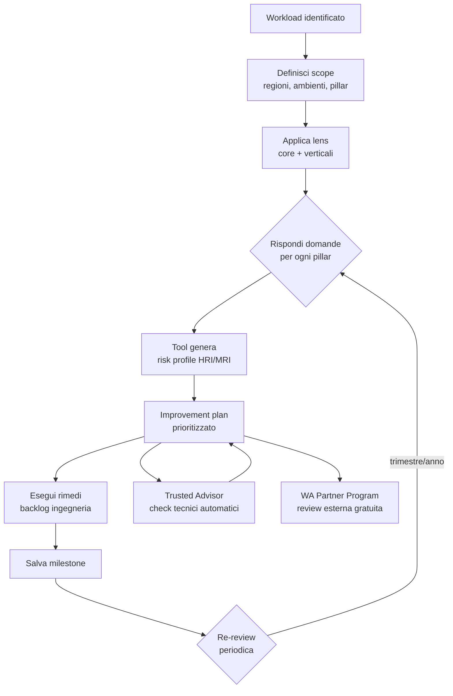

# Well-Architected Framework

Il **Well-Architected Framework (WAF)** è il manuale ufficiale AWS per progettare e revisionare carichi di lavoro in cloud. Non è un prodotto: è un insieme di domande, principi e best practice raggruppati in **6 pillar**, supportati dal **Well-Architected Tool** (gratuito) per fare review formali e tracciare il piano di rimedio nel tempo.

## 1. I 6 pillar

Originariamente 5, dal 2021 è stato aggiunto **Sustainability** come sesto pillar in linea con gli obiettivi ESG.

| # | Pillar | Domanda chiave |
|---|---|---|
| 1 | **Operational Excellence** | Come gestisci e fai evolvere il sistema in produzione? |
| 2 | **Security** | Come proteggi dati, sistemi e asset? |
| 3 | **Reliability** | Come recuperi da failure e gestisci la capacità? |
| 4 | **Performance Efficiency** | Come usi risorse di compute/storage/network in modo efficiente? |
| 5 | **Cost Optimization** | Come eviti spreco e ottieni valore dal cloud? |
| 6 | **Sustainability** | Come minimizzi l'impatto ambientale (energia, hardware)? |

Ogni pillar ha **design principles** (es. "automate everything", "design for failure", "stop guessing capacity") e **best practice** raggruppate per area.

## 2. Principi di design ricorrenti

Trasversali a più pillar, sono il "DNA cloud-native":

- **Loosely coupled**: componenti comunicano via API/eventi, non riferimenti diretti.
- **Design for failure**: ogni componente può cadere; tollera fallimenti parziali.
- **Automate everything**: IaC + CI/CD + runbook automatizzati. Niente click manuali in produzione.
- **Scale horizontally**: più istanze piccole > una grande (no SPOF, capacity elastica).
- **Test recovery**: chaos engineering, gameday, backup restore testati (non solo presi).
- **Stop guessing capacity**: usa auto-scaling, serverless, managed services elastici.
- **Right-size continuously**: monitoring e Compute Optimizer per evitare over-provisioning.

## 3. Well-Architected Tool — review

Tool gratuito nella console AWS. Crea un **workload** (descrivi nome, ambiente, regioni), scegli i pillar e rispondi a 40-60 domande per pillar.

Ogni domanda produce uno di tre rischi:

- **High Risk Issue (HRI)**: rimediare urgente.
- **Medium Risk Issue (MRI)**: pianificare rimedio.
- **No risk**: ok.

Il tool genera un **improvement plan** prioritizzato con link a documentazione e azioni concrete. Puoi salvare **milestone** (snapshot della review) per tracciare progressi nel tempo, e usare **custom lens** per aggiungere domande aziendali (es. compliance bancaria interna).

## 4. Lens specifiche

Le **lens** estendono il framework a domini verticali con domande mirate.

| Lens | Quando usarla |
|---|---|
| **Serverless** | Lambda + API Gateway + DynamoDB workload |
| **SaaS** | Multi-tenant, isolation, billing per tenant |
| **IoT** | Device fleet, edge processing, telemetria |
| **Machine Learning** | Pipeline MLOps, training, inference |
| **Foundation Model Operations (FMOps)** | LLM/GenAI: RAG, evaluation, guardrails |
| **HPC** | MPI, EFA, FSx Lustre, parallel compute |
| **Data Analytics** | Lakehouse, Redshift, Athena, Glue |
| **Financial Services Industry** | Compliance bancaria/insurance |
| **Government / Healthcare** | Settori regolamentati |

Puoi applicare più lens allo stesso workload (es. un sistema GenAI multi-tenant usa SaaS Lens + FMOps Lens).

## 5. Architettura della review — diagramma

## 6. Trusted Advisor — connessione

**Trusted Advisor** è il "cugino automatizzato": esegue check tecnici continui (Security Groups aperti, EC2 sotto-utilizzate, S3 bucket pubblici, MFA root, limiti di servizio vicini al cap) e li classifica per pillar. Con **Business o Enterprise Support** si sbloccano tutti i ~115 check; il piano Basic ne dà solo 7.

La WA review è **strategica e umana**; Trusted Advisor è **tattico e automatico**. Si completano: TA produce evidenze per rispondere alle domande WA.

## 7. AWS WA Partner Program

I **Well-Architected Partners** (consulting AWS certificati) possono condurre review esterne. AWS spesso copre i **crediti AWS** per finanziare i rimedi degli HRI (programma a budget annuale, da richiedere via account manager). Utile per audit indipendenti e per ottenere fondi.

## 8. Anti-pattern comuni

- **"One and done"**: review fatta una volta e mai più. WA è un processo continuo (ri-review semestrale).
- **Rispondere sulla carta**: dire "sì abbiamo backup" senza evidenza testata.
- **Ignorare Sustainability**: spesso saltato; in realtà si sovrappone a Cost (right-sizing = meno watt).
- **Confondere lens core e specifiche**: la serverless lens *non* sostituisce le 6 core, le integra.
- **Nessun owner del workload**: il piano di rimedio non viene assegnato e muore in un foglio.

## 9. Esercizio

Un'app fintech con Lambda + DynamoDB + Cognito multi-tenant. Quali lens applichi?

**Core WAF** (6 pillar, sempre) + **Serverless Lens** (architettura Lambda) + **SaaS Lens** (multi-tenant, isolation, metering) + **Financial Services Industry Lens** (compliance PCI-DSS, audit trail, encryption, KYC/AML controls).

Output: ~3x le domande di una review base, ma copertura completa. Prioritizza HRI di Security (es. tenant data leak) prima di MRI di Performance.

WA Tool ti segnala HRI "no multi-AZ on RDS". Come rispondi?

1. Crea **ticket nel backlog ingegneria** con priorità alta.
2. Pianifica abilitazione Multi-AZ (richiede ~10 min downtime di failover o usa Aurora con minimal disruption).
3. Aggiungi al runbook un **gameday** per testare failover (induci fault con Fault Injection Service).
4. Aggiorna la review nel WA Tool, marca la domanda risolta, salva **milestone "post-RDS-HA"**.
5. Aggiungi check Trusted Advisor automatico per evitare regressioni.

> **Riassunto**: WAF = 6 pillar (Ops, Sec, Rel, Perf, Cost, Sustainability) + design principle ricorrenti (loose coupling, design for failure, automate, scale horizontal, test recovery); WA Tool fa review formale con HRI/MRI + milestone; lens specifiche (Serverless, SaaS, FMOps, HPC...) estendono il framework; Trusted Advisor è il check automatico complementare; WA Partner Program può finanziare i rimedi con crediti AWS.
