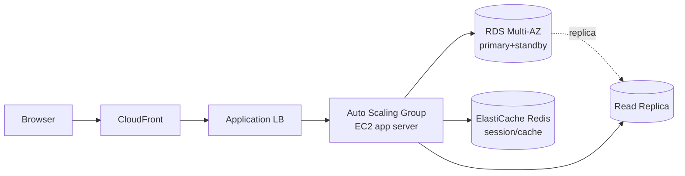
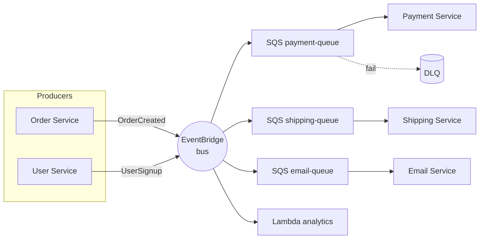

# Architecture patterns

Non esiste l'architettura "giusta" in assoluto: esistono pattern adatti a contesti diversi. Conoscerli ti permette di scegliere consapevolmente invece di re-inventare. Questa sezione passa in rassegna i pattern più usati su AWS, con quando applicarli e i loro trade-off.

## 1. 3-tier classico

Il pattern "monolitico distribuito": **presentation / application / data**. Storia 25+ anni, ancora vivissimo per app enterprise.



Stack AWS tipico: CloudFront → ALB → ASG di EC2 (Node/Java/.NET) → RDS Multi-AZ + Read Replica + ElastiCache. **Pro**: semplice, debug facile. **Contro**: scaling per-tier non granulare, deploy monolitico.

## 2. Serverless web app

Pattern moderno: zero server da gestire, costo pay-per-request, scaling automatico.

| Layer | Servizio |
|---|---|
| Static frontend | S3 + CloudFront (SPA React/Vue) |
| Auth | Cognito User Pool |
| API | API Gateway REST/HTTP |
| Business logic | Lambda (per endpoint o aggregata) |
| Database | DynamoDB (NoSQL key-value) |
| Search | OpenSearch Serverless |
| Image processing | Lambda + S3 trigger |

**Pro**: zero ops, scaling istantaneo, cost-efficient sotto certi volumi. **Contro**: cold start, limiti Lambda (15 min, 10 GB RAM), DynamoDB richiede modellazione single-table.

## 3. Event-driven

Servizi comunicano via **eventi** asincroni invece che chiamate sincrone. **EventBridge** è l'event bus centrale; SNS/SQS coprono pub-sub e queue.

Due stili:

- **Choreography**: ogni servizio reagisce agli eventi che gli interessano, nessun coordinatore. Semplice ma debug difficile (chi ha fatto cosa?).
- **Orchestration**: uno state machine (**Step Functions**) coordina i passi. Più visibile, costo per transizione di stato.



Pattern utili:
- **Fan-out**: SNS → multiple SQS (ogni consumer ha la sua coda).
- **Outbox**: scrivi evento in DynamoDB + stream → garantisci consistency tra DB e eventi pubblicati.
- **Inbox**: deduplica eventi in arrivo via ID idempotente.

## 4. CQRS + Event Sourcing

**CQRS** (Command Query Responsibility Segregation): separa write (command) da read (query). **Event Sourcing**: il sistema-of-record è la sequenza di eventi, non lo stato corrente.

Implementazione AWS:

- Write: API Gateway → Lambda → DynamoDB (eventi append-only).
- DynamoDB Streams → Kinesis Firehose → S3 (audit log permanente).
- Read: proiezioni aggiornate da Lambda (eventi → vista materializzata in Aurora o OpenSearch per query complesse).

Pro: audit completo gratis, time-travel, scale read separato da write. Contro: complessità, eventual consistency, schema migration eventi è dura.

## 5. Microservices

Decomposi il sistema in servizi piccoli, ognuno con DB e team proprio. Su AWS: **ECS Fargate** o **EKS** + **API Gateway** o **AWS App Mesh / Service Connect** + DB per servizio.

Trade-off rispetto al monolito:

| Aspetto | Monolite | Microservices |
|---|---|---|
| Deploy | unico | per servizio |
| Team scaling | bottleneck | indipendente |
| Latency | locale, ns | rete, ms |
| Debug | breakpoint | tracing distribuito (X-Ray) |
| Consistency | transazione DB | saga + eventual |
| Costo infra | basso | alto (overhead per servizio) |
| Quando | team < 20, dominio piccolo | team > 50, domini multipli |

**Modular monolith** è spesso la scelta corretta per startup: codice modulare, deploy unico; quando il team cresce, estrai i moduli in servizi.

## 6. Saga pattern (transazioni distribuite)

In microservices manca la transazione ACID cross-servizio. Il **saga** è una sequenza di transazioni locali, ognuna con la sua **compensating action** se fallisce.

Implementazione con **Step Functions**:

```yaml
StateMachine:
  StartAt: ReserveInventory
  States:
    ReserveInventory:
      Type: Task
      Resource: arn:aws:lambda:...:reserveInventory
      Catch:
        - ErrorEquals: ["States.ALL"]
          Next: FailOrder
      Next: ChargeCard
    ChargeCard:
      Type: Task
      Resource: arn:aws:lambda:...:chargeCard
      Catch:
        - ErrorEquals: ["States.ALL"]
          Next: ReleaseInventory  # compensating
      Next: ShipOrder
    ReleaseInventory:
      Type: Task
      Resource: arn:aws:lambda:...:releaseInventory
      Next: FailOrder
    ShipOrder: { Type: Task, End: true, ... }
    FailOrder: { Type: Fail }
```

## 7. Data mesh e altri pattern

- **Data mesh**: ogni dominio possiede e pubblica i propri dataset come "data product" (con SLA, schema, governance). Lake Formation + Glue + cross-account sharing.
- **Throttling/backpressure**: API Gateway usage plan, SQS visibility timeout, token bucket Lambda reserved concurrency.
- **Bulkhead**: isola risorse per consumer (es. Lambda concurrency per tenant) per evitare noisy neighbor.
- **Circuit breaker**: chiamante interrompe richieste verso servizio in failure (App Mesh / library lato client).

## 8. Esercizio

<details>
<summary>Startup B2B SaaS, team 5 dev, MVP da fare in 3 mesi. Quale pattern scegli?</summary>

**Modular monolith serverless**: API Gateway + 1 Lambda monorepo (Python/Node) ben strutturata in moduli (auth, billing, core) + DynamoDB + Cognito. Deploy unico, debug facile, scaling automatico, costo ~$0 a basso volume.

**Non** scegliere microservices: con 5 dev sarebbe overhead enorme (rete, deploy, tracing, observability) per zero beneficio. Estrai a microservices quando il team supera 20-30 e i moduli iniziano a competere sul codice.
</details>

<details>
<summary>E-commerce: ordine richiede inventory + payment + shipping. Sync o async?</summary>

**Saga asincrono con Step Functions** (orchestration): API riceve `POST /order`, scrive ordine in DynamoDB stato `PENDING`, scatena Step Function che esegue ReserveInventory → ChargeCard → ShipOrder, ognuna con compensating action. Cliente fa polling o riceve WebSocket update.

Pro: ogni step può ritentare, audit completo, gestisci timeouts. Sync end-to-end (chiamate REST a catena) è fragile: se shipping fallisce dopo charge, hai pagamento senza ordine.
</details>

> **Riassunto**: 3-tier (ALB+EC2+RDS) per enterprise classico; serverless (S3+API GW+Lambda+DDB) per startup/event-driven; event-driven con EventBridge per loose coupling; CQRS+event sourcing per audit e read-scale; microservices solo con team grande e dominio maturo (preferisci modular monolith prima); saga con Step Functions per transazioni distribuite; pattern di resilienza (bulkhead, circuit breaker, throttling) sono trasversali.
