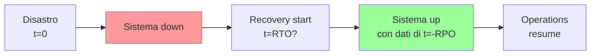
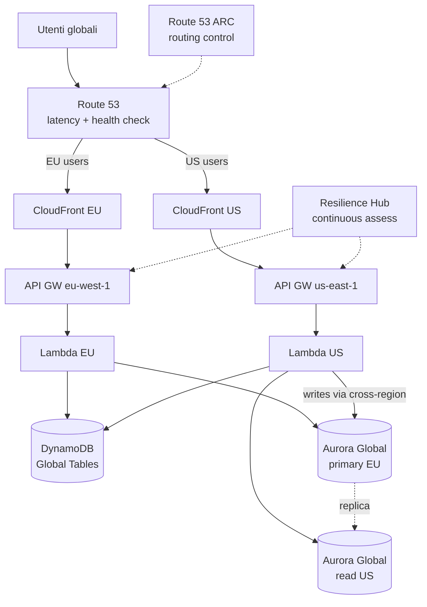

# Disaster Recovery e Multi-Region

Un piano di **Disaster Recovery (DR)** definisce come riprendersi dal disastro: regione AWS down, dataset corrotto, attacco ransomware, fornitore unico fallito. La domanda chiave non è "se" accadrà, ma "quanto dati perdo" e "in quanto tempo torno operativo".

## 1. RTO e RPO — le 2 metriche

- **RTO (Recovery Time Objective)**: tempo massimo accettabile di indisponibilità. Se RTO = 1h, il sistema deve essere risorto entro 1h dal disastro.
- **RPO (Recovery Point Objective)**: dato massimo accettabile perso. Se RPO = 5 min, accetto di perdere fino a 5 min di transazioni.

Esempio: una banca core RPO=0 RTO=secondi (perdere transazioni è inaccettabile). Un blog RPO=24h RTO=4h va benissimo. Più aggressivi gli obiettivi, più alto il costo.

## 2. Le 4 strategie DR AWS

| Strategia | RPO | RTO | Costo idle | Quando |
|---|---|---|---|---|
| **Backup & Restore** | ore-giorni | ore-giorni | molto basso | tier 3 app, archivi |
| **Pilot Light** | minuti | decine min-ore | basso | core off, dati replicati |
| **Warm Standby** | secondi-min | minuti | medio | infra ridotta sempre attiva |
| **Multi-site Active-Active** | quasi 0 | secondi | alto (2x prod) | tier 0 critico |

### Backup & Restore

Snapshot regolari (EBS, RDS) replicati cross-region. In caso di DR, ricrei l'infra (CloudFormation/Terraform) e ripristini. Cheap ma RTO alto (potresti impiegare 1 giorno).

### Pilot Light

Infra "spenta" pronta nella regione DR: dati replicati continuamente (RDS snapshot cross-region, S3 CRR, DynamoDB Global), compute scaled-to-zero (ASG min=0). In DR: scala ASG, switch DNS. RTO 30-60 min.

### Warm Standby

Versione ridotta dell'infra (es. 1 EC2 invece di 10) sempre attiva nella DR region. In DR: scala su e switch. RTO 5-15 min.

### Multi-site Active-Active

Traffico distribuito su 2+ region (Route 53 latency-based o geo). Ogni region serve tutto. In DR: Route 53 health check toglie la region down. RTO secondi. Costo: paghi 2x e devi risolvere consistency.

## 3. AWS Elastic Disaster Recovery (DRS)

Servizio managed che fa **block-level replication** di server (on-prem o cloud) verso AWS. Replica continua, RPO secondi. In DR: lancia istanze EC2 dalla replica, RTO ~10 min.

Use case: lift-and-shift DR, migrazione DC fisico, hybrid. Sostituisce CloudEndure (acquisito 2019).

## 4. Database replication cross-region

| Servizio | Meccanismo | RPO |
|---|---|---|
| **Aurora Global Database** | physical log shipping dedicato | < 1 sec, RTO < 1 min |
| **DynamoDB Global Tables** | multi-master, ogni region read+write | secondi (eventual consistency) |
| **RDS cross-region read replica** | async replication | secondi-minuti |
| **S3 CRR** (Cross-Region Replication) | async object copy | secondi-minuti |
| **EBS snapshot cross-region** | snapshot copiati | ore (manuali o EventBridge) |
| **ElastiCache Global Datastore** | Redis cross-region | < 1 sec |

Aurora Global è il gold standard per DB relazionali multi-region: in caso di DR la secondary può essere promossa primary in < 1 min con un'API call.

## 5. Route 53 failover e routing policy

Route 53 implementa il **failover DNS** con health check:

- **Failover routing**: primary attivo, secondary attivato solo se health check primary fallisce.
- **Latency-based**: client va alla region con minor latenza.
- **Geolocation**: routing per paese/continente (compliance EU vs US).
- **Weighted**: A/B testing o canary cross-region.
- **Multivalue answer**: ritorna fino a 8 IP, client side load balancing.

Health check: HTTP/HTTPS/TCP endpoint, soglia configurabile, CloudWatch alarm trigger.

**Route 53 Application Recovery Controller (ARC)**: per Active-Active critico, **routing control** manuale (switch DR via API atomica garantita, non aspetti il DNS TTL) + **readiness check** continui (verifica che la DR region sia davvero capace di servire).

## 6. Architettura multi-region Active-Active

## 7. Consistency challenges (CAP)

In multi-region active-active emergono problemi che single-region non ha:

- **CAP theorem**: in caso di partition tra region scegli tra Consistency e Availability. AWS managed services scelgono A (DynamoDB Global, S3) → eventual consistency.
- **Last-writer-wins**: DynamoDB Global usa timestamp, l'ultima scrittura vince. Se due region scrivono lo stesso item nella stessa finestra, perdi una.
- **Conflict resolution**: pattern come CRDT (counter), vector clock, o "tutti i write in una sola region" (write follows reader).
- **Clock skew**: timestamp non perfetti tra region; NTP non sufficient per ordering globale. Usa logical clock o coordination layer (DynamoDB conditional writes).

Rule of thumb: se servono **transazioni strong consistent globali**, multi-region è hard e probabilmente devi accettare RTO > 0 (active-passive con Aurora Global).

## 8. Gameday e AWS Resilience Hub

**Gameday**: esercitazione pianificata dove team simula disastro (es. termina la primary region, induce fault con **Fault Injection Service**) e verifica RTO/RPO reali. Best practice: 1-2 gameday/anno minimo per workload critici.

**AWS Resilience Hub**: tool che ingerisce CloudFormation/Terraform/CDK, calcola RTO/RPO target vs effettivi, suggerisce miglioramenti, integra con FIS per test automatici. Free per i primi 5 workload.

## 9. Esercizio

E-commerce con RTO=15 min, RPO=1 min. Quale strategia?

**Warm Standby**: infra ridotta sempre attiva nella DR region (1 EC2 piccola, ASG min=1) + Aurora Global Database (RPO < 1s, RTO < 1min) + DynamoDB Global Tables + S3 CRR + Route 53 failover.

In DR (es. region principale down): Route 53 health check fallisce, traffico va alla DR region. ASG scala da 1 a N. Aurora secondary promossa primary via API. Tempo totale: 5-10 min, dentro RTO.

Costo: ~20-30% in più di solo primary, accettabile per app critica. Multi-site active-active sarebbe overkill (raddoppia costi per guadagnare ~10 min RTO).

Hai un'app legacy on-prem. Vuoi un DR su AWS senza rifare nulla.

**AWS Elastic Disaster Recovery (DRS)**: installa l'agent DRS su ogni server (Windows/Linux), replica block-level continua verso AWS. RPO secondi.

In DR: dalla console DRS lanci "recovery", il servizio crea istanze EC2 dalla replica con stesso IP/config in pochi minuti. RTO ~10 min.

Costo: paghi solo lo storage di staging (EBS) + costo basso per server replicato. Zero costi di compute idle. Quando torni in normalità, fai failback verso on-prem o continui a vivere su AWS (migrazione di fatto).

> **Riassunto**: RTO/RPO definiscono obiettivi; 4 strategie DR (Backup-Restore < Pilot Light < Warm Standby < Multi-site, costo crescente RTO decrescente); Aurora Global + DynamoDB Global Tables + S3 CRR + Route 53 failover sono i building block; multi-site active-active richiede gestione consistency (CAP, last-writer-wins); DRS per lift-and-shift; Resilience Hub + gameday + FIS per testare; il DR non testato è DR finto.
