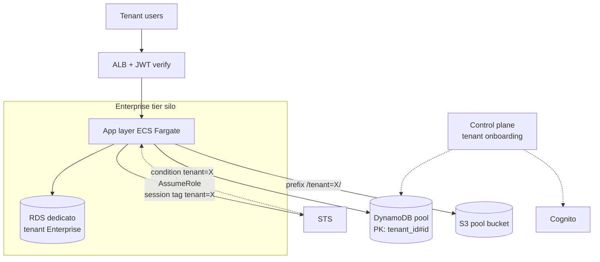
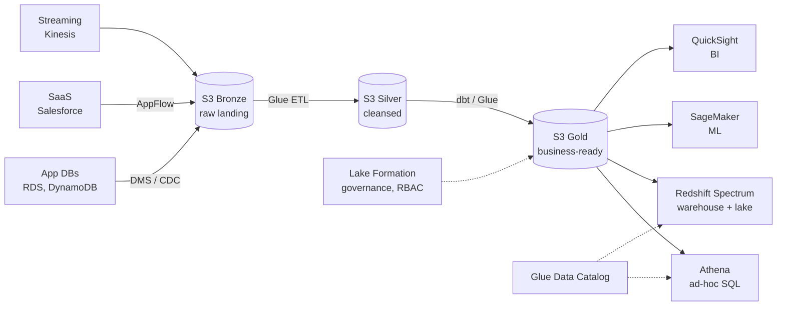

# Reference architectures real-world

Le **reference architecture** sono blueprint testati per scenari ricorrenti. AWS pubblica decine di "AWS Solutions" gratuiti (CloudFormation pronti). Questa sezione presenta i pattern più richiesti, con servizi e trade-off.

## 1. SaaS multi-tenant

Tre modelli di **tenant isolation**:

| Modello | Isolamento | Costo | Esempio |
|---|---|---|---|
| **Silo** | risorse dedicate per tenant (account/VPC/DB separati) | alto | banche, healthcare, enterprise dedicato |
| **Pool** | risorse condivise, tenant separati a livello applicativo (chiave tenant_id) | basso | SaaS B2C, freemium |
| **Hybrid / Bridge** | mix: compute pool, DB silo per tier premium | medio | tier enterprise + free su stesso stack |

Tecniche di isolamento pool:

- **IAM session tag**: assumi role con tag `tenant=abc`, IAM policy referenzia `${aws:PrincipalTag/tenant}` per limitare accesso a DynamoDB items/S3 prefix.
- **Cell-based architecture**: gruppi di tenant in "cell" indipendenti (es. 1000 tenant/cell). Blast radius limitato, deploy progressivo cell-by-cell.
- **Cognito user pool per tenant** o pool unico con custom attribute.



## 2. IoT platform

Stack standard per gestire flotte di device:

- **AWS IoT Core**: MQTT broker managed, autenticazione X.509 per device, rules engine.
- **Greengrass**: runtime edge per processing locale (latenza < 100ms, offline).
- **IoT SiteWise**: time-series per asset industriali (OPC-UA, modbus).
- **Kinesis Data Streams + Firehose**: ingestione ad alto throughput, scarica su S3.
- **Timestream**: time-series DB per analitica IoT.
- **QuickSight / Grafana**: dashboard.

Pattern: device → MQTT IoT Core → Rules Engine → (Kinesis per analytics + Lambda per real-time alert + DynamoDB per shadow state). Per OTA usa Device Management.

## 3. Data platform / Lakehouse

Architettura "modern data stack" su AWS:



Medallion architecture (Bronze → Silver → Gold) + Lake Formation per row-level security e cross-account sharing. Pattern "data mesh" se più team/dominio.

## 4. Media streaming

Live broadcast (es. sport, eventi):

- **MediaLive**: encoder live (input RTMP/SRT, output HLS/DASH).
- **MediaPackage**: just-in-time packaging (DRM, ad insertion SCTE-35).
- **MediaConnect**: transport sicuro contribution (replace satellite).
- **MediaConvert**: file-based transcoding VoD.
- **CloudFront**: CDN delivery globale.

Architettura: camera → MediaConnect (contribution) → MediaLive (encode) → MediaPackage (HLS/DASH multi-bitrate) → CloudFront → player.

## 5. E-commerce

Stack tipico:

| Componente | Servizio |
|---|---|
| Catalogo prodotti | DynamoDB (PK product_id, GSI per category) |
| Ricerca | OpenSearch (BM25 + vector per "find similar") |
| Carrello | ElastiCache Redis (TTL 24h, fast read) |
| Checkout | Step Functions (saga: inventory→payment→shipping) |
| Pagamenti | Lambda + Stripe/Adyen + KMS per token PCI |
| Notifiche | SNS (email) + Pinpoint (mobile push) |
| Frontend | Next.js su Amplify Hosting o S3+CloudFront |
| Recommendation | Personalize o SageMaker custom |
| Analytics | Kinesis → S3 → Athena/QuickSight |

Trick: cache aggressivo prodotti su CloudFront (TTL 1h con cache invalidation su update via SQS), DynamoDB per scrittura/ordini, OpenSearch per query complesse.

## 6. Gaming backend

- **GameLift FleetIQ / Anywhere**: matchmaking + server di gioco managed (spot pricing -75%).
- **DynamoDB**: profili giocatore, leaderboard (con score atomico).
- **Lambda + API Gateway**: meta-game API (inventario, achievement).
- **AppSync GraphQL Subscriptions**: real-time chat / lobby update.
- **Kinesis + Personalize**: analytics live e raccomandazioni in-game.

Per leaderboard globale: DynamoDB con sort key sullo score + cache Redis sorted set per top 100 (sub-ms reads).

## 7. HPC (High Performance Computing)

Per simulazioni scientifiche, CFD, finance:

- **AWS ParallelCluster**: tool open source per orchestrare cluster Slurm/PBS su EC2.
- **EFA (Elastic Fabric Adapter)**: NIC custom per MPI/NCCL bypass kernel, latency μs.
- **FSx for Lustre**: filesystem parallelo POSIX, throughput TB/s, integrato con S3 (sync on read/write).
- **Spot instances + capacity reservation**: ridurre costo del 70-90% per job batch.
- **Batch / Step Functions**: orchestrare job DAG.

## 8. Serverless data pipeline

Per piccoli batch o eventi:

```python
# CDK pseudocode
bucket = s3.Bucket("data-landing")
bucket.add_event_notification(
    s3.EventType.OBJECT_CREATED,
    eventbridge.EventBridgeDestination(rule_to_lambda)
)
# Lambda fa validation/enrichment, scrive su S3 processed
# Glue crawler aggiorna Data Catalog
# Athena query, QuickSight dashboard
```

S3 → EventBridge → Lambda (transform) → S3 → Glue (catalog) → Athena. Costo: pochi $ al mese per TB se accesso sporadico.

## 9. Esercizio

<details>
<summary>Startup IoT smart-home, 50k device, telemetria ogni 30s. Architettura?</summary>

**Ingestion**: device → MQTT su IoT Core (autenticazione X.509). Rules Engine: 1 rule scrive in DynamoDB lo "shadow" (stato corrente per UI mobile), 1 rule scrive in Kinesis Data Streams per analytics.

**Analytics**: Kinesis Firehose → S3 Bronze (parquet) + Lambda per anomaly detection real-time (es. consumo anomalo) → SNS push notification all'utente.

**Backend mobile app**: API Gateway + Lambda + DynamoDB (shadow). Cognito per auth utente.

**Cost-saving**: 50k * 2/min = 100k msg/min = ~$200/mese IoT Core + $50 Kinesis + $20 storage S3. Niente EC2.
</details>

<details>
<summary>SaaS B2B che vende a piccole banche (10-100 utenti per tenant). Silo o pool?</summary>

**Hybrid pragmatico**: account AWS unico, ma per ogni tenant banca crei un VPC + RDS dedicati (silo data) e ECS Fargate cluster condiviso (pool compute) con task role assunto con session tag `tenant=X`.

Motivo: le banche richiedono spesso isolation dei dati per audit (silo DB obbligatorio), ma compute condiviso riduce costi (un cluster ECS gestisce 100 tenant). Cognito user pool per tenant (URL `bank-x.tuoapp.com`) o singolo pool con custom attribute.

Onboarding nuovo tenant: Step Functions automatizza creazione VPC + RDS + secret Secrets Manager + record Route 53 in ~10 min.
</details>

> **Riassunto**: SaaS multi-tenant scegli silo/pool/hybrid in base a compliance e costo, IAM session tag + cell-based; IoT = IoT Core + Greengrass + Kinesis + Timestream; lakehouse = Bronze/Silver/Gold su S3 + Glue + Lake Formation + Athena/Redshift; media = MediaLive/Package + CloudFront; e-commerce = DynamoDB+OpenSearch+Redis+Step Functions; gaming = GameLift + DynamoDB; HPC = ParallelCluster + EFA + FSx Lustre + Spot; serverless data pipeline = S3+EventBridge+Lambda+Glue+Athena.
