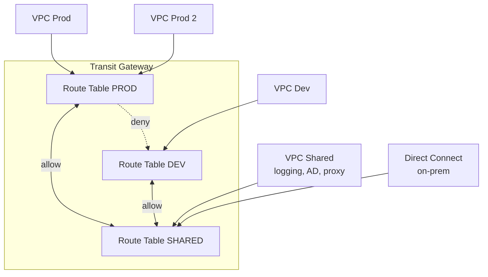

# Advanced networking deep dive

Una volta capiti VPC, subnet, NAT e VPC peering, AWS networking si apre verso territori da network engineer enterprise: BGP, segmentazione TGW, backbone managed multi-region, zero-trust app access. Questa sezione copre i tool che servono quando l'azienda cresce oltre il singolo VPC.

## 1. BGP fundamentals

**BGP** (Border Gateway Protocol) è il protocollo che fa funzionare Internet — e anche le connessioni AWS verso on-prem (Direct Connect, Site-to-Site VPN, Transit Gateway Connect).

Concetti chiave per AWS:

- **AS (Autonomous System) number**: identifica una "rete" (AWS ha ASN propri; il tuo Direct Connect ne ha uno, default 64512 privato).
- **AS-PATH**: lista degli AS attraversati; più corta = preferita.
- **Local preference**: priorità interna; più alta = preferita per uscita.
- **MED (Multi-Exit Discriminator)**: dice al peer quale ingresso preferire; più basso = preferito.
- **Communities**: tag che permettono policy custom (AWS supporta community standard per influenzare path).

Use case: route 2 Direct Connect link in attivo-attivo. Manipoli AS-PATH prepending sul backup per renderlo meno preferito; primario regge il traffico, backup subentra se primary cade (failover BGP in 30-180s).

## 2. Transit Gateway route table design

TGW supporta **multiple route table** che permettono **segmentazione di rete** (network segmentation) in stile firewall logico. Pattern tipico "shared services / prod / dev":

Ogni VPC è "associated" a 1 route table (che usa per routing in uscita) e "propagates" 0-N route table (chi vede le sue route). Così Prod e Dev sono isolati ma entrambi raggiungono Shared (AD, logging, proxy).

## 3. TGW Connect e SD-WAN

**TGW Connect** è una virtual attachment GRE-based che permette di terminare appliance SD-WAN (Cisco SD-WAN, Aruba, Fortinet, Versa) direttamente sul TGW, con peering BGP sul tunnel GRE. Vantaggi rispetto a VPN classico:

- **Throughput**: 5 Gbps per attachment vs 1.25 Gbps VPN.
- **BGP nativo**: SD-WAN annuncia subnet on-prem via BGP, no static route hell.
- **Multipath**: ECMP automatico.

## 4. Cloud WAN — managed backbone

**AWS Cloud WAN** (GA 2022) è un backbone globale managed che astrae TGW multi-region. Configuri una **core network** con policy JSON (segment, attachment, sharing) e AWS gestisce TGW peering, route, ottimizzazione path.

| Componente | Funzione |
|---|---|
| **Global network** | container logico |
| **Core network** | backbone effettivo, multi-region |
| **Segment** | partizione logica (prod, dev, shared), policy-defined |
| **Attachment** | VPC, VPN, Connect, TGW attach |

Use case: enterprise con 30 VPC in 8 region, vuole connettività any-to-any segmentata senza gestire 30 TGW + 100 peering.

## 5. AWS Network Firewall

Firewall di rete managed, stateful, basato su **Suricata** (IDS/IPS open source). Posizionato in subnet dedicata, ispeziona traffico inter-VPC, ingress/egress, intra-VPC.

Capability:

- **Stateful**: track connessioni TCP, regole "established/related".
- **Suricata rules**: ~50k regole community (ET Open) + custom.
- **TLS inspection**: decifra e ispeziona HTTPS (richiede private CA).
- **Domain filter**: blacklist/whitelist FQDN per egress.

Pattern: tutto egress VPC passa via Network Firewall per impedire data exfiltration, IDS attivo per detection.

## 6. Multi-account VPC sharing (RAM)

**AWS RAM (Resource Access Manager)** permette di condividere risorse cross-account. Per networking:

- **Subnet sharing**: account "network" possiede VPC, condivide subnet con account "app". Gli account app lanciano EC2/RDS/Lambda nella subnet condivisa senza vedere il VPC owner. Pattern raccomandato in **AWS Control Tower / Landing Zone**.
- **TGW sharing**: TGW in account network, account app fanno attach del loro VPC.
- **License Manager / Route 53 Resolver rules**: condivisi via RAM.

Vantaggio: networking centralizzato, costi e gestione VPC su 1 account, business unit autonome.

## 7. Performance: jumbo frames, ENA Express, EFA

| Tecnologia | Vantaggio | Use case |
|---|---|---|
| **Jumbo frames** (MTU 9001) | meno overhead, +throughput | intra-VPC, EFS, S3 same-region. Internet/VPN: 1500 |
| **ENA Express** | TCP enhancement, lower latency p99 | EC2 nitro, automatic |
| **EFA (Elastic Fabric Adapter)** | OS-bypass network, latency μs | HPC, MPI, distributed ML training |
| **Cluster placement group** | EC2 fisicamente vicini in 1 AZ | low latency + alto throughput |

EFA è essenziale per training LLM/HPC: bypassa kernel, accede direttamente HW via libfabric. Disponibile su istanze p4/p5, c5n, hpc7a.

## 8. PrivateLink for SaaS

**PrivateLink** non è solo per VPC endpoint AWS: SaaS vendor possono pubblicare il loro servizio come "endpoint service", e i clienti accedono via VPC endpoint privato (no internet, no peering).

Architettura: SaaS deploy NLB davanti al servizio, lo espone come endpoint service, condivide con account cliente. Cliente crea VPC endpoint che punta al service. Traffico flow tutto interno AWS network. Snowflake, Databricks, Datadog, Stripe usano PrivateLink.

## 9. Verified Access — zero-trust

**AWS Verified Access** (GA 2023) elimina la VPN per app aziendali non-HTTP. Identity provider (Okta, Entra ID, IAM Identity Center) + device trust (Jamf, CrowdStrike) verificati per ogni richiesta. Policy Cedar (linguaggio AWS) decide accesso.

Pattern: dipendenti accedono a SSH bastion, RDP Windows, app interne — senza VPN, da qualsiasi rete, sempre autenticati per request.

## 10. Esercizio

Enterprise con 5 region, 40 VPC, on-prem datacenter. Quale topologia?

**Cloud WAN + Direct Connect**: 1 core network globale, 3 segment (prod, dev, shared-services), policy permette prod↔shared e dev↔shared, blocca prod↔dev.

On-prem: **2 Direct Connect** in 2 location distinte (per HA fisico) terminati su TGW Connect via SD-WAN appliance, BGP attivo-attivo con AS-PATH prepending per influenzare path.

Shared VPC ospita: Network Firewall (egress filter), Route 53 Resolver inbound endpoint (DNS hybrid), AD domain controller.

40 VPC attaccati a Cloud WAN tramite RAM share. Cost: ~$500/mese Cloud WAN + DX ~$1000-3000/mese. Tradeoff vs TGW manuale: meno operations, più cost per attachment.

Devi connettere VPC al servizio Snowflake senza traffico internet. Come?

**PrivateLink endpoint**: Snowflake offre PrivateLink (su tier Business Critical+). Da console Snowflake ottieni il service name (es. `com.amazonaws.vpce.us-east-1.vpce-svc-xxx`).

Crea VPC interface endpoint nelle subnet private: `aws ec2 create-vpc-endpoint --vpc-id vpc-xxx --service-name com.amazonaws.vpce... --vpc-endpoint-type Interface --subnet-ids ...`. Aggiungi SG che permetta 443 dalla tua app.

Configura Route 53 private hosted zone per risolvere `xyz.snowflakecomputing.com` al DNS name dell'endpoint. Da questo momento tutte le query Snowflake viaggiano dentro AWS backbone, niente internet, ~10-20ms latenza.

> **Riassunto**: BGP regola routing dinamico verso on-prem (AS-PATH, local pref, MED); TGW con multiple route table per segmentazione prod/dev/shared; TGW Connect + SD-WAN per multipath BGP; Cloud WAN per backbone multi-region managed; Network Firewall (Suricata stateful) per ispezione e egress filter; RAM share per VPC/subnet/TGW multi-account; EFA per HPC/MPI; PrivateLink come integration pattern SaaS; Verified Access per zero-trust app non-HTTP; Route 53 ARC per failover atomico critical.
