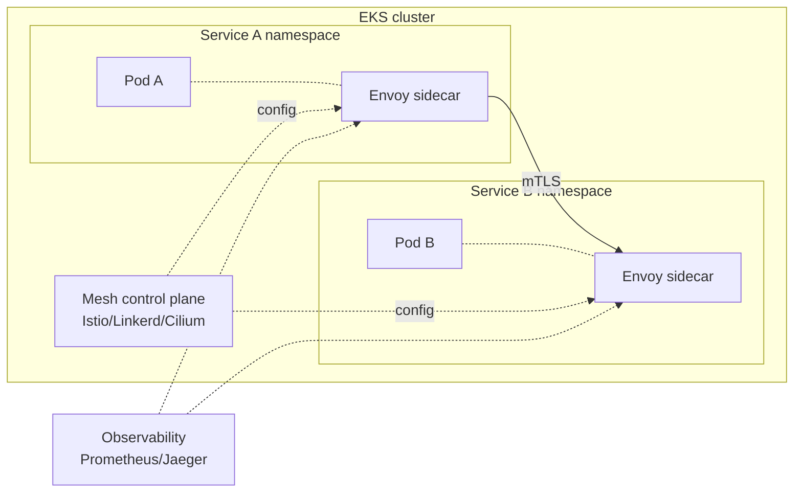

# Containers deep dive

Sezione per chi va oltre "deploy un pod in EKS". Vediamo come è fatto davvero il control plane, come gestire il data plane in modo cost-effective con Karpenter, networking CNI, service mesh moderno (post-App Mesh) e pattern GitOps in produzione.

## 1. EKS — architettura

EKS è un Kubernetes managed: AWS opera il **control plane** (API server, etcd, scheduler, controller manager) in un VPC AWS-owned, replicato in 3 AZ con SLA 99.95%. Tu paghi $0.10/h (~$73/mese) per cluster.

Il **data plane** (dove girano i pod) è tuo, con 3 opzioni:

| Opzione | Cosa gestisci | Quando |
|---|---|---|
| **Self-managed node group** | tutto (AMI, scaling, patching) | controllo totale, raro oggi |
| **Managed node group** | AWS gestisce ASG, drain, patching | default classico |
| **Fargate** | nessun nodo, pod su VM dedicata | small/medium pod, serverless |
| **EKS Auto Mode** (2024) | AWS gestisce node + addon + scaling end-to-end | nuovo gold standard |

**EKS Auto Mode** (lanciato re:Invent 2024) è la novità più importante: AWS installa Karpenter, AWS LB Controller, VPC CNI, EBS CSI, GuardDuty agent come "managed addons", scegli istanza automaticamente. Costo ~12% premium sul nodo, ma elimina ops.

## 2. Karpenter — next-gen autoscaler

**Karpenter** (open source, sviluppato AWS) sostituisce il vecchio Cluster Autoscaler. Differenze:

- **No node group rigid**: Karpenter sceglie l'istanza tipo migliore per i pod pending (es. se servono 4 CPU/16GB, lancia `m6i.xlarge` o `c6i.xlarge` o spot equivalente).
- **Fast**: scale-up in ~30s vs 2-5 min Cluster Autoscaler.
- **Consolidation**: muove pod e termina nodi sotto-utilizzati per ottimizzare costi.
- **Spot first-class**: sceglie spot quando possibile, fallback on-demand su interruzione.

```yaml
apiVersion: karpenter.sh/v1
kind: NodePool
metadata:
  name: default
spec:
  template:
    spec:
      requirements:
        - key: karpenter.sh/capacity-type
          operator: In
          values: ["spot", "on-demand"]
        - key: kubernetes.io/arch
          operator: In
          values: ["amd64", "arm64"]
        - key: karpenter.k8s.aws/instance-family
          operator: In
          values: ["m6i", "m7i", "m6g", "m7g", "c6i"]
  disruption:
    consolidationPolicy: WhenEmptyOrUnderutilized
    consolidateAfter: 30s
  limits:
    cpu: 1000
```

## 3. IAM per pod — IRSA e Pod Identity

I pod hanno bisogno di credenziali AWS per chiamare DynamoDB/S3/SQS. Due meccanismi:

- **IRSA (IAM Roles for Service Accounts)**: pod assume IAM role via OIDC del cluster. Configurazione: 1 OIDC provider per cluster, annotation `eks.amazonaws.com/role-arn` sul ServiceAccount, trust policy del role referenzia OIDC.
- **EKS Pod Identity** (2023): nuovo meccanismo senza OIDC, gestito tramite addon `eks-pod-identity-agent`. Più semplice (no OIDC setup), supporta cross-account in modo nativo. **Preferito per nuovi cluster**.

Entrambi danno al pod credenziali temporanee via SDK senza dover stoccare access key.

## 4. Networking — VPC CNI vs Calico vs Cilium

| CNI | Caratteristica | Quando |
|---|---|---|
| **AWS VPC CNI** (default) | ogni pod riceve IP del VPC, secondary IP della ENI | default EKS, integration nativa SG |
| **Calico** | overlay VXLAN, network policy avanzate | NetworkPolicy fine, esaurimento IP VPC |
| **Cilium** | eBPF-based, network + observability + service mesh | next-gen, performance, Hubble UI |

VPC CNI dà performance native (no overlay) ma consuma molti IP del VPC (un pod = 1 IP). Per cluster grandi attiva **prefix delegation** (ogni ENI riceve /28 = 16 IP), aumenta densità ~16x.

## 5. Ingress e Load Balancer Controller

**AWS Load Balancer Controller** (ex ALB Ingress Controller) installa ALB/NLB per Service e Ingress K8s:

- `Ingress` con annotation `kubernetes.io/ingress.class: alb` → crea ALB con target group IP.
- `Service type: LoadBalancer` con `service.beta.kubernetes.io/aws-load-balancer-type: external` → crea NLB.
- Supporta target group binding (cross-namespace), pod readiness gate, WAF integration.

## 6. Service mesh — post App Mesh

**AWS App Mesh** è stato annunciato in deprecation a settembre 2024 (end-of-support 2026). Alternative moderne:



- **Istio**: feature-complete, complex; standard de-facto enterprise.
- **Linkerd**: minimal, Rust-based, easy install.
- **Cilium Service Mesh**: eBPF, no sidecar Envoy (sidecarless), lower overhead.

Tutti offrono: mTLS automatico, traffic splitting (canary/blue-green), retry/timeout policy, observability distribuita.

## 7. GitOps con ArgoCD/Flux

GitOps = stato del cluster definito in Git, controller pull e applica. Su EKS:

- **ArgoCD**: UI ricca, multi-cluster, ApplicationSet per generazione massiva, popolare in enterprise.
- **Flux**: CLI-first, più leggero, GitOps Toolkit modulare.

Pattern: repo `infra/` contiene Helm chart/Kustomize/raw YAML, ArgoCD `Application` sync ogni 3 min. PR = deploy. Rollback = git revert.

Helm vs Kustomize: **Helm** è templating ricco (chart riusabili, values per env); **Kustomize** è patch overlay senza templating (più semplice, niente DSL Go).

## 8. Scaling pattern

| Tipo | Cosa scala | Trigger |
|---|---|---|
| **HPA** (Horizontal Pod Autoscaler) | numero pod | CPU/memory/custom metric |
| **VPA** (Vertical Pod Autoscaler) | resource request del pod | uso storico |
| **KEDA** | numero pod (anche a 0) | event-driven (SQS depth, Kafka lag, ecc.) |
| **Karpenter** | numero nodi | pod pending |

Combinazione tipica: HPA gestisce repliche app su CPU, KEDA gestisce worker su lunghezza SQS, Karpenter aggiunge/toglie nodi. VPA usato meno (richiede restart pod).

## 9. Security e EKS-D / EKS Anywhere

- **Pod Security Standard** (privileged/baseline/restricted): label namespace, K8s rifiuta pod che violano.
- **OPA Gatekeeper / Kyverno**: policy-as-code (es. "vieta image non da ECR aziendale").
- **GuardDuty EKS Protection**: monitora audit log K8s + runtime monitoring (eBPF) per detection malware/crypto-mining.
- **EKS Distro (EKS-D)**: stessa distribuzione K8s di EKS, open source, per usarla on-prem.
- **EKS Anywhere**: EKS-D + tooling per gestione on-prem (bare metal, vSphere). Subscription paid.

## 10. Upgrade strategy

Kubernetes rilascia 3 minor/anno. EKS supporta 4 versioni in standard (+ 12 mesi in **Extended Support** a costo extra). Pattern:

1. Test in cluster dev/staging prima.
2. Upgrade control plane via console/Terraform.
3. Upgrade managed node group (drain + rolling).
4. Verifica deprecation API (`kubectl convert`, `pluto`).

## 11. Esercizio

<details>
<summary>Cluster con 200 microservizi, costi nodo elevati, dev frustrati da scale lento. Che fai?</summary>

1. **Migra a Karpenter** dal Cluster Autoscaler: scale 30s vs 5 min, picks spot automaticamente, consolida nodi sottoutilizzati. Risparmio 30-60% sul compute, latenza scaling drastica.
2. **Abilita Graviton (ARM)** nei NodePool requirement: aggiungi `m7g` e `c7g` al pool, fai build multi-arch dei container. ~20% sconto su workload compatibili.
3. **Pod Disruption Budget** per servizi critici (impedisce Karpenter consolidation di rompere availability).
4. **Spot ratio**: 70% spot per worker stateless, 30% on-demand per API critiche.

Risultato tipico: -40% bill compute, scale latency da 5min a 30s.
</details>

<details>
<summary>App in pod deve scrivere su DynamoDB. Come dai i permessi senza access key?</summary>

**EKS Pod Identity** (preferito per nuovi cluster):

1. Installa addon `eks-pod-identity-agent` (Auto Mode lo include).
2. Crea IAM role `app-dynamodb-role` con policy DynamoDB necessaria, trust policy `pods.eks.amazonaws.com`.
3. Crea ServiceAccount `app-sa` in namespace.
4. Crea `PodIdentityAssociation`: `aws eks create-pod-identity-association --cluster-name X --namespace Y --service-account app-sa --role-arn arn:aws:iam::...:role/app-dynamodb-role`.
5. Nel pod spec: `serviceAccountName: app-sa`.

SDK boto3/AWS SDK ottiene credenziali automaticamente da `AWS_CONTAINER_CREDENTIALS_FULL_URI`. Niente IRSA OIDC, più semplice.
</details>

> **Riassunto**: EKS control plane managed + data plane (managed node group / Fargate / Auto Mode); Karpenter sostituisce Cluster Autoscaler con scale 30s e spot first-class; Pod Identity preferito su IRSA per nuovi cluster; VPC CNI nativa (con prefix delegation per scale), Calico/Cilium per network policy; AWS LB Controller per ALB/NLB; App Mesh deprecato, scegli Istio/Linkerd/Cilium; GitOps con ArgoCD/Flux + Helm o Kustomize; scaling HPA+KEDA+Karpenter; security pod standard + OPA + GuardDuty; EKS-D per on-prem.
