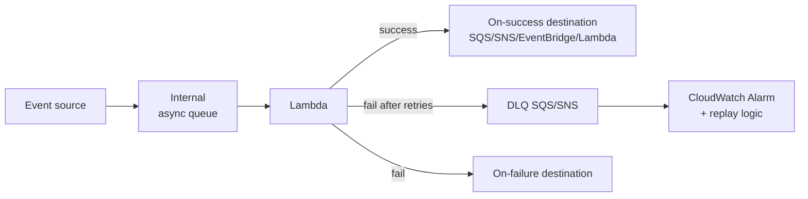

# Serverless patterns deep dive

Serverless è facile da iniziare (1 Lambda + 1 trigger) ma in produzione richiede pattern specifici per gestire cold start, idempotenza, backpressure, distributed transaction. Questa sezione raccoglie i pattern che salvano sistemi in scala.

## 1. Cold start — strategie

Lambda esegue cold start (~100ms-3s) quando deve istanziare un nuovo worker. Mitigation:

| Tecnica | Riduzione | Costo |
|---|---|---|
| **Memory bump** (2-3 GB) | -30-50% (più CPU = init veloce) | linearmente più costoso |
| **Lambda SnapStart** (Java/Python/.NET) | -90% (snapshot init pre-cached) | gratis ma versioning richiesto |
| **Provisioned concurrency** | ~0 cold start | $$ (paghi anche idle) |
| **Smaller runtime** (Rust, Go, Node) | -50% (vs Java/Python big deps) | refactor codice |
| **Lambda Layer + minimo dependency** | -20% | refactor |
| **Avoid VPC unless needed** | -200-500ms storici (Hyperplane risolve molto) | architettura |

Best practice 2026: SnapStart per JVM/Python, codice runtime nativi (Rust/Go) per latency-critical, provisioned concurrency solo per API user-facing con SLA stretto.

## 2. Idempotency

Lambda **at-least-once delivery** (SQS, SNS, EventBridge, S3 trigger): lo stesso evento può arrivare 2+ volte. Senza idempotenza = doppia carica carta, doppio ordine.

Pattern: **DynamoDB conditional write** con chiave idempotency ID:

```python
import hashlib
from aws_lambda_powertools.utilities.idempotency import idempotent, DynamoDBPersistenceLayer

persistence = DynamoDBPersistenceLayer(table_name="idempotency-store")

@idempotent(persistence_store=persistence)
def lambda_handler(event, context):
    # Powertools dedupe automatico via event hash
    order_id = process_payment(event["order"])
    return {"order_id": order_id}
```

**Lambda Powertools** (Python/Java/TypeScript/.NET) include `@idempotent` decorator che fa lock+TTL su DynamoDB automaticamente.

## 3. Async invocation pattern

Lambda async (invocato da SNS/EventBridge/S3 o `InvocationType=Event`) ha lifecycle dedicato:



- **Retry**: 2 retry default per async (configurabile 0-2), backoff exponential.
- **Destination**: meglio del DLQ — invia metadata + result a SQS/SNS/EventBridge/Lambda sia per success che failure.
- **DLQ**: SQS/SNS per messaggi falliti dopo retry. Sempre configurare.
- **Event source mapping** (SQS/Kinesis/DDB Stream/Kafka): batch, parallel, error handling separato (`ReportBatchItemFailures`).

## 4. EventBridge Pipes

EventBridge Pipes (2023) collega 1 source → 1 target con filter/transform/enrich opzionali, **senza Lambda glue**. Esempio: DynamoDB Stream → filter solo `INSERT` → enrich con Lambda → EventBridge bus.

Risparmia: niente Lambda per "instradare" eventi, riduci cold start e codice.

## 5. Transactional outbox

Problema: scrivi su DynamoDB + pubblichi evento su EventBridge. Se la seconda fallisce dopo la prima, sistema inconsistente.

Soluzione **outbox**: scrivi solo su DynamoDB (atomic), DynamoDB Streams trigger Lambda che pubblica su EventBridge. Atomicità garantita dal DB.

## 6. Scatter-gather, fan-out, fan-in

**Scatter-gather**: invii N task in parallelo, aggreghi risultati.

```yaml
# Step Functions Map
{
  "StartAt": "FanOut",
  "States": {
    "FanOut": {
      "Type": "Map",
      "ItemsPath": "$.tasks",
      "MaxConcurrency": 100,
      "Iterator": {
        "StartAt": "ProcessTask",
        "States": {
          "ProcessTask": { "Type": "Task", "Resource": "arn:...lambda...", "End": true }
        }
      },
      "ResultPath": "$.results",
      "Next": "Aggregate"
    },
    "Aggregate": { "Type": "Task", "Resource": "arn:...aggregator...", "End": true }
  }
}
```

**Step Functions Distributed Map** (2022) scala a 10k+ esecuzioni parallele leggendo da S3 manifest — perfetto per processare milioni di file (es. ETL su data lake).

**Fan-out** classico: SNS → multipli SQS, ogni consumer ha la sua coda. **Fan-in**: SQS multipli → 1 Lambda aggregatore (rare, di solito si fa altrove).

## 7. Choreography vs orchestration

| Aspetto | Choreography (EventBridge) | Orchestration (Step Functions) |
|---|---|---|
| Coordinator | nessuno | state machine centrale |
| Visibility | tracing difficile | grafico nativo + history |
| Coupling | loose | medium (logica nel state machine) |
| Costo | $1/M event | $25/M state transition (Standard), $0.000001/transition (Express) |
| Best for | event broadcasting, microservices loose | workflow lineare con compensation |

Trick: Step Functions **Express** è 1000x più economico di Standard per workflow brevi (< 5 min), ma niente history dettagliato. Usa Express per ETL e mass processing, Standard per business workflow con audit.

## 8. Throttling, backpressure, bulkhead

- **Reserved concurrency** per Lambda: throttle fisso a N (es. 100), evita esaurire account concurrency.
- **Provisioned concurrency**: anche pre-warm.
- **SQS visibility timeout** + **maxReceiveCount**: implicit retry, DLQ dopo soglia.
- **API Gateway usage plan**: rate limit per API key, burst.
- **AppSync caching + DDB throttling**: GraphQL non explode il DB.

Pattern bulkhead: Lambda con reserved concurrency per tenant prevents noisy neighbor.

## 9. API Gateway HTTP vs REST vs WebSocket vs AppSync

| Servizio | Quando |
|---|---|
| **API Gateway REST** | feature complete: usage plan, API key, request validation, custom authorizer, WAF | 
| **API Gateway HTTP** | 70% meno costo, latenza minore, no request validation/usage plan |
| **API Gateway WebSocket** | chat, real-time push da server |
| **AppSync GraphQL** | mobile/web con schema GraphQL, subscriptions real-time, DDB/Aurora/Lambda resolver |

Default 2026: **HTTP API** se non servono feature REST avanzate (3.5x cheaper). AppSync se schema GraphQL preferito o subscription real-time.

## 10. Anti-pattern

- **Lambda monolitica** (`lambda-monorepo` con 100 endpoint in 1 handler): scaling indiscriminato, deploy lento, blast radius enorme. Meglio 1 Lambda per dominio o per endpoint.
- **Sync chain di Lambda**: API GW → Lambda A → invoke Lambda B → invoke Lambda C. Latency cumulata, costo doppio (paghi B mentre A aspetta). Usa Step Functions o async event.
- **Lambda in VPC senza necessità**: con Hyperplane il problema dei 10s cold start è risolto, ma comunque + complessità (ENI, IP exhaustion). Solo se serve RDS/ElastiCache.
- **Senza Powertools**: re-implementi logging strutturato, tracing X-Ray, idempotency, metrics... copre tutto gratis.

## 11. Esercizio

<details>
<summary>API serverless con picchi di 10k RPS e SLA p99 < 200ms. Architettura?</summary>

1. **API Gateway HTTP** (non REST: latenza inferiore, costo 70% in meno).
2. **Lambda** in Python con **SnapStart** o Rust per cold start ridotto.
3. **Provisioned concurrency** = baseline RPS / 1000 (es. 10 RPC = 10k baseline, dimensiona dopo load test) + auto-scaling.
4. **Reserved concurrency** = 2x picco per safety margin.
5. **DynamoDB** on-demand mode + DAX cache per item caldi.
6. **CloudFront** davanti per static + cache per GET cacheable.
7. **Powertools** per logging strutturato + tracing.

p99 attesa: 50-100ms con DAX, < 200ms con DynamoDB cold. Cost: ~$200/giorno a 10k RPS (vs ~$1000 di ECS Fargate equivalente).
</details>

<details>
<summary>Devi processare 5 milioni di file S3 con un Lambda. Come?</summary>

**Step Functions Distributed Map**: 1 state machine con `Type: Map`, `ItemReader` che legge da S3 inventory (manifest JSON con 5M oggetti), `MaxConcurrency: 10000`.

Lambda invocata in batch (es. 100 file per execution per ridurre overhead). Throttling automatico, retry per item, output aggregato in S3.

Tempo stimato: 5M / 10k concurrency × tempo per batch (es. 5s) = 2500 secondi = ~40 min. Costo: $0.000001/transition × 5M = $5 + costo Lambda.

Senza Distributed Map dovresti scrivere logica di paginazione/parallelismo a mano e gestire failure: ore di codice e bug.
</details>

> **Riassunto**: cold start: SnapStart, runtime nativi, provisioned concurrency; idempotency con Powertools + DDB conditional write; async pattern usa destination > DLQ; EventBridge Pipes sostituisce glue Lambda; outbox per consistency DB+evento; scatter-gather con Step Functions Distributed Map (10k parallel); choreography (EventBridge cheap) vs orchestration (Step Functions visible); Express SF 1000x cheaper di Standard; throttling con reserved concurrency + usage plan; API HTTP API default vs REST/AppSync; evita Lambda monolitica e sync chain.
