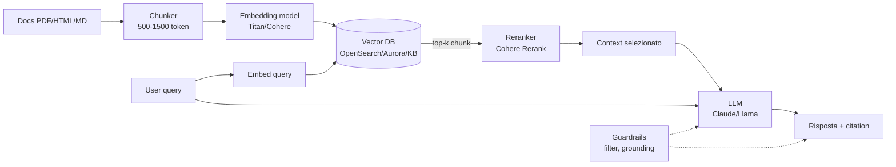

# Generative AI su AWS — RAG e Agents

GenAI in produzione non è "chiama un LLM". È un sistema con retrieval, prompt engineering, guardrails, evaluation, cost optimization e agentic patterns. AWS offre **Bedrock** come piattaforma managed multi-model + servizi correlati. Questa sezione copre i pattern di produzione 2026.

## 1. Foundation model selection

Bedrock offre decine di model in API unica:

| Model family | Provider | Forte in |
|---|---|---|
| **Claude** (Sonnet, Opus, Haiku) | Anthropic | reasoning, coding, agentic, long context |
| **Llama 3.x / 4** | Meta | open weight, customizzazione fine-tuning |
| **Mistral / Mixtral** | Mistral AI | european, balance qualità/costo |
| **Titan / Nova** | Amazon | embedding, lightweight, embedded in Bedrock |
| **Cohere Command R+** | Cohere | enterprise RAG, citation native |
| **Stable Diffusion / Titan Image** | Stability/Amazon | image generation |

Trade-off: model "frontier" (Opus, Claude 4.7) qualità top ma costo 10-30x un model leggero (Haiku, Nova Lite). **Model routing**: smista query semplici a model cheap, complesse a Frontier (saving 50-80%).

## 2. Prompt engineering production

- **System prompt**: ruolo, vincoli, output format (JSON schema). Riusa tra chiamate.
- **Few-shot**: 2-5 esempi nel prompt per task strutturati. Migliora consistency.
- **Chain of thought**: chiedi al modello di ragionare step-by-step (`<thinking>` tags Anthropic). Migliora reasoning, +costo.
- **Output schema**: `<json>` tags o tool use forzato per output strutturato parseable.
- **Prompt caching** (Bedrock 2024): cache system prompt + few-shot, paghi 0.1x per i token cachati. Riduzione costo 50-90% per chat lunghi.

## 3. RAG architecture pattern

**RAG (Retrieval-Augmented Generation)**: invece di addestrare il model sui tuoi dati, recupera context rilevante a runtime e lo inserisci nel prompt.



## 4. Vector database scelta

| Opzione | Caratteristica | Quando |
|---|---|---|
| **OpenSearch Serverless vector** | scaling auto, hybrid BM25+vector nativo | enterprise, già su OpenSearch |
| **Aurora PostgreSQL + pgvector** | DB relazionale + vector | dati ibridi struct+unstruct |
| **Amazon Kendra** | enterprise search managed, connettori SharePoint/Confluence | NO embedding manuale |
| **Bedrock Knowledge Bases** | RAG end-to-end managed (ingest S3 + chunk + embed + retrieve) | fast POC, semplice |
| **MemoryDB / DocumentDB / RDS** | vector emergente | esistente |
| **Pinecone / Weaviate** | gestiti 3rd party | feature avanzate non in AWS |

**Bedrock Knowledge Bases** (KB) è la scelta più rapida: punta a S3 con i tuoi PDF, KB chunka + embed + indicizza in OpenSearch Serverless automaticamente, espone API `Retrieve` e `RetrieveAndGenerate`.

## 5. Chunking strategy

Chunking sbagliato = retrieval pessimo:

- **Fixed size** (500-1500 token): semplice, può tagliare frasi.
- **Semantic** (separator: paragraph, section): preserva struttura.
- **Hierarchical**: chunk parent (grande) per context + child (piccolo) per match. Bedrock KB li supporta nativi.
- **Overlap**: 10-20% tra chunk per non perdere info al confine.

Token count: 1500 token ≈ 1000 parole ≈ 1 pagina dense. Per documenti tecnici, hierarchical 1500/300 con overlap 200.

## 6. Hybrid search e reranker

**Hybrid search**: combina **BM25** (keyword matching, alta precision su query letterali) + **vector** (semantic, query parafrasate). OpenSearch lo fa nativo.

**Reranker**: prendi top 50 da retrieval, riordini con un modello più potente (Cohere Rerank, Voyage AI). Top 5-10 va al LLM. Riduce token in context, migliora precision.

**Citation**: chiedi al model di citare chunk usati (es. `<source>chunk_id</source>`), mostra all'utente per trust e debugging hallucination.

## 7. Bedrock Agents

**Bedrock Agents** orchestrano tool use, RAG, e multi-step reasoning automaticamente:

- **Action group**: API esposte come tool (OpenAPI schema o function definition); agent decide quando chiamare; backend Lambda esegue.
- **Knowledge base attach**: agent può fare retrieve da KB associata.
- **Agent memory**: conserva contesto cross-session per session_id (lanciato 2024).
- **Multi-agent collaboration** (2024): un agent "supervisor" delega ad agent specialist (es. CustomerAgent, RefundAgent, ShipAgent).

```python
import boto3
brt = boto3.client('bedrock-agent-runtime')
response = brt.invoke_agent(
    agentId='AGENT_ID',
    agentAliasId='ALIAS',
    sessionId='user-123-session-456',
    inputText='Rimborsami ordine 1234',
    enableTrace=True
)
# Agent decide: chiama action group GetOrder → ProcessRefund → reply
```

## 8. Guardrails

**Bedrock Guardrails** è un layer di policy sopra qualsiasi model:

- **Content filters**: blocca categorie (hate, sexual, violence, misconduct) con soglie low/medium/high.
- **Denied topics**: testo libero "competitor X products" → blocca.
- **Sensitive info filter**: regex/entità (PII, credit card, SSN) → block o redact.
- **Word filter**: blacklist parole.
- **Contextual grounding check**: verifica che la risposta sia supportata dal context retrieved (anti-hallucination). Score < soglia → fallback message.

Applicabili a input (user) e output (model). Indipendenti dal model scelto.

## 9. Evaluation

Senza valutazione il sistema è una scatola nera che hallucina senza saperlo.

| Tecnica | Cosa misura |
|---|---|
| **LLM-as-judge** | LLM giudica risposte vs reference (es. Claude valuta Claude) |
| **Bedrock Model Evaluation Jobs** | job managed: automatic (truthfulness, robustness) o human review |
| **RAGAS** (open source) | metriche RAG: faithfulness, context relevance, answer relevance |
| **Embedding similarity** | cosine vs gold answer |
| **A/B test in prod** | thumbs-up/down user + click-through |

Best practice: dataset di **golden questions** (50-200) + run continui in CI/CD. Soglia accettazione per merge PR.

## 10. Production patterns

- **Semantic cache**: query simili (cosine > 0.95) ritorna cached answer. Cache via ElastiCache + embedding. Saving 30-70% costo + latency.
- **Model routing/distillation**: classify query intent, route a model giusto (Haiku per simple, Opus per complex).
- **Streaming response**: SSE/WebSocket per typing-effect, riduce latenza percepita.
- **Async batch**: per workload non real-time (es. transcribe + summarize 1000 call), Bedrock Batch API costa 50% meno.
- **Provisioned throughput**: per workload prevedibile alto-volume, paghi capacity dedicata invece di on-demand.

## 11. Agentic patterns

- **ReAct (Reasoning + Acting)**: think → tool → observation → think → tool... fino a final answer. Default Bedrock Agents.
- **Plan-and-Execute**: model genera piano upfront, esegue step (più affidabile per task complessi).
- **Reflexion**: model critica la propria risposta e re-tenta.
- **Multi-agent debate**: 2+ agent discutono, supervisor consolida.

## 12. Q Developer vs Q Business

- **Amazon Q Developer**: assistente coding (IDE plugin, CLI), generation, security scan, AWS expertise. ~$19/dev/mese.
- **Amazon Q Business**: assistente enterprise per dipendenti, connettori SharePoint/Salesforce/Confluence, no-code app builder. ~$20/user/mese.

Entrambi sono "managed RAG/Agent" su modelli AWS. Cheap se vuoi adottare GenAI senza costruire stack.

## 13. Esercizio

<details>
<summary>Chatbot HR aziendale su 500 PDF policy. POC in 2 giorni.</summary>

**Bedrock Knowledge Bases**:

1. Carica i 500 PDF su S3 bucket.
2. Crea KB in console Bedrock, punta al bucket, sceglie embedding Titan Embeddings v2 e Bedrock OpenSearch Serverless vector store (managed end-to-end).
3. Crea Bedrock Agent con instruction "Sei un assistente HR. Rispondi solo basandoti su policy aziendali. Cita la sezione." Attach KB.
4. Aggiungi Guardrails: denied topic "competitor information", PII filter (redact employee ID), contextual grounding 0.7.
5. Frontend Lex/Streamlit/Chainlit chiamando `invoke_agent`.

Tempo: 1-2 giorni POC. Cost: ~$50/mese a basso volume (1k query/giorno). Production hardening (eval, monitoring, semantic cache, custom UI) richiede 2-4 settimane in più.
</details>

<details>
<summary>Hai un agent che chiama API ma a volte hallucina parametri. Come fissi?</summary>

1. **Tool definition strict**: schema OpenAPI/JSON con tutti i required, type, enum constraint. Bedrock force il model a strutturare l'output secondo schema (function calling).
2. **Guardrails contextual grounding**: imposta soglia (es. 0.8). Se il model genera testo non supportato, fallback.
3. **Few-shot in instruction**: 2-3 esempi di uso corretto del tool nella system instruction dell'agent.
4. **Validation Lambda**: prima di eseguire l'API check parametri (es. order_id esiste in DDB), se invalido ritorna errore al model che si auto-corregge.
5. **Eval set**: 50 query con expected tool calls, regression test in CI. Reject merge se accuracy < 90%.
6. **Switch model**: Claude Sonnet/Opus hanno function-calling più affidabile di model più piccoli; trade-off costo.
</details>

> **Riassunto**: Bedrock = piattaforma multi-model (Claude, Llama, Mistral, Titan, Cohere) con routing per cost; RAG = chunking + embedding + vector DB + hybrid search + reranker + citation; Bedrock KB managed end-to-end, OpenSearch/Aurora/Kendra alternativi; Bedrock Agents per tool use + memory + multi-agent; Guardrails per content/PII/grounding; eval con LLM-as-judge + RAGAS + golden dataset; production: semantic cache, model routing, streaming, batch, provisioned throughput; ReAct/Plan-Execute/Reflexion agentic; Q Developer/Business managed alternative. Anti-pattern: RAG senza eval, prompt injection senza guardrails.
