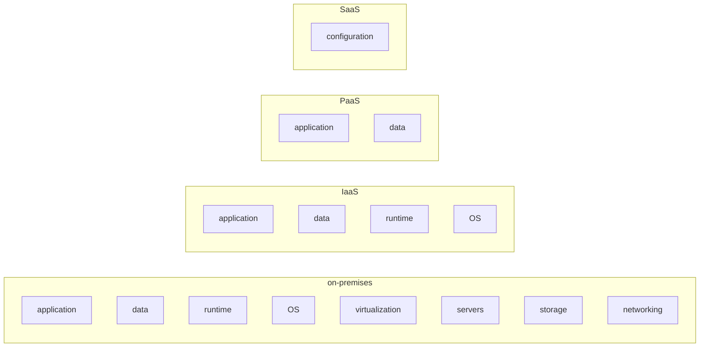

# What the cloud is, and what AWS is

Before touching a single service, you need the right mental model. Cloud computing isn't "the internet" and isn't "someone else's computer". It's a shift in **economic and operating model**: from buying hardware and paying for it upfront (CAPEX) to renting compute capacity by the minute, billed by usage (OPEX). This page gives you the conceptual foundation and the "why" of everything in the next 51 sections.

## 1. What changed in 2006

On March 14, 2006 Amazon launched **S3**: object storage accessible over HTTP, billed per GB-month. A few months later came **EC2**: on-demand virtual machines, billed per hour. For the first time, a developer with a credit card could spin up 100 servers in 5 minutes — no contract, no data center, no CAPEX. That's the break. Everything else — the 200+ other services — came after.

Pre-cloud, launching a web startup meant: (a) estimating peak traffic for the next 3 years, (b) buying servers for that peak, (c) hoping you didn't go bust before amortizing them, (d) also hoping you didn't underestimate — because adding capacity meant ordering hardware with an 8-week lead time. Result: either under-provisioning (site crashes when you go viral) or over-provisioning (you pay for servers used at 12%).

## 2. The three "as a Service"

| model | what you manage | what the provider manages | AWS example |
|---|---|---|---|
| **IaaS** (Infrastructure) | OS, runtime, app, data | virtualization, servers, network, storage | EC2, EBS, VPC |
| **PaaS** (Platform) | app, data | everything else + runtime | Elastic Beanstalk, Lambda, RDS |
| **SaaS** (Software) | configuration and data | everything | Amazon Connect, WorkMail, Chime |

The higher you go (IaaS → PaaS → SaaS), the less you manage, but the less flexibility you have. Lambda is wonderful because you don't think about the operating system. It's less wonderful if you need to install a custom kernel driver.

## 3. Shared responsibility model

Probably the single most important slide in all of AWS. AWS is responsible for the **security of the cloud** (hardware, software running on their servers, physical data centers). You are responsible for the **security in the cloud** (configuration of your services, IAM, data, logical networking).

| Layer | AWS handles | You handle |
|---|---|---|
| Hardware, data center, power, cooling | ✓ | — |
| Hypervisor, host OS | ✓ | — |
| Managed services (RDS DB engine, Lambda runtime) | ✓ | — |
| Operating system on your EC2 | — | ✓ (patching, hardening) |
| IAM, security group, NACL configuration | — | ✓ |
| Encryption of your data | — | ✓ (with KMS) |
| Application code | — | ✓ |

**Practical implication**: if you leave an S3 bucket public by accident and it ends up in the news, that's on you. AWS gives you the tools to lock it down (Block Public Access is now default), but configuration is the customer's responsibility. We'll see dozens of cases where this boundary triggers incidents.

## 4. The five real benefits (not the marketing)

1. **Elasticity**: go from 10 to 1,000 servers in minutes, and from 1,000 back to 10 when the peak ends. No CAPEX locked up.
2. **Pay-as-you-go**: you pay only what you use, by the second (Lambda, Fargate), the hour (EC2 on-demand), the GB-month (S3), the request (DynamoDB on-demand).
3. **Global reach**: 30+ regions worldwide. Deploy in Tokyo, Frankfurt and São Paulo in 30 minutes, without owning data centers there.
4. **Managed services**: instead of installing and patching PostgreSQL on a VM, you use RDS Postgres. AWS handles backups, failover, patching. Cost: less control, lock-in.
5. **Time-to-market**: idea → prototype in production in days, not months.

And the three **anti-benefits** marketing skips:

- **Unpredictable cost**: the same elasticity that helps on the way up burns you on the way down. A bug that calls Lambda in a loop can cost you $10k overnight (true story, multiple times).
- **Lock-in**: the more proprietary services you use (DynamoDB, Step Functions, Cognito), the harder it is to leave. Postgres on EC2 is portable; DynamoDB isn't.
- **Complexity**: 200+ services, 17 ways to do networking, 5 queueing services. Without discipline it turns into chaos.

## 5. AWS in 30 seconds: what it offers

To orient yourself, picture AWS as a big supermarket divided into aisles. The aisles you'll meet in this path:

| Aisle | Typical services |
|---|---|
| **Compute** | EC2, Lambda, ECS, EKS, Fargate, Batch |
| **Storage** | S3, EBS, EFS, FSx, Glacier |
| **Database** | RDS, Aurora, DynamoDB, ElastiCache, Redshift |
| **Networking** | VPC, Route 53, CloudFront, Direct Connect, Transit Gateway |
| **Security & Identity** | IAM, KMS, Secrets Manager, GuardDuty, WAF |
| **Application Integration** | SQS, SNS, EventBridge, Step Functions |
| **Analytics** | Athena, Glue, EMR, Kinesis, OpenSearch |
| **ML / AI** | SageMaker, Bedrock, Rekognition, Comprehend |
| **DevOps** | CloudFormation, CDK, CodePipeline, CloudWatch, Systems Manager |
| **Management** | Organizations, Control Tower, Config, CloudTrail |

That's thousands of pages of docs. But underneath, they're **combinations of a few primitives**: compute attached to storage, fronted by an IAM principal, exposed through a load balancer inside a VPC, protected by a security group. The rest is syntactic sugar.

## 6. Pricing in three words

Every service has three typical cost components:

1. **Compute / requests**: EC2 hours, Lambda seconds, millions of DynamoDB requests.
2. **Storage**: GB-months on S3/EBS/snapshots.
3. **Data transfer**: egress traffic to the internet (ingress is almost always free).

Item 3 is the one that gets everyone. **Egress from AWS to the internet costs ~$0.09/GB in major regions** (volume discounts apply, and starting in 2024 100 GB/month to internet is free). 1 TB of user traffic ≈ $90. If you move 100 TB/month, that's ~$9,000 in bandwidth alone. Your "$5/month EC2" app can have $900/month of egress if your users download video.

We'll cover pricing in detail in section 7. For now: **the cloud bill is the sum of hundreds of micro-costs**. Winning on one (e.g. moving the DB to Aurora Serverless) and losing on another (e.g. leaving CloudWatch Logs with no retention) is the most common pattern.

## 7. Four mental models to memorize

1. **A Region is isolated**: everything in AWS is regional. When you launch an EC2 you pick a Region (e.g. `eu-west-1` Ireland). That instance lives there only. If you want geographic resilience, you replicate across Regions yourself (not free — see section 44).
2. **Multi-AZ is the default for HA**: within a Region there are Availability Zones (physically separate data centers). To be "Highly Available" you need to live across at least 2 AZs (see section 2).
3. **Everything is API**: the web console is just a client calling REST/JSON APIs signed with AWS Signature V4. You can do the same things with the `aws` CLI, the Python/JS/Java SDK, Terraform, CloudFormation. Console is for exploration; production is IaC.
4. **IAM authorizes every call**: every single API call goes through IAM, which decides whether that principal (user/role) can perform that action on that resource. If IAM says no, the call fails. Even if you're "admin", if you don't have the permission, it fails.

## 8. Exercise: think like a cloud architect

You have a static site (HTML+CSS+JS) receiving 1 million visits/month. On AWS what's the minimum monthly cost?

**Worked answer.** Static site = S3 (object storage) + CloudFront (global CDN) + Route 53 (DNS).

- **S3**: 1 GB of assets = $0.023/month. Negligible.
- **CloudFront**: 1M requests ≈ $0.75; assuming 500 KB/visit = 500 GB/month of egress from CDN ≈ $42 (at $0.085/GB in US/EU edges). Free tier: 1 TB/month and 10M requests/month free perpetually.
- **Route 53**: hosted zone $0.50/month + ~$0.40 per million DNS queries.

**Total ~$45/month** in production, **~$1/month** if you stay in the CloudFront free tier. Compare with a dedicated VPS: ~$10/month, but no global CDN, no automatic scaling, and you manage everything. The difference isn't the price; it's what you get.

Same question but the site is a Node.js app with PostgreSQL and ~100 daily active users. Estimate the minimum.

**Worked answer.** Three architectures with growing cost/complexity:

- **Lowest tier**: AWS Lightsail (containerized PaaS) ~$7–$15/month all-in.
- **"AWS-native basic"**: EC2 t4g.small ($12/month) + RDS db.t4g.micro Postgres ($14/month) + EBS 20 GB ($2/month) + minimal traffic ≈ **$30/month**.
- **"Serverless"**: Lambda + API Gateway + Aurora Serverless v2 minimum (0.5 ACU) ≈ $50–$80/month (Aurora Serverless v2 has a ~$43/month floor unless it scales to zero).

**Lesson**: serverless isn't always cheaper at low traffic. It becomes cheaper as load is sporadic but spiky.

## 9. What you do NOT learn from this page

- Details of any single service: we'll cover EC2 in 2 dedicated sections, S3 in 1, IAM in 2.
- How to configure your first instance: the next section opens the account; section 4 touches IAM.
- What to choose: EC2 vs Lambda vs Fargate has its own sections (17, 43, 48).

The point here is just the **mental model**: cloud = composable primitives, pay-per-use, globally distributed, authorized by IAM, managed by API. Keep these five words in mind: the rest of the path is variance on this theme.

> **One-line summary**: AWS is a catalogue of composable primitives (compute, storage, network, identity, events) billed by consumption, accessed via signed APIs, replicable across 30+ global Regions; you pay what you use and are responsible for configuration (shared-responsibility model).
