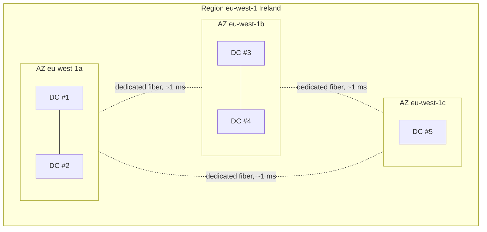

# Global infrastructure: Regions, AZs, Edge

When you say "I launched an EC2", you're implicitly saying "in a specific Availability Zone, inside a specific Region". Understanding AWS geography is the prerequisite for discussing user latency, resilience, data-transfer cost and compliance (GDPR tells you where data can live).

## 1. Region: the unit of isolation

A **Region** is a named geographic area (`us-east-1` = North Virginia, `eu-west-1` = Ireland, `eu-south-1` = Milan). Each Region contains at least 3 (usually 3–6) **Availability Zones**, and is **completely isolated** from other Regions.

Key facts to memorize:

- **Data isolated**: if you create an S3 bucket in `eu-west-1`, its objects never leave Ireland unless you explicitly enable cross-region replication.
- **APIs isolated**: the S3 endpoint for Ireland is `s3.eu-west-1.amazonaws.com`. Calling the Tokyo endpoint (`s3.ap-northeast-1.amazonaws.com`) for the same bucket name won't find it.
- **Services are not all everywhere**: new services launch first in `us-east-1` and propagate. Always check the [Region table](https://aws.amazon.com/about-aws/global-infrastructure/regional-product-services/).
- **Pricing varies by Region**: the same EC2 costs 10–30% more in São Paulo than in Virginia (regional cap-ex, electricity, taxes).

As of 2026 AWS has **34+ commercial Regions** + GovCloud (US) + China (operated by local partners by law). 1–3 new Regions launch per year.

## 2. Availability Zone: physically separated data centers

An **AZ** is a cluster of one or more physically distinct data centers, with independent power, network and cooling, within the same Region. They're connected to each other by dedicated low-latency (~1–2 ms) high-bandwidth fiber. AZs are **identified by a letter** (`eu-west-1a`, `eu-west-1b`, `eu-west-1c`).

**Subtle point**: account `a` is not the same physical AZ as another account's `a`. AWS randomizes the mapping to balance load. To reference a physical AZ deterministically, use the **AZ ID** (`use1-az1`, `use1-az2`, …) which is consistent across all accounts.

**Golden rule for HA**: always spread across **at least 2 AZs**. If you have an ALB with 2 EC2s in the same AZ and that AZ fails (this happened in `us-east-1` December 2021), your service is down. With 1 EC2 per AZ × 2 AZs, you survive.

## 3. Edge locations and PoPs

**Edge locations** are ~600 mini-data centers in 90+ cities (Milan, Rome, Bologna for Italy). They don't run generic EC2. They power **CloudFront** (CDN), **Route 53** (DNS), **Global Accelerator** (anycast networking), **AWS WAF**, **Shield** and **Lambda@Edge / CloudFront Functions** (code running near the user).

Mental model: Regions are where you **do** things (compute, store); Edge is where you **distribute** those things to users with low latency.

## 4. Special flavors

| Type | What it is | When you need it |
|---|---|---|
| **Local Zone** | "branch" AZs in non-Region cities (Los Angeles, Phoenix, Miami, etc.) | low latency for specific metro users |
| **Wavelength Zone** | data centers *inside* a 5G carrier network (Verizon, KDDI, Vodafone) | 5G apps with single-digit ms latency (AR/VR, gaming) |
| **Outposts** | physical AWS rack installed in your data center | compliance / on-prem latency with AWS APIs |
| **Local Gateway** | gateway from Outposts to your LAN | hybrid cloud |
| **AWS Snow Family** | portable hardware (Snowcone, Snowball, Snowmobile) | move petabytes offline (when internet upload would take months) |

## 5. Global vs regional services

| Category | Examples |
|---|---|
| **Global** (no Region to pick) | IAM, Route 53, CloudFront, WAF (for CloudFront), Organizations, STS (global + regional endpoints), Health Dashboard |
| **Regional** (live in a Region) | EC2, S3, RDS, Lambda, DynamoDB (Global Tables optional), VPC, KMS, Secrets Manager |
| **Per-AZ** (you pick the AZ) | EBS (volume lives in 1 AZ), EFS (lives in multiple AZs but with per-AZ mount targets), EC2 instances, VPC subnets |

A classic junior mistake: create an EBS snapshot in `eu-west-1a` and try to attach it to an EC2 in `eu-west-1b`. You can't: snapshots are regional but volumes are per-AZ. You must **create a new volume from the snapshot in the second AZ**.

## 6. Latency: orders of magnitude

| Hop type | Time |
|---|---|
| RAM access | 100 ns |
| Local NVMe SSD | 100 µs |
| Same AZ (server-to-server) | 0.1–0.5 ms |
| Cross-AZ (same Region) | 1–2 ms |
| Cross-Region intra-continent (eu-west-1 → eu-central-1) | 15–30 ms |
| Cross-Region intercontinental (eu-west-1 → ap-northeast-1) | 200–250 ms |
| Edge → user (CloudFront) | 5–40 ms |

**Implication**: a real-time chat between users on two continents is limited by the speed of light, not by AWS. Chasing sub-50 ms latency in global workloads needs Edge logic (CloudFront Functions, Lambda@Edge) or geographic partitioning.

## 7. How to choose

Three criteria:

1. **User proximity**: 70% of users in Italy? `eu-south-1` (Milan), `eu-central-1` (Frankfurt) or `eu-west-1` (Ireland). All three work; Milan has the lowest Italian latency but is a newer Region (some services lag).
2. **Compliance**: GDPR requires certain personal data to stay in the EU. EU = any EU Region; German sovereignty may require Frankfurt specifically.
3. **Cost**: Virginia (`us-east-1`) is almost always cheapest and gets **every** service on day-zero. For workloads not sensitive to user latency (e.g. nightly batches, AI training) it's often the right pick.

Anti-pattern: starting in `us-east-1` "because every tutorial uses it" and later realizing you have Italian users and need to migrate everything. Cross-region migration is painful: snapshots, replication, DNS change, sync. Think first.

## 8. Exercise

You have a consumer app in Italy with primary DB in Milan and a disaster-recovery copy. Which Region for DR?

**Answer.** For DR you want a Region **far enough** not to share physical risk (earthquake, blackout, attack) but **not so far** that replication lag becomes unsustainable.

- **Good picks**: `eu-west-1` (Ireland) or `eu-central-1` (Frankfurt). Distance ~1000–1500 km. RTT ~15–25 ms. You can replicate data with DMS/Aurora Global or cross-region snapshots.
- **Bad picks**: `eu-south-2` (Spain) if both could share a risk zone (pan-European blackout, improbable but…), or `us-east-1` (too far — 80+ ms RTT slows everything).
- **Cost**: you pay double for everything replicated + inter-Region traffic at ~$0.02/GB.

Why does AWS recommend against using AZ "a" if spreading across 3 AZs?

**Answer.** It doesn't. The point is: **don't assume `a` is the same physical AZ across accounts**. AWS randomizes letter-to-physical mapping (to balance customers). If your team has 3 accounts (dev, staging, prod) and all deploy "to a, b, c", they could end up physically in the same AZ.

For deterministic references, use the AZ ID (`use1-az1`) returned by `aws ec2 describe-availability-zones`.

> **Summary**: Region = isolation (data, APIs, billing); AZ = physically separated data centers within a Region; Edge = fast user-side distribution. Multi-AZ is for HA inside a Region; multi-Region is for disaster recovery or proximity to global users. Knowing where data lives is the first step to talking about latency, cost and compliance.
