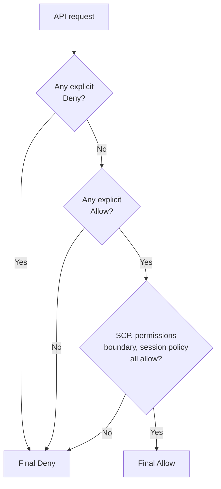

# IAM — fundamentals

IAM (Identity and Access Management) is the **wall around everything**. With no explicit IAM permissions, no API call succeeds. Understanding it deeply is not optional: 90% of public AWS breaches are "IAM misconfigured" (keys in public repos, `*` policies, cross-account roles without conditions).

## 1. The four principal types

A **principal** is whoever (or whatever) makes an API call. AWS recognizes four:

| Type | Example | When |
|---|---|---|
| **Root user** | the sign-up email/password | never, after setup |
| **IAM user** | username + (password or access key) | individual human (legacy) |
| **IAM role** | role assumed temporarily via STS | EC2/Lambda/cross-account |
| **Federated user** | identity from external IdP (Google, Okta, ADFS, IAM Identity Center) | corporate SSO |

2026 best practice: **IAM users are legacy**. For humans use **IAM Identity Center** (formerly AWS SSO). For machines use **roles**: no static keys, time-bound credentials via STS.

## 2. The three policy types (plus two)

Policies are JSON documents that describe permissions.

| Type | Attached to | Example |
|---|---|---|
| **Identity-based** | IAM user/group/role | `AmazonS3ReadOnlyAccess` attached to a role |
| **Resource-based** | the resource (S3 bucket, SQS queue, KMS key) | bucket policy allowing cross-account |
| **Permissions boundary** | identity (caps the maximum) | "this role can never exceed S3+DynamoDB" |
| **SCP (Service Control Policy)** | account/OU in Organizations | "in this OU you cannot launch EC2 outside EU" |
| **Session policy** | STS session | further narrows an assumed session |

## 3. Anatomy of a policy

```json
{
  "Version": "2012-10-17",
  "Statement": [
    {
      "Sid": "ReadProdLogsBucket",
      "Effect": "Allow",
      "Action": ["s3:GetObject","s3:ListBucket"],
      "Resource": [
        "arn:aws:s3:::prod-logs",
        "arn:aws:s3:::prod-logs/*"
      ],
      "Condition": {
        "StringEquals": {"aws:PrincipalTag/Team": "platform"},
        "Bool": {"aws:MultiFactorAuthPresent": "true"}
      }
    }
  ]
}
```

Five elements:

1. **Effect**: `Allow` or `Deny`.
2. **Action**: what is allowed (e.g. `s3:GetObject`, `ec2:RunInstances`). Per-API granularity.
3. **Resource**: on which resources (ARN). `*` means "any" — dangerous.
4. **Condition** (optional): extra constraints (tag, MFA, IP, time of day, encryption type).
5. **Principal** (resource-based only): who.

## 4. Evaluation rule



Key points:

- **Default deny**: if no policy says "Allow", the call fails.
- **Explicit Deny always wins**. `Allow *` + `Deny s3:DeleteBucket` = you cannot delete buckets.
- **The intersection of SCP + boundary + session policy + identity policy + resource policy** must permit the call.

## 5. Users, groups, and roles

- **IAM User**: long-lived identity with credentials (console password, access key). Avoid in new setups.
- **Group**: a set of users sharing policies. Not a principal: just avoids duplicating policies.
- **Role**: identity with no fixed credentials, assumed on demand via `sts:AssumeRole`. Returns temporary credentials (15 min – 12 hours).

Typical role uses:

| Use case | Example |
|---|---|
| EC2 instance role | EC2 gets credentials via metadata service (`http://169.254.169.254/latest/meta-data/iam/security-credentials/`) |
| Lambda execution role | function receives `AWS_ACCESS_KEY_ID`/`AWS_SECRET_ACCESS_KEY`/`AWS_SESSION_TOKEN` from env vars |
| Cross-account access | account A assumes a role in account B to access B's resources |
| Federated SSO | an Okta user assumes a temporary role via SAML |

## 6. Best practices to memorize

1. **Least privilege**: start denying everything, add only what's needed. AWS Access Analyzer generates policies from real CloudTrail usage.
2. **Never static access keys on EC2/Lambda/ECS**: use roles.
3. **MFA on all humans**, with `aws:MultiFactorAuthPresent` condition on sensitive actions.
4. **Permissions boundary** on devs: even if they grant themselves more, they can't exceed the cap.
5. **Naming**: consistent prefixes (`role/svc-`, `role/human-`, `role/cross-acct-`) for fast audit.
6. **Access key rotation** if you must use them (max 90 days, ideally automatic via Lambda).
7. **Never commit keys to git** (GitGuardian/TruffleHog scan public repos; AWS auto-quarantines them if you publish on GitHub).

## 7. Hands-on examples

```bash
# Create an IAM user and attach an AWS managed policy
aws iam create-user --user-name alice
aws iam attach-user-policy \
  --user-name alice \
  --policy-arn arn:aws:iam::aws:policy/ReadOnlyAccess

# Create a role assumable by Lambda
aws iam create-role --role-name lambda-s3-reader \
  --assume-role-policy-document '{
    "Version":"2012-10-17",
    "Statement":[{
      "Effect":"Allow",
      "Principal":{"Service":"lambda.amazonaws.com"},
      "Action":"sts:AssumeRole"
    }]
  }'

# Assume role from CLI (cross-account)
aws sts assume-role \
  --role-arn arn:aws:iam::222222222222:role/cross-acct-read \
  --role-session-name alice-prod-read \
  --external-id "shared-secret-XYZ"
```

## 8. Exercise

<details>
<summary>A dev has `AdministratorAccess`. You want them not to delete S3 buckets whose name starts with `prod-`. How?</summary>

Attach an extra policy with an explicit `Deny` to the same user/role:

```json
{
  "Version":"2012-10-17",
  "Statement":[{
    "Effect":"Deny",
    "Action":["s3:DeleteBucket","s3:DeleteObject"],
    "Resource":["arn:aws:s3:::prod-*","arn:aws:s3:::prod-*/*"]
  }]
}
```

The explicit Deny beats the `AdministratorAccess` Allow. More scalable alternatives: an SCP at the Organization level, or a permissions boundary on the dev role.
</details>

<details>
<summary>EC2 in account A must read an S3 bucket in account B. Minimal setup?</summary>

Two options:

**A) Bucket policy in B that allows the role in A**:
```json
{
  "Version":"2012-10-17",
  "Statement":[{
    "Effect":"Allow",
    "Principal":{"AWS":"arn:aws:iam::111111111111:role/ec2-app-role"},
    "Action":"s3:GetObject",
    "Resource":"arn:aws:s3:::bucket-in-b/*"
  }]
}
```
+ the EC2 in A must have `s3:GetObject` on the bucket in its identity policy.

**B) Cross-account role**: in B create a `s3-reader` role that trusts A's role; the EC2 calls `sts:AssumeRole` to get temp credentials in B, then reads S3.

For "read one bucket", A is simpler. For "access many resources in B", B (cross-account role) is cleaner.
</details>

> **Summary**: every AWS API call goes through IAM. Default deny; explicit Allow; explicit Deny wins. Principal = caller; policy = JSON with effect+action+resource+condition. Best practice: no static keys, roles for machines, IAM Identity Center for humans, MFA, least privilege, boundary on devs.
