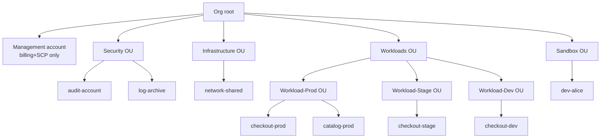

# AWS Organizations & multi-account strategy

Past the "personal" account, the first question a company asks is: "how many accounts do I need?". The modern answer is **many, organized in a hierarchy**. One account = one isolation boundary for billing, IAM, blast radius. Putting prod and dev in the same account is like keeping the ATM PIN on the back of the card.

## 1. Why multi-account

| Benefit | What it solves |
|---|---|
| Blast-radius isolation | a dev deletes everything in `dev`: prod stays alive |
| Hard limits | many AWS limits are per-account (e.g. 5 VPCs, 1000 IAM users) |
| Separate billing | clear cost allocation: 1 account = 1 CUR line |
| Compliance | a "clinical data" account can have an SCP forbidding cross-account share |
| Audit | prod CloudTrail isolated, write-only |
| Freedom to experiment | dev/sandbox with soft SCPs, prod with hardened SCPs |

## 2. Typical structures



Best practice (Control Tower default):

- **Management account**: ZERO workload. Organizations, billing, SCPs only. Hyper-protected.
- **Log archive**: immutable S3 bucket (Object Lock) for CloudTrail and Config across the org.
- **Audit/security**: account where GuardDuty, Security Hub, IAM Access Analyzer aggregate findings.
- **OU per environment/criticality**: Prod, Stage, Dev, Sandbox. Stricter SCPs as you go up.

## 3. AWS Organizations

Free service that:

- Creates/invites accounts into an "organization".
- Provides **consolidated billing** (single invoice, volume discounts shared across accounts).
- Applies **SCPs** (Service Control Policies) at OU/account level.
- Enables cross-account services like Config aggregator, GuardDuty multi-account, Security Hub.

## 4. Service Control Policies (SCPs)

SCPs **grant nothing**: they define the **maximum** an account can do. It's reverse IAM: IAM decides if the action is permitted, then SCP filters.

Very useful SCP examples:

```json
// Forbid disabling CloudTrail
{
  "Version":"2012-10-17",
  "Statement":[{
    "Effect":"Deny",
    "Action":["cloudtrail:StopLogging","cloudtrail:DeleteTrail"],
    "Resource":"*"
  }]
}

// EU Regions only
{
  "Effect":"Deny",
  "NotAction":["iam:*","s3:*","cloudfront:*","route53:*","support:*"],
  "Resource":"*",
  "Condition":{
    "StringNotEquals":{"aws:RequestedRegion":["eu-west-1","eu-central-1","eu-south-1"]}
  }
}

// No IAM user creation (force Identity Center only)
{
  "Effect":"Deny",
  "Action":["iam:CreateUser","iam:CreateAccessKey"],
  "Resource":"*"
}
```

Most common SCPs: deny dangerous actions (root creds, cloudtrail off, MFA off), region restriction, mandatory tags, prevent leaving the org.

## 5. Control Tower and Landing Zone

**Control Tower** is the multi-account "fast-forward": in ~1 hour it creates Organization + management + log-archive + audit + some guardrail SCPs + an account factory for new accounts.

**Guardrails** are predefined SCPs (preventive) + AWS Config rules (detective):

| Type | Example |
|---|---|
| Preventive (SCP) | forbid disabling CloudTrail, forbid public S3 |
| Detective (Config) | detect unencrypted EBS, detect root login |

Account Factory creates new accounts in minutes with a standard baseline (VPC, IAM, CloudTrail pre-configured).

## 6. Network sharing — AWS Resource Access Manager (RAM)

A standard pattern is "centralized networking": **one "network" account** owns the Transit Gateway, route tables, shared VPCs. Workload accounts don't have their own TGW; they use the shared one via RAM. Saves money and centralizes routing.

```bash
# Share a Transit Gateway with an OU
aws ram create-resource-share \
  --name shared-tgw \
  --resource-arns arn:aws:ec2:eu-west-1:111111111111:transit-gateway/tgw-abc \
  --principals arn:aws:organizations::123456789012:ou/o-xxxx/ou-yyyy
```

## 7. Account vending machine

Modern pattern: engineers request an account via an internal form → CI/CD calls Service Catalog / Control Tower Account Factory → in 15 minutes you have a new account, baseline applied, access via Identity Center, account already "production-ready" (CloudTrail, GuardDuty, Config, baseline VPC).

Without a vending machine, each new account = 2 weeks of manual setup. With it = 15 automated minutes.

## 8. Exercise

<details>
<summary>A 30-person startup with 1 product in production. How many accounts?</summary>

Minimum 4–6:

- **management** (Organizations, billing, SCP).
- **log-archive** (S3 Object Lock for audit logs).
- **security-audit** (GuardDuty/Security Hub aggregator).
- **prod** (workload).
- **stage** (1:1 replica of prod).
- **dev** (shared dev environment) and/or **per-dev sandbox** (1 account each, wiped every 30 days).

Bonus: **shared-services** (artifact storage, CI/CD, DNS root domain).
</details>

<details>
<summary>Prevent any dev from launching EC2 outside `eu-west-1` OR without `Owner` tag. Strategy?</summary>

Two SCPs at Dev OU level:

1. Region restriction (example §4 above).
2. Mandatory tag:
```json
{
  "Effect":"Deny",
  "Action":"ec2:RunInstances",
  "Resource":"arn:aws:ec2:*:*:instance/*",
  "Condition":{"Null":{"aws:RequestTag/Owner":"true"}}
}
```

Also AWS Config rule `required-tags` to catch existing untagged resources.
</details>

> **Summary**: account = blast radius + billing + IAM tenant. Multi-account is the norm (Prod/Stage/Dev/Sandbox + log + audit + network + management). Organizations applies SCPs that CAP what an OU can do. Control Tower automates the landing zone. RAM shares resources (TGW, subnets) across accounts. Account vending machine = happy engineers, consistent infra.
