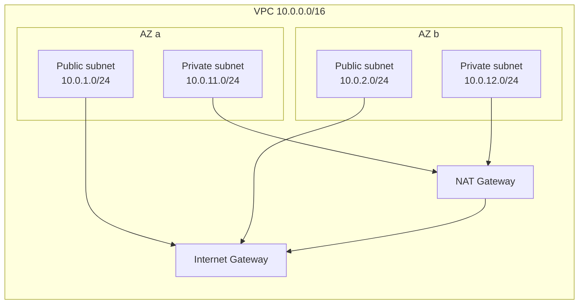

# VPC — fundamentals

A VPC (Virtual Private Cloud) is the isolated logical network where all your resources live. No EC2 exists "outside a VPC" (even the default ones are inside an auto-created default VPC). Understanding VPCs, subnets, route tables and security groups is the non-negotiable skill for anyone deploying anything more complex than a standalone Lambda.

## 1. CIDR — the IP plan

When creating a VPC you pick a **CIDR block** (IPv4 range), e.g. `10.0.0.0/16` = 65,536 addresses. Recommended ranges (RFC1918):

- `10.0.0.0/8` (16M IPs)
- `172.16.0.0/12` (1M IPs)
- `192.168.0.0/16` (65k IPs)

Key points:

- **Don't overlap** CIDRs between VPCs if you might peer them or use TGW later.
- **Leave room to grow**: a /16 beats a /22.
- **AWS reserves the first 4 + last IP** of each subnet (e.g. in `10.0.1.0/24`: `.0` network, `.1` router, `.2` DNS, `.3` reserved, `.255` broadcast → 251 usable IPs).
- **Secondary CIDR**: you can add additional CIDRs to an existing VPC (handy when you run out).
- **IPv6**: optional, range provided by AWS (`/56`).

## 2. Subnets: public and private

A **subnet** is a portion of the VPC CIDR tied to a specific AZ. A subnet is "public" or "private" not by attribute but by the **route table** associated with it:

- **Public**: route table with `0.0.0.0/0 → Internet Gateway`. Instances here can send/receive Internet traffic.
- **Private**: no IGW in the route table. To go out, you need a NAT Gateway (or VPC endpoint for AWS services).



Typical layout: **2 public subnets** (load balancer, bastion, NAT) + **2 private subnets** (app servers, RDS), one pair per AZ.

## 3. Route tables

A table saying "traffic to CIDR X goes to target Y". Possible targets: `Internet Gateway`, `NAT Gateway`, `Transit Gateway`, `VPC Peering`, `VPC Endpoint`, `Virtual Private Gateway` (VPN). A route table is associated with 0+ subnets; each subnet has **exactly 1 active route table** (the explicitly associated one or the VPC's main).

Example private route table:

| Destination | Target |
|---|---|
| `10.0.0.0/16` | `local` (auto, immutable) |
| `0.0.0.0/0` | `nat-0123abc` |
| `pl-xxxxxx` (S3 Prefix List) | `vpce-yyy` (Gateway Endpoint) |

## 4. Internet Gateway vs NAT Gateway

**IGW**: logical, free, scalable gateway. Allows bidirectional Internet ↔ VPC, but instances need a **public IP** (or Elastic IP) to be reachable from outside. Free and redundant.

**NAT Gateway**: managed gateway doing Network Address Translation: private instances egress to the Internet using the NAT's public IP, but are not reachable from outside. Cost: **$0.045/h ≈ $32/month** + **$0.045/GB processed**. One per AZ for HA (otherwise AZ-dependency).

NAT alternatives:

- **NAT Instance**: self-managed EC2 (cheap but maintenance).
- **VPC Gateway Endpoint** for S3/DynamoDB: FREE, avoids NAT traffic.
- **VPC Interface Endpoint** for other AWS services: paid ($0.01/h per AZ + data), but avoids NAT.

## 5. Security Group vs NACL

| | Security Group | NACL |
|---|---|---|
| Layer | instance (ENI) | subnet |
| Stateful? | **Yes** (return traffic auto-allowed) | **No** (must allow both directions) |
| Rules | `Allow` only | `Allow` and `Deny` |
| Evaluation | all rules evaluated, 1 match suffices | numerical, lowest first |
| Default | inbound deny all, outbound allow all | inbound allow all, outbound allow all (default NACL) |

2026 best practice: use **security groups only** for 95% of cases. NACL only for subnet-wide IP blacklists (e.g. block a hostile /24 without modifying every SG).

Example SG for a web server:

```
Inbound:
  - HTTPS 443 from 0.0.0.0/0
  - HTTP 80 from 0.0.0.0/0 (for HTTPS redirect)
  - SSH 22 from SG `bastion-sg`
Outbound:
  - all to 0.0.0.0/0 (default)
```

**Killer trick**: the source of an SG rule can be **another SG** (e.g. `db-sg` allows 5432 from `app-sg`). You don't write IPs: AWS expands dynamically. Survives auto-scaling.

## 6. DNS inside a VPC

VPC has internal DNS (`amazon-provided DNS server`) at `VPC_CIDR + 2` (e.g. `10.0.0.2`). Two flags:

- `enableDnsSupport` (default true): DNS resolution works.
- `enableDnsHostnames` (default false on non-default VPCs): EC2s get a hostname `ip-10-0-1-23.eu-west-1.compute.internal`.

For private DNS (e.g. resolve `my-db.internal.acme.com` only inside the VPC): **Route 53 Private Hosted Zone** associated with the VPC.

## 7. Basic commands

```bash
# Create VPC
aws ec2 create-vpc --cidr-block 10.0.0.0/16 \
  --tag-specifications 'ResourceType=vpc,Tags=[{Key=Name,Value=acme-prod}]'

# Public + private subnet in AZ a
aws ec2 create-subnet --vpc-id vpc-xxx --availability-zone eu-west-1a \
  --cidr-block 10.0.1.0/24 --tag-specifications 'ResourceType=subnet,Tags=[{Key=Name,Value=public-a}]'
aws ec2 create-subnet --vpc-id vpc-xxx --availability-zone eu-west-1a \
  --cidr-block 10.0.11.0/24 --tag-specifications 'ResourceType=subnet,Tags=[{Key=Name,Value=private-a}]'

# IGW
aws ec2 create-internet-gateway
aws ec2 attach-internet-gateway --vpc-id vpc-xxx --internet-gateway-id igw-yyy

# Public route table
aws ec2 create-route-table --vpc-id vpc-xxx
aws ec2 create-route --route-table-id rtb-pub --destination-cidr-block 0.0.0.0/0 --gateway-id igw-yyy
aws ec2 associate-route-table --subnet-id subnet-pub-a --route-table-id rtb-pub
```

In production **do not write this by hand**: use Terraform/CDK (see section 34).

## 8. Exercise

<details>
<summary>3-tier web app (frontend, app, db). Sketch the minimum resilient network.</summary>

VPC `10.0.0.0/16` across 2 AZs:

- 2 **public** subnets (`10.0.1.0/24` AZ-a, `10.0.2.0/24` AZ-b): hold ALB.
- 2 **private app** subnets (`10.0.11.0/24` AZ-a, `10.0.12.0/24` AZ-b): hold EC2/Fargate.
- 2 **private data** subnets (`10.0.21.0/24` AZ-a, `10.0.22.0/24` AZ-b): hold RDS Multi-AZ.

- 1 NAT Gateway **per AZ** (HA, but costly). For dev: 1 NAT is enough.
- SGs: `alb-sg` (443 from 0/0), `app-sg` (8080 from `alb-sg`), `db-sg` (5432 from `app-sg`).
- VPC Gateway Endpoint for S3 + DynamoDB (free, cuts NAT traffic).

This survives AZ-a failure → traffic routes through AZ-b. Security: only ALB exposed, app/db private.
</details>

<details>
<summary>You need SSH only from a corporate network. How?</summary>

Three options:

1. **Security group with corp CIDR source**: `22 from 203.0.113.0/24`. Simple but reveals the EC2 IP and requires maintaining the IP list.
2. **SSM Session Manager** (recommended): no port 22 open, access via IAM API. EC2 needs SSM Agent + `AmazonSSMManagedInstanceCore` role. Auto audit log in CloudTrail.
3. **Bastion host** in a public subnet with a restricted SG, then SSH to private instances. Legacy pattern but still in use.

Best practice: SSM Session Manager. No open ports, no SSH keys to manage.
</details>

> **Summary**: VPC = isolated logical network; subnet = chunk of VPC in 1 AZ; public vs private depends on the route table; IGW for Internet traffic (free), NAT Gateway for private-subnet egress ($$); SG = stateful per-instance, NACL = stateless per-subnet (rarely used); SG-source-as-another-SG is the killer pattern. Multi-AZ is mandatory for HA.
