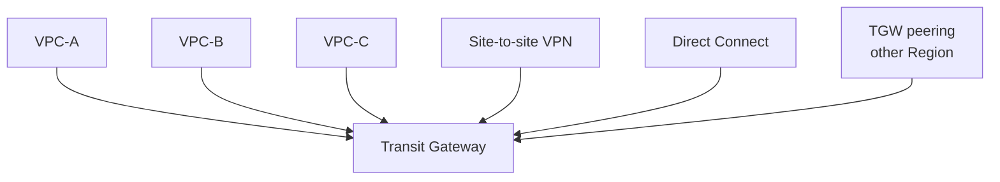
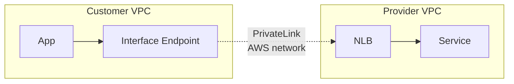

# VPC advanced

Once you have more than one VPC (or more than one account, or services that should talk without Internet), you enter the realm of connectivity mechanisms. Five main ones exist, each with cost/complexity/scale trade-offs.

## 1. VPC Peering

1-to-1 connection between two VPCs (same account, cross-account, cross-Region). Not transitive (A↔B + B↔C ≠ A↔C). **Non-overlapping** CIDRs are mandatory.

```bash
aws ec2 create-vpc-peering-connection \
  --vpc-id vpc-aaa --peer-vpc-id vpc-bbb \
  --peer-region eu-central-1
# accept in the peer
aws ec2 accept-vpc-peering-connection --vpc-peering-connection-id pcx-zzz
# update route tables: VPC-B CIDR → pcx-zzz
```

**Cost**: object free, you pay only traffic (intra-Region same-AZ free; cross-AZ $0.01/GB; cross-Region $0.02/GB).

**When**: 2 VPCs that talk a lot, no need for VPC-scale meshing. Above 5–10 VPCs, peering explodes (O(N²) mesh).

## 2. Transit Gateway (TGW)

Central hub: each VPC attaches to the TGW and routes through it. Scales to thousands of VPCs, supports VPN/Direct Connect, inter-Region peering.



**Cost**: ~$0.05/h per VPC attachment (~$36/mo per VPC) + $0.02/GB processed. 10 VPCs ≈ $360/month fixed.

**When**: ≥ 3–5 VPCs, hybrid scenarios (VPN/DX), multi-account with RAM-sharing. The standard pattern for medium and large orgs.

## 3. VPC Endpoints — Gateway

Free service, *only for S3 and DynamoDB*. Adds a route in your route table pointing at the service's **prefix list**. Traffic reaches the service without leaving the AWS network, **without NAT**.

```bash
aws ec2 create-vpc-endpoint \
  --vpc-id vpc-xxx \
  --service-name com.amazonaws.eu-west-1.s3 \
  --route-table-ids rtb-private-a rtb-private-b
```

**When**: ALWAYS for S3 and DynamoDB if you have NAT. Saves NAT processing fees.

## 4. VPC Endpoints — Interface (powered by PrivateLink)

ENI with a private IP inside your subnet, acting as a "proxy" to the AWS service (e.g. SSM, ECR, Secrets Manager, CloudWatch Logs). Cost: ~$0.01/h per AZ per endpoint + $0.01/GB. Not free.

**When**: workloads in fully private subnets (no NAT) that must call AWS services.

```bash
aws ec2 create-vpc-endpoint \
  --vpc-endpoint-type Interface \
  --vpc-id vpc-xxx \
  --service-name com.amazonaws.eu-west-1.secretsmanager \
  --subnet-ids subnet-priv-a subnet-priv-b \
  --security-group-ids sg-endpoint
```

## 5. PrivateLink — publish your own service

You have a private API in a VPC. You want other VPCs (even other customers') to consume it without traversing the Internet. Create a **VPC Endpoint Service** behind an NLB. Consumers create an Interface Endpoint that connects to your NLB over the AWS network.

**Real use case**: Snowflake, Datadog, Atlassian. You buy their service and they give you a PrivateLink endpoint — traffic never hits the public Internet.



## 6. Egress-only IGW (IPv6)

The NAT-Gateway equivalent for IPv6: allows IPv6 egress while blocking ingress. Free. IPv6 only.

## 7. Reachability Analyzer

Diagnostic service simulating a packet's path and telling you **why** it doesn't arrive. Saves hours of "why isn't this port responding?".

```bash
aws ec2 create-network-insights-path \
  --source eni-aaa --destination eni-bbb \
  --protocol tcp --destination-port 5432
aws ec2 start-network-insights-analysis \
  --network-insights-path-id nip-xxx
```

Returns the step-by-step path or the exact SG/NACL/route table blocking it.

## 8. Exercise

<details>
<summary>5 workload accounts + 1 shared network account. Architecture?</summary>

Classic **hub-and-spoke**:
- Network account hosts 1 Transit Gateway, shared via **RAM** to the workload OU.
- Each workload account has its own VPC, attached to the shared TGW.
- TGW route table: inter-workload traffic blocked by default; allow only what's needed.
- Site-to-site VPN and Direct Connect terminated on the shared TGW.
- VPC Gateway Endpoint for S3/DynamoDB in every VPC.
- Centralized egress: one VPC owns the NAT Gateway; other VPCs egress via TGW → egress VPC → NAT (cuts NAT cost but adds $0.02/GB of TGW data).

Trade-off: TGW costs ~$36/VPC/mo fixed + traffic. For <3 VPCs, peering is cheaper.
</details>

<details>
<summary>App in a private subnet calls Secrets Manager. Timeout. What to check?</summary>

1. **Route table** of the private subnet: route to NAT? Or VPC Interface Endpoint for Secrets Manager?
2. If Interface Endpoint: endpoint's SG allows port 443 from the app's SG.
3. **DNS resolution**: the private endpoint needs `enableDnsHostnames=true` on the VPC, otherwise the client resolves the public endpoint.
4. **Reachability Analyzer** between app ENI and endpoint ENI to pinpoint.
5. Verify IAM: EC2 role has `secretsmanager:GetSecretValue` on the specific secret.
</details>

> **Summary**: Peering 1-to-1 free but mesh explodes; TGW central hub with fixed cost but scalable; VPC Gateway Endpoint (S3/DynamoDB) free, always use it; Interface Endpoint for other AWS services in private subnets; PrivateLink to publish/consume private services; Reachability Analyzer for debugging.
