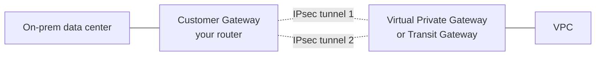
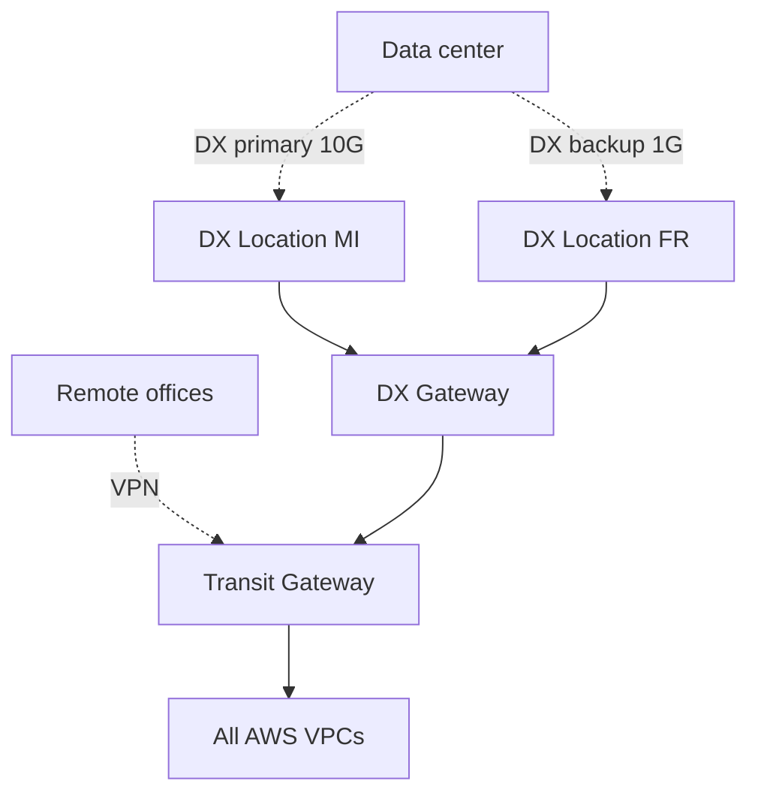

# Hybrid: VPN, Direct Connect, PrivateLink

Pure cloud is the exception: most companies have data centers, offices, factories, stores — all needing to connect to AWS. AWS offers three main mechanisms (VPN, DX, PrivateLink) that combine to build robust **hybrid cloud**.

## 1. Site-to-Site VPN

IPsec tunnel over the Internet. Fast to set up (minutes), priced per hour ($0.05/h ≈ $36/month) + traffic.

- 2 HA tunnels by default (one per AWS AZ).
- Bandwidth up to ~1.25 Gbps per tunnel.
- Dynamic BGP recommended (automatic subnet announcements, automatic failover).

**Limits**: variable latency (Internet), no guaranteed throughput, no strict SLA. OK for non-critical or DX-backup roles.

## 2. Direct Connect (DX)

Dedicated fiber from a partner location (e.g. Equinix MI3 Milan, Frankfurt Interxion) to an AWS **DX location**. Private physical link, stable latency, up to 100 Gbps.

Three setups:

| Type | Bandwidth | When |
|---|---|---|
| **Dedicated** | 1/10/100 Gbps physical | heavy consumption |
| **Hosted** (via partner) | 50 Mbps – 25 Gbps logical | small/medium |
| **Public VIF** | access to AWS public services (S3, DynamoDB) over DX | bypass Internet for massive egress |
| **Private VIF** | access to your VPC (via VGW or DX Gateway/TGW) | the common case |

**Costs**: ~$0.30/h per dedicated 1 Gbps port (~$220/month) + traffic over DX (~$0.02/GB egress, far less than Internet $0.09).

**HA pattern**: 2 DX connections in 2 different DX locations + VPN as extra backup. The DX single point of failure is missing redundancy.

## 3. VPN over DX

IPsec tunnel built *on top* of the DX fiber. Pros:

- End-to-end **encryption** (DX is not encrypted by default).
- Faster failover between links.

Standard for regulated workloads (banking, healthcare).

## 4. Direct Connect Gateway

A DX Gateway is a virtual hub that connects **one DX connection to VPCs in multiple Regions**. Without DXGW, a DX connection only sees VPCs in its Region. With DXGW, it sees worldwide (with caveats).

## 5. Hybrid DNS with Route 53 Resolver

Three typical scenarios:

- **Resolver Inbound endpoint**: on-prem can do DNS queries into the AWS VPC (resolve `db.internal.acme.aws`).
- **Resolver Outbound endpoint + rules**: VPC can forward queries for `corp.acme.com` to on-prem DNS.
- **Conditional forwarding** between the two.

Enables **bidirectional** name resolution without exposing anything publicly.

## 6. Complete hybrid pattern

## 7. PrivateLink hybrid

PrivateLink (section 10) can be consumed from on-prem too **if you go through DX or VPN**. Example: your on-prem servers call Snowflake via a PrivateLink endpoint inside AWS — traffic goes on-prem → DX → AWS → endpoint → Snowflake, never the public Internet.

## 8. Exercise

3 on-prem EU data centers. You need HA + encryption + low latency to AWS. Setup?

- **2 DX connections** to different DX locations (Milan + Frankfurt) for geographic redundancy.
- **VPN over DX** on both for encryption.
- **Internet VPN** as a 3rd backup (low cost, triggered on full DX failure).
- **Transit Gateway** in AWS as the hub: each DX + VPN attaches to TGW.
- BGP for automatic failover (DX primary, DX secondary, VPN backup) using AS-PATH prepending.
- **Route 53 Resolver** inbound/outbound for hybrid name resolution.

On-prem ↔ VPC AWS latency is 200 ms over Internet, 8 ms over DX. Why?

- **Internet VPN**: traffic crosses multiple ISPs, IPsec encapsulation overhead, public Internet congestion.
- **DX**: dedicated private fiber from the partner location to the AWS Region, direct physical distance. Latency is essentially $\sim \frac{d}{c \cdot 0.66}$ (speed of light in fiber). 1000 km ≈ 5 ms RTT.

For DB workloads or chatty RPCs (hundreds of queries per user request), 200 ms vs 8 ms is the difference between "unusable" and "transparent".

> **Summary**: VPN to start fast and as backup; DX for high bandwidth, stable latency, and cheaper egress at volume; VPN over DX for encryption; DX Gateway or TGW to scale to multi-Region/multi-VPC; Route 53 Resolver for hybrid bidirectional name resolution; PrivateLink also consumable from on-prem over DX/VPN.
