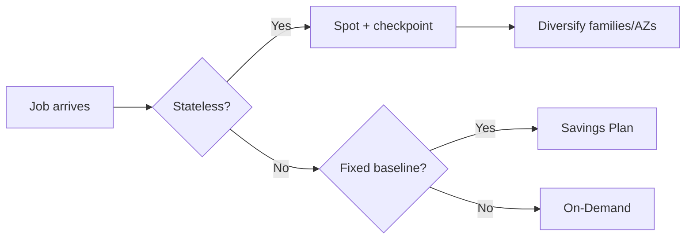

# EC2 advanced

After the fundamentals, this is where the production-grade detail lives: how to **pay less** (Spot, RI, SP), how to **place** instances (placement groups), what the **Nitro** generation gives you, and how to **protect** instance metadata.

## 1. Purchasing models

| Model | Discount vs On-Demand | Commitment | When |
|---|---|---|---|
| **On-Demand** | 0% | none | dev, unpredictable traffic |
| **Spot** | up to 90% | none, but interruption possible | batch, CI, stateless, big data |
| **Reserved (Standard)** | ~40-72% | 1 or 3 years, fixed type | steady baseline, long-lived servers |
| **Compute Savings Plan** | ~54-66% | 1 or 3 years, $/h committed | flexible (covers Fargate/Lambda too!) |
| **EC2 Instance Savings Plan** | ~72% | 1/3 years, fixed family+region | known baseline, want more discount |
| **Dedicated Host** | premium | per host | BYOL licensing (Oracle, core-based Windows) |

2026 rule of thumb: **Compute Savings Plan** for the baseline (covers EC2 any family + Fargate + Lambda) + **Spot** for elastic workload. Reserved Instance is almost always suboptimal vs SP today.

## 2. Spot Instances

AWS sells unused capacity at huge discount, taking it back when needed. Interruption warning: **2 minutes** via instance metadata.

```bash
# Fetch interruption notice from metadata service (IMDSv2)
TOKEN=$(curl -s -X PUT "http://169.254.169.254/latest/api/token" \
  -H "X-aws-ec2-metadata-token-ttl-seconds: 21600")
curl -s -H "X-aws-ec2-metadata-token: $TOKEN" \
  http://169.254.169.254/latest/meta-data/spot/instance-action
```

Allocation strategies (Spot Fleet / ASG):
- `price-capacity-optimized` — **recommended default**: balances price and interruption probability.
- `capacity-optimized`: minimizes interruptions (long-running workload).
- `lowest-price`: max discount, more interruptions.



Spot saving calculation: $\text{saving} = (1 - p_{spot}/p_{ondemand}) \cdot \text{hours}$. With Spot at $0.012/h vs On-Demand $0.12/h you get $90\%$ off.

## 3. Placement Groups

Control where AWS physically places your instances.

| Type | Layout | Use case |
|---|---|---|
| **Cluster** | same rack, same AZ, 10/100 Gbps low-latency network | HPC, MPI |
| **Spread** | distinct physical hosts (max 7 per AZ) | critical DBs, high availability |
| **Partition** | separate rack groups (up to 7 partitions/AZ) | HDFS, Cassandra, Kafka |

```bash
aws ec2 create-placement-group --group-name my-hpc --strategy cluster
aws ec2 run-instances --placement GroupName=my-hpc --instance-type c7i.16xlarge ...
```

## 4. Nitro hypervisor

Since around 2018 most new families (m5/c5/r5 and onward, all 6/7 gens) run on **Nitro**: a lightweight KVM-based hypervisor + dedicated Nitro chips for network, storage and security.

Benefits:
- **Native NVMe** for EBS (lower latency, higher IOPS).
- **Multiple high-bandwidth ENIs** (up to 15 ENIs, 100+ Gbps on big instances).
- **Enhanced networking** (SR-IOV) always on.
- **Nitro Enclaves**: isolated TEEs for sensitive workloads (keys, KYC).
- Better security baseline: no provider access to guest OS.

## 5. Hibernation

Saves RAM to an encrypted EBS volume and powers off. On restart picks up exactly where it was.

Requirements: supported AMI, encrypted EBS root, RAM <= 150 GB, enabled at launch time.

```bash
aws ec2 run-instances ... --hibernation-options Configured=true \
  --block-device-mappings '[{"DeviceName":"/dev/xvda","Ebs":{"Encrypted":true,"VolumeSize":50}}]'
```

When it makes sense: workloads needing many minutes of warmup (big in-memory cache, warmed JVM) that you want to scale to zero overnight.

## 6. Dedicated Hosts vs Dedicated Instances

- **Dedicated Instance**: hardware not shared with other accounts, but AWS manages it.
- **Dedicated Host**: you have physical visibility (sockets, cores), required for **BYOL** of Windows Server, Oracle, SQL Server "core-based".

Costs more — only pick it for licensing or compliance needs.

## 7. IMDSv2 (mandatory)

The Instance Metadata Service is the `169.254.169.254` endpoint exposing metadata and **IAM role credentials**. IMDSv1 was vulnerable to SSRF (Capital One 2019). IMDSv2 requires a session token via PUT.

```bash
# Force IMDSv2-only on an existing instance
aws ec2 modify-instance-metadata-options \
  --instance-id i-xxx \
  --http-tokens required \
  --http-put-response-hop-limit 1
```

Best practice: `http-tokens=required`, `hop-limit=1` (prevents containers from reaching the host IMDS), and auditing via SSM Inventory.

## 8. Exercise

<details>
<summary>You have a video rendering batch job running 6h/day, costs 2k$/month On-Demand. How to optimize?</summary>

Ideal pipeline:
1. Stateless job + checkpoint to S3 → **Spot**: ~90% off, brings cost to ~200$/month.
2. `price-capacity-optimized` strategy, diversify 3-4 compatible families (c7i, c6i, m7i) and all AZs.
3. Handle interruption: 2-min hook to save current chunk, ASG with `capacity-rebalance` launches replacement before interruption.

Bonus: use **EC2 Fleet** or **AWS Batch** (see section 18) to manage allocation automatically.
</details>

<details>
<summary>3-node Kafka cluster: which placement group?</summary>

**Partition placement group** with 3 partitions: each broker on a different partition, physical rack separation. If a rack/switch dies you lose at most one broker, and Kafka keeps quorum (RF=3). Cluster placement would be wrong (all on the same rack = single point of failure).
</details>

> **Summary**: Spot for up to 90% off on stateless workloads; Compute Savings Plan for the baseline; placement groups (cluster/spread/partition) to control topology; Nitro = the modern standard (NVMe, multiple ENIs, enclaves); hibernation for heavy warmups; IMDSv2 mandatory to prevent SSRF.
